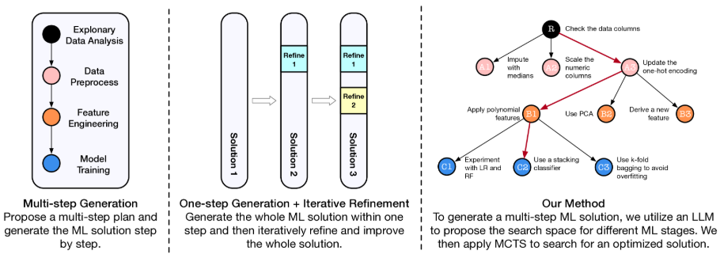
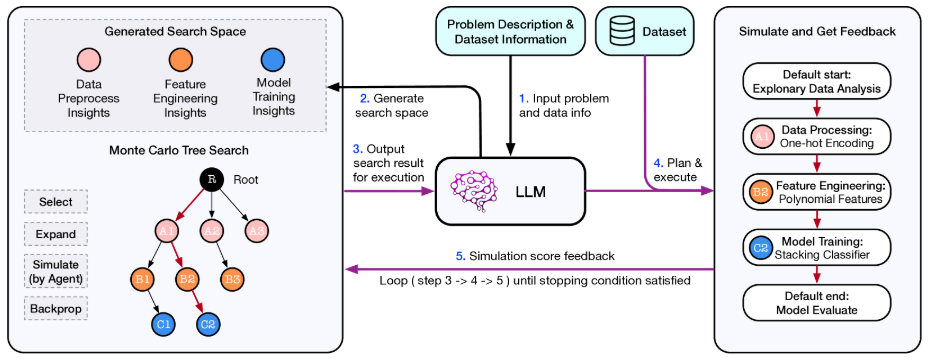
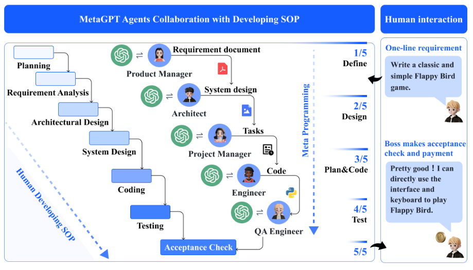

## 1. 多Agent协作系统（MAS）相关工作：

### 1.1 MetaGPT：The Multi-Agent Framework

多Agent框架：为 GPT 分配不同的角色，以形成用于复杂任务的协作实体。

该项目 48.6k Star 和 5.8k Fork ：[geekan/MetaGPT: 🌟 The Multi-Agent Framework: First AI Software Company, Towards Natural Language Programming](https://github.com/geekan/MetaGPT?tab=readme-ov-file)

该团队公开的论文：

[MetaGPT: Meta Programming for a Multi-Agent Collaborative Framework](https://arxiv.org/html/2308.00352v7)

MetaGPT支持AFlow自动生成工作流框架

[AFlow: Automating Agentic Workflow Generation](https://arxiv.org/abs/2410.10762)

MetaGPT其他支持实现的功能：

[FACT](https://arxiv.org/abs/2410.21012)，[SELA](https://arxiv.org/abs/2410.17238)，[SPO](https://arxiv.org/pdf/2502.06855)，[AOT](https://arxiv.org/pdf/2502.12018)

> **FACT：**基于上下文检索事实的迭代重写方法，对于用户的查询，通过使用LLM作为检索器或基于向量的方法检索候选事实。然后，这些候选事实位于上下文中，通过删除或替换其他噪声数据来重写它们，从而产生一个新的上下文。这个过程不断重复，指导达到最大迭代次数或满足停止条件。在每次迭代中找到的候选事实被聚合以形成最终的事实集。
>
> 
>
> 
>
> **SELA：**自动化ML树搜索增强型LLM Agent。利用MCTS来优化AutoML工作流。
>
> 
>
> 图一注：与其他基于代理的 AutoML 框架的比较。对于 AutoML 问题，基于代理的方法主要有两种类型。第一种方法将一个机器学习任务分为多个阶段，为每个阶段提出一个计划，并根据计划逐步生成和执行代码，方案完成后不做细化。第二中在一个步骤中生成整个解决方案，并将其作为一个整体迭代优化。我们SELA集成了这两种方法，支持分阶段规划，同时在每个阶段级别迭代探索更好的解决方案。
>
> 
>
> 图二注：系统首先将问题描述和数据集信息输入到 LLM 中，LLM 会生成潜在解决方案的搜索空间，包括数据预处理、特征工程和模型训练。搜索模块由蒙特卡洛树搜索（MCTS） 提供支持，通过选择、扩展和模拟潜在配置来探索此空间。然后，LLM 代理通过规划、编码和执行实验来模拟选定的配置。来自模拟的反馈被反馈到搜索模块中，在反向传播步骤中用于优化未来的搜索。此迭代过程将持续，直到满足预定义的停止标准，从而产生优化的实验pipeline。
>
> 
>
> **SPO：**自监督提示优化（SPO），LLM可以有效地评估队任务需求的遵守程度，受此观察的激励，纯粹从输出比较重获得评估和优化信号。SPO优于最先进的提示优化方法，以现有方法1.1%-5.6%的成本和更少的样本（3个）取得相当或更好的结果。
>
> 
>
> 图一注：提示优化方法的比较。（a） 通过外部参考说明了传统的提示优化过程，其中来自人类基本事实的反馈用于迭代改进最佳提示。（b） 我们提出的自我监督提示优化，它利用 LLM 自身输出的成对比较来优化提示，而无需依赖外部参考。
>
> 
>
> **AOT：**测试时规模扩展（test-time scaling）进一步增强LLM在推理阶段的能力。现有的测试时扩展方法会受到历史信息累积的影响，不仅浪费计算资源，还会干扰有效推理。
>
> 我们发现复杂推理的进展通常通过解决一系列相互独立的子问题来实现，每个子问题都是 自包含（self-contained）且可验证的（verifiable）。这些子问题本质上是原子问题（atomic questions），主要依赖于 当前状态，而非累计的历史信息，这与 马尔可夫过程（Markov process） 中的无记忆性状态转移相似。
>
> 基于这一观察，我们提出 原子思维（Atom of Thoughts, AoT） 方法。在 AoT 中，推理过程的每一步都涉及 将当前问题分解为基于依赖关系的有向无环图（DAG），并 收缩（contract）其子问题，从而形成新的原子问题状态。这一 迭代的分解-收缩（decomposition-contraction） 过程会持续进行，直到得到可直接求解的原子问题，进而 自然实现问题状态之间的马尔可夫转移。
>
> 
>
> 图一注：**AoT 概述**。左侧部分展示了 我们的马尔可夫过程，其中每个状态 $Q_i$ 代表一个 原子推理状态（atomic reasoning state），通过 DAG 分解 和 收缩（contraction） 由其前驱状态推导而来；右侧部分展示了 AoT 与现有测试时扩展方法（如 CoT、ToT）的集成能力。该集成的 关键特性 在于：任意中间状态 $Q_i$ 都可以作为其他方法的起点（$Q_0$），使得不同方法能够灵活组合，同时保证答案与原始问题的等价性。
>
> 这一设计使得 AoT 既可以作为独立的迭代推理框架，也可以作为预处理模块，通过结构优化 增强现有方法。

MetaGPT项目的论文于23.8月公开，其被ICLR 2024接收，并在同期LLM-based Agent category工作中排名第一

------

图一注： **MetaGPT 和现实世界的人类团队之间的软件开发 SOP。**在软件工程中，SOP 促进不同角色之间的协作。 MetaGPT 展示了它将复杂任务分解为分配给各种角色（例如，产品经理、架构师、工程师等）的特定可作程序的能力。

图二注：通信协议示例（左）和带有可执行反馈的迭代编程示例（右）。**左**：Agent使用共享消息池发布结构化消息。他们还可以根据自己的配置文件订阅相关消息。**右**：生成初始代码后，Engineer Agent运行并检查错误。如果发生错误，Agent会检查存储在内存中的过去消息，并将其与 PRD、系统设计和代码文件进行比较。

#### 角色专业化

明确的角色专业化可以将复杂的工作分解为更小、更具体的任务。 解决复杂的任务或问题通常需要具有不同技能和专业知识的座席合作，每个座席都为特定问题提供量身定制的专业输出。

在 MetaGPT 中，我们指定Agent的配置文件，其中包括他们的名称、配置文件、目标和每个角色的约束。 我们还为每个角色初始化特定的上下文和技能。例如，产品经理可以使用 Web 搜索工具，而工程师可以执行代码，如图 [2](https://arxiv.org/html/2308.00352v7#S3.F2) 所示。

**每个Agent都会监控环境**（*即* MetaGPT 中的消息池）以发现重要的观察结果（*例如，*来自其他Agent的消息）。这些消息可以直接触发作或帮助完成作业。

#### 跨Agent的工作流

通过定义Agent的角色和作技能，我们可以建立基本的工作流程。在我们的工作中，我们在软件开发中遵循 SOP，这使得所有Agent都能按顺序工作。

具体来说，如图 [1](https://arxiv.org/html/2308.00352v7#S1.F1) 所示，在获得用户需求后，产品经理进行全面分析，制定详细的 PRD，其中包括 User Stories 和 Requirement Pool。这用作初步的功能分解。然后，结构化的 PRD 被传递给架构师，架构师将需求转换为系统设计组件，例如文件列表、数据结构和接口定义。一旦在系统设计中捕获，信息就会被直接发送给项目经理进行任务分配。工程师继续执行指定的类和函数，如图 2 所示（详见[图 2](https://arxiv.org/html/2308.00352v7#S3.F2)）。在接下来的阶段，QA 工程师制定测试用例以强制实施严格的代码质量。

图三注：显示 MetaGPT 中软件开发过程的图表，强调其对 SOP 的严重依赖。

#### 结构化通信接口

当前基于 LLM 的多Agent框架（Li 等人，[2023](https://arxiv.org/html/2308.00352v7#bib.bib28);Zhuge 等人，[2023](https://arxiv.org/html/2308.00352v7#bib.bib77);Zhang et al.，[2023 年一](https://arxiv.org/html/2308.00352v7#bib.bib71);Park 等人，[2023](https://arxiv.org/html/2308.00352v7#bib.bib42)) 利用不受约束的自然语言作为通信接口。

然而，尽管自然语言用途广泛，但一个问题出现了：纯自然语言交流是否足以解决复杂的任务？ 例如，在电话游戏中（或中文耳语）2，经过几轮沟通，原始信息可能会相当失真。 受人类社会结构的启发，我们建议使用结构化通信来构建Agent的通信。我们为每个角色建立架构和格式，并要求个人根据其特定角色和背景提供必要的输出。

如图 [3](https://arxiv.org/html/2308.00352v7#S3.F3) 所示，Architect Agent生成两个输出：系统接口设计和序列流程图。这些包含系统模块设计和交互序列，它们是工程师的重要交付成果。 与 ChatDev 不同（Zhao 等人，[2023](https://arxiv.org/html/2308.00352v7#bib.bib73))，MetaGPT 中的Agent通过文档和图表（结构化输出）而不是对话进行通信。这些文档包含所有必要的信息，防止不相关或缺失的内容。

#### 发布-订阅机制

共享信息在协作中至关重要。 例如，架构师和工程师经常需要引用 PRD。但是，正如以前的工作所表明的那样，每次都以一对一的方式传达此信息（Li 等人，[2023](https://arxiv.org/html/2308.00352v7#bib.bib28);Zhao 等人，[2023](https://arxiv.org/html/2308.00352v7#bib.bib73);Zhang et al.，[2023 年一](https://arxiv.org/html/2308.00352v7#bib.bib71))可能会使通信拓扑复杂化，从而导致效率低下。

为了应对这一挑战，一种可行的方法是将信息存储在全局*消息池中*。 如图 [2](https://arxiv.org/html/2308.00352v7#S3.F2) 所示（左），我们引入了一个共享消息池，它允许所有Agent直接交换消息。这些Agent不仅**在池中发布**其结构化消息，而且还透明地访问来自其他实体的消息。 任何Agent都可以直接从共享池中检索所需信息，无需询问其他Agent并等待他们的响应。这提高了通信效率。

与每个Agent共享所有信息可能会导致信息过载。 在任务执行期间，Agent通常更喜欢只接收与任务相关的信息，并避免因不相关的细节而分心。 这些信息的有效管理和传播起着至关重要的作用。 我们提供了一种简单有效的解决方案**订阅机制**（如图 [2](https://arxiv.org/html/2308.00352v7#S3.F2) （左）所示）。 Agent不依赖对话，而是利用特定于角色的利益来提取相关信息。他们可以根据其角色配置文件选择要关注的信息。 在实际实现中，Agent仅在收到其所有先决条件依赖项后才会激活其作。如图 [3](https://arxiv.org/html/2308.00352v7#S3.F3) 所示，架构师主要关注产品经理提供的 PRD，而来自 QA 工程师等角色的文档可能不太重要。

### 1.2 AFLOW 

[AFlow: Automating Agentic Workflow Generation](https://arxiv.org/abs/2410.10762)

MetaGPT所支持的后续工作AFlow于24.10月公开，其被ICLR 2025接收，并在同期LLM-based Agent category工作中排名第二

------

大型语言模型 （LLM） 在解决不同领域的复杂任务方面表现出了巨大的潜力，通常是通过采用遵循详细说明和作顺序的Agent工作。但是，构建这些工作流需要大量的人力，从而限制了可扩展性和通用性。最近的研究试图自动生成和优化这些工作流程，但现有方法仍然依赖于初始人工设置，无法实现完全自动化和有效的工作流程生成。

为了应对这一挑战，我们将工作流优化重新表述为代码表示工作流上的搜索问题，其中 LLM 调用节点由边沿（edge）连接。我们介绍了 AFLOW，这是一个自动化框架，它使用 Monte Carlo Tree Search 有效地探索这一领域，通过代码修改、树状结构体验和执行反馈迭代优化工作流程。

图一注：node、operator 和 edge 的示例。我们演示了 Node 的可选参数、一些 Operator 的结构以及 Edge 的常见表示形式。

#### Agent工作流

我们将Agent工作流 W 定义为一系列由边沿连接的 LLM 调用节点，以定义执行顺序，表示为 N = {N1，N2,...,Ni ...}。每个节点 Ni 代表 LLM 执行的特定作，其特征如下。

- 模型 M：在节点 Ni 处调用的特定语言模型。
- 提示 P：在每个节点提供给模型的输入或任务说明。
- 温度 τ：控制 LLM 在节点 Ni 处输出随机性的参数。
- 输出格式 F：模型输出的结构格式 （例如，xml、json、markdown、raw）。工作流中的节点应提供不同的输出格式。

边沿 E 表示定义节点关系的摘要结构，控制执行顺序。边沿 E 可以通过各种结构表示，例如：

- Graph （Zhuge et al. 2024）：一种灵活的结构，表示节点之间的分层、顺序或同等等位关系，允许复杂的分支工作流程。
- Neural Network（Liu et al.， 2023）：一种可以表示节点之间复杂、非线性关系的结构，允许基于输入和反馈的自适应和可学习的工作流程。
- Code（胡 et al.， 2024）：一种全面的表示，可以表达线性序列、条件逻辑、循环，并结合图形或网络结构，为 LLM 的工作流执行提供最精确的控制

虽然图形结构可以表示工作流关系，但它们需要除基本 DAG 之外的复杂扩展（例如，Petri网、BPMN）才能自然地表达并行执行和条件逻辑。神经网络支持自适应过渡，但缺乏对工作流程执行的精确控制。相比之下，代码表示本身就通过标准 program-ming 构造支持所有这些关系。因此，我们采用代码作为主要的边沿结构，以最大限度地提高表现度。

#### 自动工作流优化

在给定任务 $T$ 和评估函数 $G$ 的情况下，工作流优化的目标是找到一个 工作流 $W$，使得 $G(W,T)$ 最大化。这可以形式化为一个搜索过程，其中算法 $A$ 在搜索空间 $S$ 中探索，以确定最优的工作流配置。

工作流优化问题的 搜索空间 $S$ 包含所有可能的 节点参数配置 和 边沿结构，其数学表示如下：
$$
S = \{ (N, E) \ | \ E \in \mathcal{E} \}
$$
其中：

$N = \{ N(M, \tau, P, F) \ | \ M \in \mathcal{M}, \tau \in [0,1], P \in \mathcal{P}, F \in \mathcal{F} \}$

- $\mathcal{M}$ —— 可能的**语言模型**集合
- $\mathcal{P}$ —— 可能的**提示（Prompt）**集合
- $\mathcal{F}$ —— 可能的**输出格式**集合
- $\mathcal{E}$ —— 可能的**边结构**集合

在上述定义下，工作流优化问题可以表述为：
$$
W = A(S, G, T)
$$
其中：

- $A$ 是用于搜索的**优化算法**，
- $S$ 是搜索空间，
- $G$ 是评估函数，
- $T$ 是给定的任务，
- $W$ 是搜索得到的工作流配置。

最终，我们希望找到最优的工作流 $W^*$，使得：
$$
W^* = \arg\max_{W \in S} G(W, T)
$$
即，我们要找到一个最优的工作流配置 $W^*$，使得其在任务 $T$ 下的评估函数 $G(W,T)$ 取得最大值。

图二注：总体AFLOW框架：通过设置一个搜索空间由节点组成，其中只有 prompt 参数可修改，一个给定的运算符集（Operators set），以及一个代码表示的边沿集（Code Represented Edges），AFLOW 在此空间内执行基于 MCTS 的搜索。通过为工作流作计时设计的 MCTS 变体，AFLOW 迭代执行 Soft Mixed Probability Selection 的循环，基于 LLM 的扩展，Execution Evaluation 和 Experience Backpropagation，直到达到最大迭代次数或满足收敛条件。

#### AFLOW 概览

为了解决以前方法的局限性，我们提出了一种新颖的框架工作，该工作**利用 LLMs 作为蒙特卡洛树搜索（MCTS）的优化器来搜索最佳工作流**。正如上文讨论的，边集（edges）可以同时在图和代码中表示。为了确保 AFLOW 能够探索所有可能的智能体（Agentic）工作流，我们使用 代码 来表示 节点 $N$ 和 边 $E$。具体而言，如 图二 所示。

为了提高搜索效率，AFLOW 固定了一些关键参数，包括：模型$M$，温度 $\tau$，输出格式 $F$ 。这种简化使得 AFLOW 的搜索主要集中在代码表示的边 $E$ 和提示词（Prompt） 上

由于搜索空间仍然庞大，我们引入了 Operators（操作符）的概念。这些 Operators 封装了常见的Agent操作（如 集成（Ensemble）、审查（Review）、修改（Revise）），它们将 节点 $N$ 和边 $E$ 组合成统一的接口，从而提升 AFLOW 的搜索效率，并简化工作流的生成。

正式地，给定一组 Operators 集合 **$O$**，其中每个 Operator 代表预定义的节点组合，同时边 **$E$** 由代码表示，则 AFLOW 的优化问题可定义为：
$$
S_{\text{AFlow}} = \{ (P_1, ..., P_n, E, O_1, ..., O_n) \ | \ P_i \in \mathcal{P}, E \in \mathcal{E}, O_i \in \mathcal{O} \}
$$
AFLOW 通过优化搜索空间 **$S_{\text{AFlow}}$** 来找到最优的工作流 $W^*$：
$$
W^* = \text{AFLOW}(S_{\text{AFlow}}, G, T)
$$
其中：

- $S_{\text{AFlow}}$ 表示**AFLOW 的搜索空间**，
- $G$ 是评估函数，
- $T$ 是任务，
- $W^*$ 是优化后的最优工作流。

通过这种方法，AFLOW 高效探索搜索空间，生成**优化的Agent工作流**。

#### 任务范围于操作符

在本文中，我们专注于将 **AFLOW** 应用于**具有数值评估函数的推理任务**。我们从现有文献中提取了常见操作，并将其定义为**操作符集合 $O$** 的一部分。这些操作包括：

1. **生成（Generate）**
2. **格式化（Format）**
3. **审查与修改（Review and Revise）** *（Madaan et al., 2023）*
4. **集成（Ensemble）** *（Wang et al., 2022）*
5. **测试（Test）** *（Zhong et al., 2024a）*
6. **编程（Programmer）**
7. **自定义（Custom）**（作为基本节点构造的默认操作符）

操作符集合 $O$ 可轻松扩展，以提升不同任务的搜索效率。

即使没有任何预定义操作符，AFLOW 仍然可以使用 Custom 操作符 构建不同的工作流节点。

#### AFLOW设计细节

AFLOW 的核心理念是利用大语言模型（LLMs）作为优化器，结合蒙特卡洛树搜索（MCTS）变体来发现高效的工作流。在我们的 MCTS 结构中，每个树节点表示一个完整的工作流，而非单独调用 LLM 的节点。这种设计使得 AFLOW 能够发现适用于一类问题的通用解决方案。

搜索过程采用迭代循环，包括以下几个关键步骤：

1. **软混合概率选择（Soft Mixed Probability Selection）**
2. **LLM 进行优化扩展（LLM-based Optimization Expansion）**
3. **执行评估（Execution Evaluation）**
4. **经验回传（Experience Backpropagation）**

整个流程会持续进行，直至达到最大迭代次数或满足收敛条件。简化流程示意图如图 3 所示，详细算法流程和理论分析可见原文附录 A.6 和 G。

当前的工作流优化方法依赖于使用过去的工作流结构来提示 LLM 生成新结构。但由于信息在累积过程中丢失（输入 Token 数量增加导致），这一方法难以有效引导 LLM 优化特定性能指标。此外，代码的巨大搜索空间进一步降低了搜索效率。

AFLOW 采用MCTS 树结构，在Nmax 轮优化中保留基于工作流的探索经验：

- 当某个工作流被重新访问时，AFLOW 能精准复用过去的成功经验并避免失败路径，从而提升搜索效率并生成更优的工作流。
- 为防止陷入局部最优解，我们引入了一种特殊选择机制，允许在任何轮次从空白模板重新生成工作流。

**1.初始化（Initialization）**

AFLOW 以一个模板工作流 $W_0$ 作为起点，该模板用于调用节点和操作符。

代码模板（详见附录 A.3）允许 LLM 通过补全函数调用来完成工作流。

在正式开始搜索之前，AFLOW 随机划分数据集：

- 验证集：20%
- 测试集：80%
- 固定随机种子为 42 以保证实验可复现性。

优化计算效率：

- AFLOW 先在验证集上运行空白模板 5 次，然后筛选分数方差较大的子集作为最终验证集。

**2.选择（Selection）**

初始工作流评估：

- 我们首先在验证集上评估一个空白工作流，作为基准。

软混合概率选择策略（Soft Mixed Probability Selection）：

- 结合均匀分布和基于分数的加权概率分布，从前 k 个最佳工作流以及初始工作流中进行选择。
- 保留初始工作流的目的是确保持续探索能力，避免陷入局部最优。

软混合概率 $P_{\text{mixed}}(i)$ 计算如下：
$$
P_{\text{mixed}}(i) = \lambda \cdot \frac{1}{n} + (1 - \lambda) \cdot \frac{\exp(\alpha \cdot (s_i - s_{\max}))}{\sum_{j=1}^{n} \exp(\alpha \cdot (s_j - s_{\max}))}
$$
其中：

- $n$ ：工作流总数
- $s_i$ ：第 $i$ 个工作流的得分
- $s_{\max}$ ：最高分工作流的得分
- $\alpha = 0.4$ ：控制分数的影响权重
- $\lambda = 0.2$ ：在探索（exploration）与开发（exploitation）之间进行平衡

**3.扩展（Expansion）**

在扩展阶段，我们使用 LLM 作为优化器来创建新工作流（优化提示示例见附录 A.1）。

优化器的核心思路：

- 利用已选工作流的经验生成新的提示，或
- 修改节点连接方式（更改代码）以形成新工作流。

最大化挖掘历史经验：

- 记录所有修改操作及其对应的改进或失败情况。
- 精确记录预测结果与预期输出，确保优化器能有效学习历史信息。

**4.评估（Evaluation）**

由于推理任务中具有显式的评估函数，AFLOW 通过直接执行工作流来获得反馈：

- 每个生成的工作流在验证集上测试 5 次，计算均值和标准差。
- 尽管每轮迭代的计算成本增加，但能提供更准确的反馈，提升优化器的搜索效率。
- 高精度反馈有助于减少总迭代次数，从而加速找到有效的解决方案。

**5.回传（Backpropagation）**

执行完成后，我们记录以下信息：

1. 工作流的性能。
2. 优化器对其父工作流的修改。
3. 相较于父工作流的优化成功与否。

这些信息会：

- 存入经验库并向父工作流回传。
- 工作流的性能分数会加入全局记录，用于后续选择。

**6.终止条件（Terminal Condition）**

为了减少不必要的计算成本，AFLOW 采用提前停止（Early Stopping）策略：

- 若前 k 个最佳工作流的平均得分在连续 n 轮内未提升，则提前终止。
- 若未提前终止，则最多运行 N 轮后停止。

详细算法流程见原文附录 A.6。

### 1.3 ChatDev：Communicative Agents for Software Development

清华与悉尼大学合作研究：用于软件开发的通信Agent

该项目拥有 26.3k Star 和 3.3k Fork，地址：

https://github.com/OpenBMB/ChatDev

论文地址：[ChatDev: Communicative Agents for Software Development](https://arxiv.org/html/2307.07924v5)

我们介绍了 ChatDev，这是一个聊天驱动的软件开发框架，它集成了多个“软件Agent”，这些Agent具有各种社交角色（*例如，*需求分析师、专业程序员和测试工程师），在软件生命周期的核心阶段进行协作，参见图 [1](https://arxiv.org/html/2307.07924v5#S0.F1)。 从技术上讲，为了促进合作沟通，ChatDev 引入了*聊天链*，进一步将每个阶段分解为更小且可管理的子任务，从而指导不同角色之间的多轮沟通，为每个子任务提出和验证解决方案。 此外，为了减轻意外的幻觉，设计了一种称为*交际幻觉的*交际模式，其中Agent在直接回应之前要求更详细的信息，然后根据这些细节继续下一轮交流。

图一注：在收到初步任务要求（*例如，*“*开发 Gomoku 游戏*”）后，这些软件Agent会进行多回合通信，并沿着链式结构化的工作流程执行指令跟踪，协作自主执行一系列子任务，以制定全面的解决方案。

#### 聊天链

尽管大语言模型（LLMs）在自然语言和编程语言方面表现出良好的理解能力，但要高效地将文本需求一步转化为可运行的软件仍然是一个重大挑战。因此，ChatDev 采用瀑布模型的核心原则，并使用**聊天链（$C$）**来组织软件开发流程。该流程由**顺序阶段（$P$）**组成，每个阶段包含**顺序子任务（/T）**。

具体而言，ChatDev 将软件开发过程划分为三个顺序阶段：设计、编码和测试。其中，编码阶段进一步细分为代码编写和代码补全子任务，测试阶段则分为代码审查（静态测试）和系统测试（动态测试），如图 1 所示。

在每个子任务中，两个具有专门技能的Agent（例如，一个擅长识别死循环的审查员和一个精通 GUI 设计的程序员）分别扮演**指导者（$I$）**和**助手（$A$）**的角色： 

- 指导者agent负责提出指令，引导（→）对话向着子任务的完成方向进行； 
- 助手agent根据指令提供（↝）合适的解决方案。

它们通过多轮对话（𝖢）协同合作，直到达成共识，并提取（τ）最终的解决方案。这个解决方案可以是文本（例如软件功能点的定义），也可以是代码（例如源代码的初始版本）。最终，子任务得以完成。整个任务求解过程基于Agent工作流，可形式化表示如下：
$$
C = ⟨P^1, P^2, …, P^{|C|}⟩
$$

$$
P^i = ⟨T^1, T^2, …, /T^{|P^i|}⟩
$$

$$
T^j = τ(C(I, A))
$$

$$
C(I, A) = ⟨I → A, A ↝ I⟩ ↺
$$

ChatDev 采用的**双Agent通信设计**避免了复杂的多Agent拓扑结构，从而简化了沟通过程并提高了共识达成的效率。此外，先前任务的解决方案可以作为桥梁，顺畅地过渡到下一个阶段，确保任务间的衔接性。这个流程会持续进行，直到所有子任务完成。

值得注意的是，这种链式结构虽然概念上简单，但在实践中非常高效。它不仅指导Agent之间的交流，促进协作，还能顺畅衔接自然语言任务与编程任务。此外，该结构提供了透明化的软件开发流程，使得开发者能够检查中间解决方案，并及时发现潜在问题

#### Agent

为了确保稳健且高效的工作流，ChatDev 采用 **Inception Prompting 机制**（Li et al., 2023a）来 启动、维持和终结 Agent之间的通信。该机制由 指导者系统提示（$P_I$） 和 助手系统提示（$P_A$）组成。

这两种系统提示在结构上大致对称，主要包含以下内容：

- 当前子任务的概述和目标 
- 具体的角色分工 
- 可访问的外部工具 
- 通信协议 
- 终止条件 
- 约束条件（避免不良行为）

随后，通过使用 $P_I$ 和 $P_A$ 对大语言模型（LLM）进行引导，可以分别实例化 **指导者（$I$）** 和 **助手（$A$）**：
$$
I = ρ(LLM, P_I), \quad A = ρ(LLM, P_A)
$$
其中，$ρ$ 代表角色定制操作，具体实现方式是通过系统消息设定来完成角色指派。

#### 记忆

由于常见的大语言模型（LLM）存在有限的上下文长度，通常难以维护所有Agent和阶段的完整通信历史。为了解决这一问题，我们基于聊天链（Chat Chain）的特性，对Agent的上下文记忆进行分段，划分为两种功能不同的记忆类型：短期记忆（Short-Term Memory, $M$） 和 长期记忆（Long-Term Memory, $M^\sim$）。

 短期记忆用于维持单个阶段内的对话连续性。长期记忆用于在不同阶段之间保持上下文感知。

**短期记忆 **记录Agent当前阶段的对话内容，辅助其进行上下文感知的决策。在阶段 **$P_i$** 的时间步 **$t$**，我们用 **$I^t_i$** 表示指导者的指令，**$A^t_i$** 表示助手的响应。那么，短期记忆 **$M$** 在时间 **$t$** 时的存储内容如下：
$$
M^t_i = \langle (I^1_i, A^1_i), (I^2_i, A^2_i), \dots, (I^t_i, A^t_i) \rangle
$$
在下一时间步 **$t+1$** 时，指导者利用当前记忆生成新的指令 **$I^{t+1}_i$**，然后传递给助手，助手根据指令生成新的响应 **$A^{t+1}_i$**。短期记忆随着对话进行不断更新，直到达到设定的上限 **$|M_i|$**：
$$
I^{t+1}_i = I(M^t_i), \quad A^{t+1}_i = A(M^t_i, I^{t+1}_i)
$$

$$
M^{t+1}_i = M^t_i \cup (I^{t+1}_i, A^{t+1}_i)
$$

**长期记忆** $M^\sim$ 为了在不同阶段之间传递上下文信息，聊天链仅传输每个阶段的最终解决方案，并在下一个阶段开始时引入，以实现跨阶段的上下文关联：
$$
I^1_{i+1} = M^\sim_i \cup P_I^{i+1}, \quad M^\sim_i = \bigcup_{j=1}^{i} \tau(M^{|M_j|}_j)
$$
其中，**$P$** 代表每个阶段开始时的预设提示（Prompt）。通过仅共享每个子任务的最终解决方案，而不是完整的通信历史，ChatDev 有效地减少了信息过载的风险，使Agent能更加专注于当前任务，实现更精准的协作。同时，这种方式也增强了跨阶段的上下文连续性，确保整个软件开发过程的信息流畅传递。

#### 交际幻觉

当助手难以精确遵循指令时，经常会出现编码幻觉，这通常是由于某些指令的模糊性和通用性，需要多次调整，这使得Agent难以实现完全依从性。 受此启发，我们引入了*交际幻*觉，鼓励助手在做出正式回应之前主动向教练寻求更详细的建议。

在 ChatDev 体系中，指导者（Instructor, $I$） 与 助手（Assistant, $A$） 之间的基础通信模式遵循 指令-响应（Instruction-Response）的简单格式：
$$
\langle I \to A, A \rightsquigarrow I \rangle \circlearrowleft
$$
交互式去幻觉机制：相比于简单的指令-响应模式，我们引入了一种“角色反转”机制（Role Reversal），使助手能够在生成最终答案之前，主动询问更具体的信息（例如，外部依赖的具体名称及其相关类）。这一机制的交互流程如下：

1. **指导者 → 助手**：指导者提供初始指令； 
2. **助手 → 指导者**：助手主动询问具体信息； 
3. **指导者 → 助手**：指导者提供具体的修改建议；
4. **助手 → 指导者**：助手执行优化并返回最终响应。

其通信模式如下：
$$
\langle I \to A, \langle A \to I, I \rightsquigarrow A \rangle \circlearrowleft, A \rightsquigarrow I \rangle \circlearrowleft
$$
由于此机制一次解决一个具体问题，因此需要多轮沟通以优化各种潜在问题。 通信模式指示Agent如何通信，实现更精细的信息交换以实现有效的解决方案优化，这实际上有助于减少编码幻觉。

### 1.4 AutoGen：Enabling Next-Gen LLM Applications via Multi-Agent Conversation

微软开源，多Agent协作的下一代LLM应用

该项目拥有 40.6k Star 和 6k Fork，地址：[microsoft/autogen: A programming framework for agentic AI 🤖 PyPi: autogen-agentchat Discord: https://aka.ms/autogen-discord Office Hour: https://aka.ms/autogen-officehour](https://github.com/microsoft/autogen)

论文地址：https://arxiv.org/pdf/2308.08155

该框架允许开发人员通过多个Agent构建 LLM 应用程序，这些Agent可以相互交谈以完成任务。AutoGen Agent 是可定制的、可交谈的，并且可以在采用 LLM、人工输入和工具组合的各种模式下运行。使用 AutoGen，开发人员还可以灵活地定义Agent交互行为。

图一注：AutoGen 使用多Agent对话支持基于 LLM 的各种应用程序。（左）AutoGen Agent是可对话的、可定制的，并且可以基于 LLM、工具、人类，甚至是它们的组合。（上中）Agent可以交谈以解决任务。（右）他们可以与循环中的人类形成聊天。（中下）该框架支持灵活的对话模式

#### 可交互Agents

在 AutoGen 中，可交互Agent是具有特定角色的实体，它可以传递消息以与其他可交互Agent发送和接收信息，例如，开始或继续对话。它根据发送和接收的消息维护其内部上下文，并且可以配置为拥有一组功能，例如，通过 LLM、工具或人工输入等启用。Agent可以根据下面描述的编程行为模式进行作。

**由LLM，人类，工具所支持的Agent功能。**

由于Agent的功能直接影响其处理和响应消息的方式，因此 AutoGen 允许灵活地为其Agent赋予各种功能。AutoGen 支持Agent的许多常见可组合功能，包括 ：

- LLM

  LLM 支持的Agent利用高级 LLM 的许多功能，例如角色扮演、隐式状态推理和以对话历史记录为条件的进度制定、提供反馈、根据反馈进行调整和编码。这些能力可以通过新颖的提示技术4以不同的方式组合起来，以提高Agent的技能和自主性。AutoGen 还通过增强的 LLM 推理层提供增强的 LLM 推理功能，例如结果缓存、错误处理、消息模板等。

- 人类

  在许多 LLM 应用程序中，人工参与是可取的，甚至是必不可少的。AutoGen 允许人类通过人类支持Agent（human-backed agents）参与Agent对话。这些Agent可以在对话的特定轮次请求人类输入，具体触发时机取决于Agent的配置。默认用户Agent允许可配置的人工参与级别和模式，例如，请求人工输入的频率和条件，包括人工跳过提供输入的选项。

- 工具

  工具支持的Agent能够通过代码执行或函数执行来执行工具。例如，AutoGen 中的默认用户Agent能够执行 LLM 建议的代码，或进行 LLM 建议的函数调用。

**Agent的自定义与协作。**

根据特定应用需求，每个Agent可以配置为具有多种基本后端类型，以在多Agent对话中展现复杂行为。AutoGen 允许通过复用或扩展内置Agent，轻松创建具备特定能力和角色的Agent。

图 2 中黄色阴影区域概述了 AutoGen 的内置Agent。Conversable Agent 类是最高级别的智能体摘要，默认情况下可以使用 LLM、人类和工具。Assistant Agent 和 User Proxy Agent 是两个预配置的 ConversableAgent 子类，分别代表常见的使用模式，即充当 AI 助手（由 LLM 支持）和充当人类Agent以请求人类输入或执行代码/函数调用（由人类和/或工具支持）

在图 1 右侧的示例中，一个由 LLM 支持的助手Agent与一个由工具和人类支持的用户代理Agent被部署在一起以解决任务。在此过程中，助手Agent借助 LLM 生成解决方案，并将其传递给用户代理Agent。随后，用户代理Agent会请求人类输入或执行助手Agent的代码，并将结果作为反馈传回给助手Agent。

图二注：如何使用 AutoGen 对多代理对话进行编程的图示。最上面的子图说明了 AutoGen 提供的内置代理，这些代理具有统一的对话界面，并且可以自定义。中间的子图显示了使用 AutoGen 开发具有自定义回复功能的双智能体系统的示例。底部的子图说明了在程序执行期间从双代理系统生成的自动代理聊天。

通过允许自定义Agent相互对话，AutoGen 中的可对话Agent成为一个有用的构建模块。然而，为了开发能够在任务上取得实际进展的应用，开发者还需要能够指定和调整这些多Agent对话的模式。

#### 对话编程 Conversation Programming

作为上述问题的解决方案，AutoGen 采用 **对话式编程（conversation programming）** 这一范式，该范式涉及两个核心概念：

首先是 计算，即智能体在多智能体对话中采取的计算响应的行动；其次是 控制流（control flow），即这些计算发生的顺序或条件。正如我们将在应用部分展示的那样，这种编程能力有助于实现灵活的多智能体对话模式。

在 AutoGen 中，这些计算是以对话为中心的。智能体会根据所参与的对话采取相关行动，而其行动会促使消息在后续对话中传递（除非满足终止条件）。同样地，控制流也是由对话驱动的——参与的智能体决定向哪些智能体发送消息，以及计算的执行流程，这些都取决于智能体之间的对话。这一范式使得开发者能够以直观的方式理解复杂的工作流，将其归结为 **智能体的行动** 以及 **智能体之间的消息传递**。

图 2 提供了一个简单的示例。底部子图展示了各个智能体如何执行其特定角色的 **对话式计算** 来生成响应（例如通过 LLM 推理调用或代码执行）。任务的推进体现在对话框中的消息传递。中间子图展示了基于对话的控制流。当助手智能体接收到消息时，用户代理智能体通常会将人类输入作为回复发送。如果没有人类输入，它会执行助手消息中的任何代码。

AutoGen 提供以下设计模式，以促进对话式编程：

1. 统一接口与自动回复机制，实现智能体自动对话
   AutoGen 为智能体提供了 **统一的对话接口**，用于执行与对话相关的计算，包括用于发送/接收消息的 `send/receive` 函数，以及用于执行操作并基于收到的消息生成回复的 `generate_reply` 函数。此外，AutoGen 引入并默认采用 智能体自动回复机制 来实现 对话驱动的控制：当智能体接收到另一智能体的消息时，它会自动调用 `generate_reply` 生成回复，并将其发送回消息发送者，除非满足终止条件。AutoGen 内置了基于 **LLM 推理、代码/函数执行或人类输入** 的回复函数，开发者也可以注册自定义的回复函数，以调整智能体的行为模式。例如，一个智能体可以在回复发送者之前，先与另一个智能体进行对话。
   在此机制下，一旦注册了回复函数并初始化对话，**对话流程便会自然推进**，无需额外的控制模块（即专门用于管理对话流的模块）。例如，在 **图 2** 中蓝色阴影区域（标记为“开发者代码”）所示的代码，可以轻松触发智能体间的对话，而实际的对话流程会自动进行，如灰色阴影区域（标记为“程序执行”）所示的对话框内容。自动回复机制提供了一种 去中心化、模块化且统一 的方式来定义工作流。

2. 融合编程与自然语言进行控制

   AutoGen 允许开发者在控制流管理中结合 编程语言 和 自然语言 进行灵活控制，具体包括：

   - **(1) 通过 LLM 进行自然语言控制**：在 AutoGen 中，可以通过对 LLM 支持的智能体进行 自然语言提示（prompting） 来控制对话流程。例如，AutoGen 内置 `AssistantAgent` 的默认系统消息使用自然语言指示智能体在检测到错误时修正错误并重新生成代码。此外，还可以引导智能体 将 LLM 输出限制在特定结构内，使其更易被其他工具驱动的智能体处理。例如，可以指示智能体在任务全部完成时回复 `"TERMINATE"`，以终止程序。
   - **(2) 通过编程语言控制**：在 AutoGen 中，可以使用 Python 代码 定义终止条件、设置人类输入模式、控制工具执行逻辑（例如自动回复的最大次数）。开发者还可以 注册编程式自动回复函数，以 Python 代码控制对话流程，如 **图 2** 中标记为 “对话驱动的控制流” 的代码块所示。
   - **(3) 在自然语言与编程语言控制之间灵活切换**：AutoGen 还支持在 自然语言控制 和 编程控制 之间灵活过渡。例如，可以在自定义的回复函数中调用 包含特定控制逻辑的 LLM 推理，以实现 从代码控制到自然语言控制 的转换；或者通过 LLM 生成的函数调用，实现 从自然语言控制到代码控制。

在对话式编程范式下，可以实现多种模式的多智能体对话。除了 预定义流程的静态对话 之外，AutoGen 还支持 具有动态对话流程的多智能体交互。AutoGen 提供了两种通用方法来实现这一点：

- 自定义 `generate_reply` 函数：在自定义的 `generate_reply` 函数中，一个智能体可以在 保持当前对话的同时，根据当前消息的内容和上下文 动态调用其他智能体进行对话。

- 函数调用（Function Calls）：在这种方法中，LLM 根据对话状态决定是否调用特定函数。在被调用的函数中，LLM 可以向额外的智能体发送消息，从而推动动态的多智能体对话。

此外，AutoGen 还提供了更复杂的 动态群聊（Group Chat） 机制，通过内置的 `GroupChatManager`，可以 动态选择下一个发言者，并 将其回复广播给其他智能体。

为了展示这些不同的对话模式，我们提供了已实现的工作系统，其中一些示例可在 **图 3** 中可视化呈现。

图三注：使用 AutoGen 构建的不同应用程序的 6 个示例。他们的对话模式显示了 AutoGen 的灵活性和强大功能。

## 2. Muti-Agent-System 

为了实现一个功能齐全的Agent系统，我们需要从几个方面入手

Agent基元内的构建：

- LLM系统的迭代与推理优化：一个准确、强大且快速，并通过RFT持续迭代的LLM

- 完善Agent使用的外部工具库：检索向量数据库，联网搜索，计算器，访问办公软件文档等外部工具链
- Agent单元工作逻辑的流程闭环：一个包含LLM System工作与反思，使用工具与记忆的循环

Agent间协作（MAS）：

- 搭建多Agent协作框架：任务的初始化与分配，Agent间的通信与合作，任务执行的监控等

### 2.1 Agent基元内的构建：一个LLM System

#### 2.1.1 LLM系统的评估

Hallucinations 幻觉检测。检测LLM是否使用上下文信息而非虚构内容

Retrieval relevance 检索相关性。若系统需检索文档或上下文，需评估其是否与查询真正相关

Q&A accuracy 问答准确性评估。判断回答是否符合事实标准或用户需求

Toxicity 毒性检测。识别LLM是否输出有害或不恰当语言

Overal preformance 整体性能评估。衡量系统实现核心目标的有效性

### 2.2 多智能体协作框架 Muti-Agent System

[大模型多Agent协同工作：核心机制与交互流程 - 知乎](https://zhuanlan.zhihu.com/p/706511798)

一个多Agent协同工作核心机制与交互流程的闭环：

- 1.任务分配与初始化

  任务定义

  任务分配（评估Agent能力）

  任务初始化

  反馈调整（任务初始化后评估任务可行性，调整任务或Agent重新任务分配）

明确任务定义，评估Agent能力，实现任务与Agent的匹配。

初始化任务状态和Agent状态，为协同执行奠定基础。

- 2.多Agent协同执行

  Agent间通信（在任务初始化后建立通信渠道）

  任务协同执行（信息共享与协同）

  任务进度同步（在协同执行中同步任务进度）

  协同反馈（在每次任务进度同步后评估协同效率，通过调整协同策略影响任务协同执行）

Agent间通过通信共享信息，支持任务协同执行。

基于共享信息，Agent协同执行子任务，同步任务进度。

- 3.任务监控与调整

  任务执行监控（从任务进度同步中获取）

  任务调整（根据监控结果调整任务，执行至任务完成）

监控任务执行情况，根据需要进行任务调整与再分配。

- 4.任务完成与总结

  任务完成判定

  执行结果总结（总结执行经验）

  执行效果反馈（评估任务执行效果）

判定任务是否完成，总结经验教训，提升未来任务执行效率。

然而，在以上过程中，默认监管者是人类，执行者是Agent，监管者通过【任务监控】与【任务完成反馈】来介入Agent的行为流程。

我们需要Agent不再属于人类的附属层级，在一些子任务中，监管者甚至可以是Agent，执行者可以是Agent与人类。那么在【多Agent协同执行】过程中，我们还需要面对Agent与人类在执行层的消息共享。

（具体而言，Agent角色与人类操作角色在任务分配上不做区分，实例化的Agent角色与人类操作角色共享同一个基类，拥有相同的内部信息共享与协同机制。实例化的各个Agent角色通过其配置指定权限的外部工具库与环境交互，而实例化的人类操作角色通过办公软件的接口直接由真实人类操控）

### 2.3 Agent外部工具库