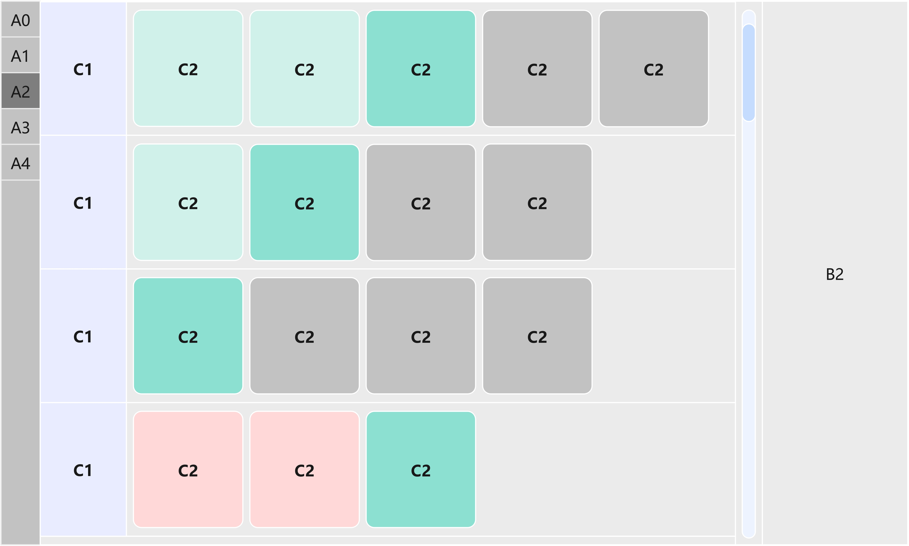
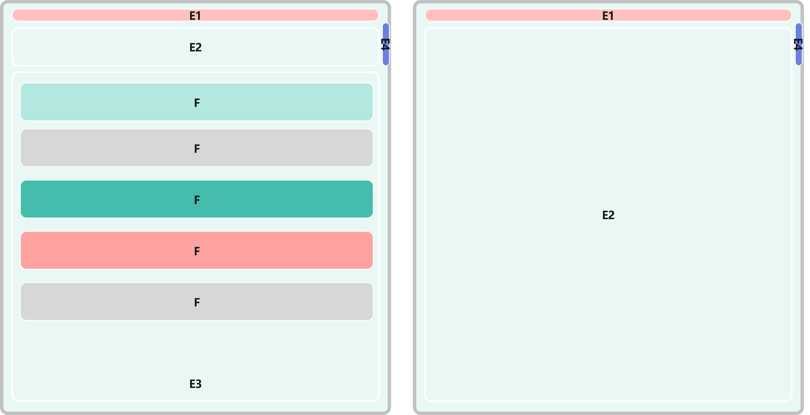
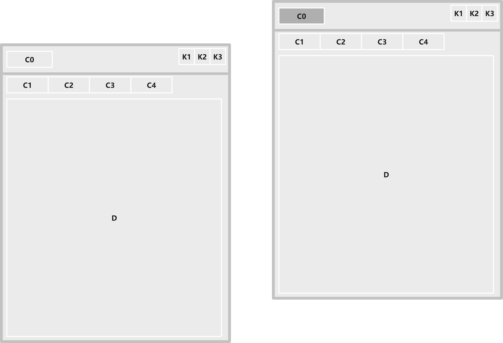
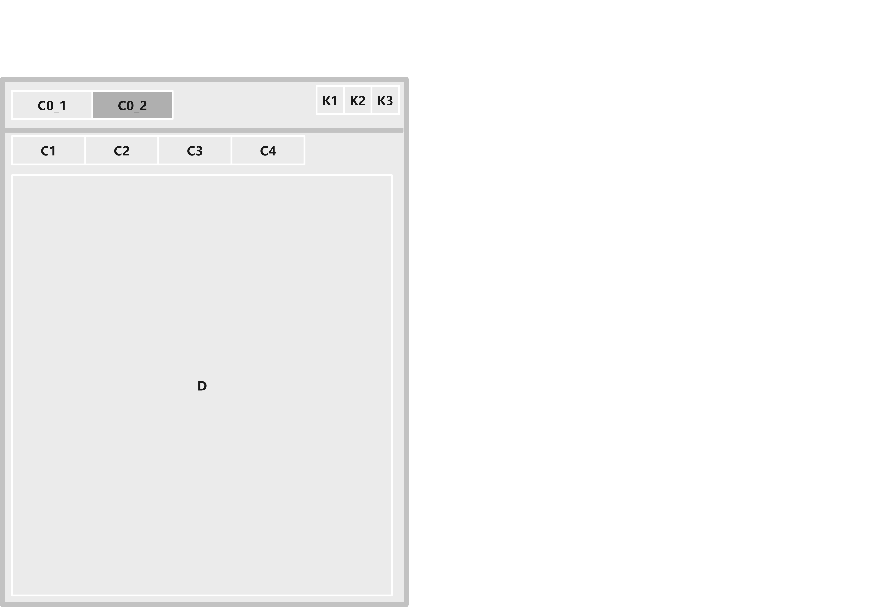
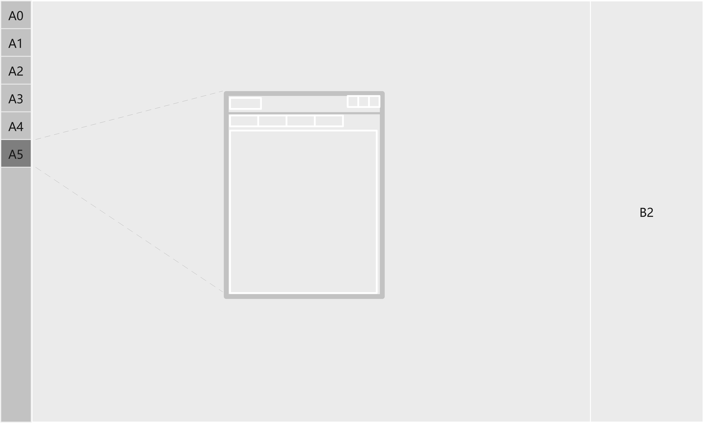

# 界面基础说明


图注：默认界面示意图，其中元素`A`为控制边栏，元素`B1`为主要工作区，元素`B2`为次要工作区


## A 控制边栏-说明


图注：控制边栏元素排列示意图。控制边栏中的元素以图标形式呈现，纵向排列。


**简介：**


控制边栏位于界面左侧，其中元素纵向排列。


**元素含义**：

元素`A0`表示菜单，**包含所有功能选项**（一些功能已经默认添加至控制边栏中，如`A1-A4`。其他不在控制边栏中直接显示的功能依然可以在控制边栏-菜单中找到），需要预留元素`A0`拓展空间。

元素`A1`表示 `Task State` ，含义是任务状态；

元素`A2`表示 `Stage State` ，含义是阶段状态；

元素`A3`表示 `Agent State` ，含义是Agent状态；

元素`A4`表示 `Step State` ，含义是步骤状态；


**呈现方式：**

元素`A0-A4`均默认以图标（具体图标暂未确定）的形式呈现。

鼠标悬停在对应元素上时显示元素对应含义的文字说明，

例如：菜单、Task 任务状态、Stage 阶段状态、Agent 智能体状态、Step 步骤状态。


**功能：**

控制边栏的主要功能是为右侧主要工作区（`B1`）呈现不同层级的内容。

1.用户点击元素`A1-A4`时：右侧主要工作区（`B1`）则显示该元素对应层级状态的内容。

2.用户点击元素`A0`时：展开控制边栏-菜单总览的第一层级目录，点击在第一层级目录中某个元素时，展开对应的第二层级目录。示意图如下：


图注：控制边栏-菜单（`A0`）操作示意图。鼠标首先点击元素`A0`展开第一级目录`A0_1-A0_9`，随后点击元素`A0_4`，展开其对应的第二级目录并最终选择元素`A0_4_3`。


**特殊说明：**

控制边栏默认元素是`A0-A4`，是为了方便用户而预设的常用功能。然而**所有的功能都可以在元素`A0`控制边栏-菜单中找到**


## B1 主要工作区-说明

对于主要工作区的第一级元素（一般是元素`C`），我们努力将其所展示的子信息限制在3-4个元素以内，其余的完整信息，通过一个按钮可以单独展开。


### A1. 显示任务状态

当点击控制边栏-任务状态（元素`A1`）时，主要工作区`B1`展示MAS所有任务状态。


图注：Task状态展示。每个Task State以一个独立的元素容器`C`显示在主要工作区`B1`中


**简介：**

点击选择 控制边栏-任务状态（`A1`） 时 主要工作区（`B1`）呈现 Muti-Agent System 中全部任务状态信息。每个任务状态信息以一个单立的元素容器（`C`）呈现，默认以行列对齐排布。


**呈现方式：**

每一个任务状态的元素容器`C`所包含的具体内容如下：


图注：任务状态示意图。展示一个任务状态时，在元素容器`C`中所包含的内容。其中C1展示任务状态，C2展示任务名称，C3展示任务阶段完成情况，C4展示任务群组中所有Agent的状态。C5为固定按钮，点击弹出Task完整信息。


**数据来源：**

任务状态的数据来源通过接口：

```python
GET /api/states?type=task
```

返回格式：

```python
{
    "StateID_1": { "task_id": "...", "task_name": "...", ... },
    "StateID_2": { ... },
    ...
}
```

返回字典，每个键值对代表一条任务状态。

任务状态的详细属性同样以字典的形式包含在内。


#### C1 任务状态

元素`C1`表示任务执行状态，包含（"init"、"running"、"finished"、"failed"）

**呈现方式：**

填充字符串，"init"、"running"、"finished"、"failed"

并显示对应颜色，init 灰色，running 黄色，finished 绿色，failed 红色

**数据来源：**

获取任务状态 `execution_state (str)` 字段内容；

**交互功能：**

鼠标悬停时显示原始字段值：init、running、finished、failed


#### C2 任务名称

元素`C2`表示任务名称。一个任务简介的名称，向人类使用者提供基本的信息区分。

**呈现方式：**

填充字符串

**数据来源：**

获取任务状态 `task_name (str)` 字段内容；

**交互功能：**

允许复制字符串内容


#### C3 任务阶段

元素`C3`用于展示任务中所有阶段，每一个阶段用一个元素`D`表示

**呈现方式：**

元素`C3`中将该任务下的每个阶段都以一个方块（元素`D`）的形式呈现，方块中不显示文字，方块颜色随着阶段的`execution_state`字段变化：init 灰色，running 深绿色，finished 浅绿色，failed 红色

方块从左往右对应获取字段的列表的顺序（该任务下的第一个阶段在最左侧，最后一个阶段在最右侧）

**数据来源：**

获取任务状态中 `stage_list (list[Dict[str,str]])` 字段内容；

字段值为一个记录了多个阶段Stage的列表，列表中的每个Stage以字典形式表示：

```python
{
    "stage_id": str,
    "stage_intention": str,
    "execution_state": str,
}
```

**交互功能：**

对于元素`D`：

鼠标悬停时显示对应的`stage_intention`字段值


#### C4 任务群组

元素`C4`展示任务群组，包含参与这个任务的所有Agent，每个Agent以一个独立的元素方框`E`表示。
其中任务管理Agent比较特殊，需要突出描边标明，一般放在左上角第一位置。

**呈现方式：**

元素`C5`中将该任务群组的每个Agent都以一个方块（元素`E`）的形式呈现。

方块中不显示文字，方块颜色随着Agent的状态变化：
idle 灰色，working 绿色，waiting 黄色

管理Agent用特殊描边标明。

**数据来源：**

- 直接获取：

获取 `task_group (list[str])` 字段内容，为所有Agent的agent_id。

获取 `task_manager (str)` 字段内容，为管理Agent的agent_id。需要为对应的元素进行特殊标明。

- 间接获取：

在获取了所有Agent的agent_id后，如何知晓Agent的状态以填充元素方块`E`和`E_0`的颜色呢？

目前后端并未直接提供根据`agent_id`查询Agent的`working_state`的接口，但是查询Agent状态的API包含了Agent的全部信息：

```python
GET /api/states?type=agent
```

返回MAS中所有Agent的状态：

```
{
    "StateID_1": { "working_state": "...", "role": "...", "name": "...",  ...  },
    "StateID_2": { "working_state": "...",  ...  },
    ...
}
```

**交互功能：**

鼠标悬停在元素`E`时，显示该Agent对应的角色和名字：`[<role>] <name>`，例如`[工程师]小白`


#### C5 显示完整信息

元素`C5`作为一个固定按钮用于弹出该任务完整信息的窗口

**呈现方式：**

红色竖向长条状色块

**数据来源：**

/

**交互功能：**

鼠标悬停时显示”完整信息“字样

鼠标点击元素`C5`时弹出完整Task信息，[T1 Task完整信息](#Task)


------

### A2. 显示阶段状态

当点击控制边栏-阶段状态（元素`A2`）时，主要工作区`B1`展示MAS所有阶段状态。




图注：Stage状态展示。每个Stage State以一个独立的元素容器`C2`显示在主要工作区`B1`中。同属于相同任务的Stage State阶段状态排列在一行；该行的最左侧有该任务的基本信息展示（元素`C1`）。

**简介：**

点击选择 控制边栏-阶段状态（`A2`） 时 主要工作区（`B1`）呈现 Muti-Agent System 中全部阶段状态信息。属于同意一个任务的阶段信息排列在同一行中，每个阶段信息以一个单独的元素容器（`C2`）呈现，该行的最左侧展示该任务状态基本信息。


**呈现方式：**

每一行最左侧的任务基本信息的元素容器`C1`所包含的具体内容如下：


图注：阶段状态展示中左侧任务信息（`C1`）示意图。其中`D1`用于展示任务状态，`D2`用于展示任务名称`task_name`，`D3`用于展示任务意图`task_intention`。`D4`为固定按钮，用于打开显示该任务完整信息的窗口。


每一行中，每一个阶段状态的元素容器`C2`所包含的具体内容如下：

图注：阶段状态展示中每一个阶段信息的示意图。Stage状态展示中的元素`C2`表示一个阶段。其中`E1`用来展示阶段状态，`E2`用于展示阶段意图`stage_intention`，`E3`用于展示阶段中Agent协作情况：其中每个Agent使用一个独立元素`F`表示。`E4`为一个固定按钮，用于展开该阶段的详细信息。

**数据来源：**

- 直接获取：

任务状态的数据来源通过接口：

```python
GET /api/states?type=stage
```

返回格式：

```python
{
    "StateID_1": { "task_id": "...", "stage_id": "...", ... },
    "StateID_2": { ... },
    ...
}
```

返回字典，每个键值对代表一条阶段状态。

阶段状态的详细属性同样以字典的形式包含在内。

- 间接获取：

对于需要展示的Agent信息与Task信息，可以通过调用接口进行筛选：

```
GET /api/states?type=task
GET /api/states?type=agent
```


**交互形式（特殊功能！！）：**

关于阶段状态反映在颜色上：

当打开这个界面时，元素容器`C2`默认为一个**不显示内容的纯色色块**，**颜色与`C2`中的`E1`保持一致**。当用户鼠标经过`C2`容器时，`C2`容器才从一个纯色色块，变为显示内部的`E1,E2,E3`元素内容。显示详细内部元素内容时，`C2`容器背景颜色变为非常浅的绿色。

（`C2`容器状态的改变，如果能用卡片翻面的效果就好了）

如果用户鼠标从`C2`上移开后30秒，该`C2`元素则从展示详细`E1,E2,E3`内容恢复为一个纯色色块。


图注：C2元素从默认状态只显示色块，变为活跃状态展示内部详细元素。触发条件：用户鼠标经过则触发30秒的活跃状态。


#### D1 任务状态

在Stage状态展示中，左`C1`元素中的`D1`用于表示该任务状态

**呈现方式：**

纯色色块（状态指示灯），init 灰色，finished 绿色，running 黄色，failed 红色

**数据来源：**

已知任务ID `task_id`；

查找对应任务状态 `execution_state (str)` 字段内容；

**交互功能：**

鼠标悬停时显示原始字段值：init , finished , running , failed


#### D2 任务名称

`C1`中元素`D2`表示任务名称。个任务简介的名称，向人类使用者提供基本的信息区分。

**呈现方式：**

填充字符串

**数据来源：**

已知任务ID `task_id`；

查找对应任务状态 `task_name (str)` 字段内容；

**交互功能：**

允许复制字符串内容


#### D3 任务意图

`C1`中元素`D3`表示任务意图，较为详细的任务目标说明

**呈现方式：**

填充字符串

**数据来源：**

已知任务ID `task_id`；

获取 `task_intention (str)` 字段内容；

**交互功能：**

允许复制字符串内容


#### D4 显示完整信息

元素`D4`作为一个固定按钮用于弹出该任务完整信息的窗口

**呈现方式：**

红色竖向长条状色块

**数据来源：**

/

**交互功能：**

鼠标悬停时显示”完整信息“字样

鼠标点击元素`D4`时弹出完整Task信息，[T1 Task完整信息](#Task)


#### E1 阶段状态

在Stage状态展示中，右`C2`元素中的`E1`用于表示该阶段状态

**呈现方式：**

纯色色块（状态指示灯），init 灰色，finished 绿色，running 黄色，failed 红色

**数据来源：**

已知阶段ID `stage_id`；

查找对应任务状态 `execution_state (str)` 字段内容；

**交互功能：**

鼠标悬停时显示原始字段值：init , finished , running , failed


#### E2 阶段意图

元素`E2`展示阶段的意图，是较为详细的阶段目标

**呈现方式：**

字符串填充

**数据来源：**

获取对应阶段状态 `stage_intention (str)` 字段内容；

**交互功能：**

鼠标点击时显示完整字段值，点击其他地方关闭完整内容的展开。



图注：鼠标点击`E2`时，展开`E2`信息向下到覆盖整个容器（`C2`）


#### E3 Agent协作情况

`E3`表示Agent协作情况

在`E3`中，每一行用一个元素`F`表示一个Agent信息

**呈现方式：**

元素`F`纵向排列与`E3`内：

`F`的颜色取决于该Agent的状态（**Agent在这个阶段的状态，不是全局状态**）：idle 灰色，working 黄色，finished 绿色，failed 红色

`F`填充Agent角色和姓名组合而成的字符串：

```python
[<role>] <name>
```

例如： [工程师] 小白

**数据来源：**

- 直接获取

Agent被分配阶段目标：

获取 `agent_allocation (Dict[<agent_id>, <agent_stage_goal>])` 字段内容；阶段中Agent的分配情况，key为Agent ID，value为Agent在这个阶段职责的详细说明。

Agent阶段工作状态：

获取 `every_agent_state (Dict[<agent_id>, <agent_state>])` 字段内容；包含：idle 空闲，working 工作中，finished 已完成，failed 失败（agent没能完成阶段目标）。这里的状态是指Agent在这个阶段的状态，不是全局状态。

- 间接获取

已知agent_id；

则可以筛选获得agent的`role`字段和`name`字段内容

```python
GET /api/states?type=agent
```

**交互功能：**

`E3`中鼠标点击`F`时展开`F1`的详细信息，点击其他地方关闭详细信息的展开：


图注：鼠标点击`F`时展开对应的`F1`的详细信息，显示对应Agent被分配的阶段目标。

**呈现方式：**

`F1`填充该Agent被分配的阶段目标的字符串

**数据来源：**

Agent被分配阶段目标：

获取 `agent_allocation (Dict[<agent_id>, <agent_stage_goal>])` 字段内容；阶段中Agent的分配情况，key为Agent ID，value为Agent被分配的阶段目标。


#### E4 显示完整信息

元素`E4`作为一个固定按钮用于弹出该任务完整信息的窗口

**呈现方式：**

紫色竖向长条状色块

**数据来源：**

/

**交互功能：**

鼠标悬停时显示”完整信息“字样

鼠标点击元素`E4`时弹出完整Stage信息，[T2 Stage完整信息](#Stage)


------

### A3 显示Agent状态

当点击控制边栏-Agent状态（元素`A3`）时，主要工作区`B1`展示MAS所有Agent的状态。


图注：Agent状态展示。每个Agent State以一个独立的元素容器`C`显示在主要工作区`B1`中。容器`C`的背景色保持和工作区背景一致，避免干扰到其内部信息展示。


**简介：**

点击选择 控制边栏-Agent状态（`A3`） 是 主要工作区（`B1`）呈现 Muti-Agent System 中全部Agent状态信息。每个Agent信息以一个单独的元素容器（`C`）呈现


**呈现方式：**

每个元素容器`C`所包含的具体内容如下：


图注：Agent状态容器内容图。其中`C1`展示Agent状态，`C2`展示Agent名字和角色，`C3`展示Agent的执行步骤。`C4`为固定按钮点击弹出Agent完整信息的窗口。

**数据来源：**

任务状态的数据来源通过接口：

```python
GET /api/states?type=agent
```

返回格式：

```python
{
    "StateID_1": { "working_state": "...", "name": "...", ... },
    "StateID_2": { ... },
    ...
}
```

返回字典，每个键值对代表一条Agent状态。

Agent状态的详细属性同样以字典的形式包含在内。


#### C1 Agent状态

元素`C1`展示Agent状态

**呈现方式：**

纯色色块（状态指示灯），idle 灰色，working 绿色，waiting 黄色

**数据来源：**

获取Agent状态 `working_state (str)` 字段内容；

**交互功能：**

鼠标悬停时显示原始字段值：idle , working , waiting


#### C2 Agent角色与名字

元素`C2`展示Agent名字和Agent角色

**呈现方式：**

字符串填充，填充内容：

```markdown
[<role>] <name>
```

例如：[工程师]小灰

**数据来源：**

Agent角色 role：从Agent状态中获取 `role (str)` 字段
Agent名字 name：从Agent状态中获取 `name (str)` 字段

**交互功能：**

鼠标点击`C2`时展开显示详细信息，点击其他地方时取消展开：

------


图注：鼠标点击`C2`时展开显示详细信息，展开后元素`C2_1`填满整个Agent容器`C`

**呈现方式：**

字符串填充，填充内容：

```markdown
[<role>] <name>

<profile>
```

**数据来源：**

Agent角色 role：从Agent状态中获取 `role (str)` 字段
Agent名字 name：从Agent状态中获取 `name (str)` 字段
Agent简介 profile：从Agent状态中获取 `profile (str)` 字段

**交互功能：**

允许复制


#### C3 Agent步骤

元素`C3`展示Agent的具体执行步骤，每一个元素`D`都表示一个步骤状态Step State

**呈现方式：**

在元素`C3`中展示所有的AgentStep，每个Step以一个纯色方块呈现, Step的颜色反映其执行状态`execution_state`：init 灰色 ，pending 黄色， running 深绿色，finished 浅绿色，failed 红色。

所有Step按照`todo_list`的顺序从左到右，从上到下依次排列。


**数据来源：**

AgentStep顺序：从Agent状态中获取 `todo_list (List[str])` 字段

获取到由`step_id`组成的顺序列表。Agent执行顺序由`todo_list`决定，`step_list`只负责记录内容，不负责记录顺序。


AgentStep内容：从Agent状态中获取 `step_list (List[Dict[str,str]])` 字段

由列表装载的Step基础内容（字典形式）：

```python
{
    "step_id": str,
    "step_intention": str,
    "execution_state": str,
}
```

`execution_state`决定`C3`中元素`D`的颜色；

`step_intention`提供鼠标悬停展开的详细信息。

**交互功能：**

鼠标悬停在元素`D`时，显示元素`D`对应步骤的意图（`step_intention`内容）。

鼠标点击元素`D`时，弹出完整Step信息[T4 Step完整信息](#Step)


#### C4 显示完整信息

元素`C4`作为一个固定按钮用于弹出该Agent完整信息的窗口

**呈现方式：**

紫色竖向长条状色块

**数据来源：**

/

**交互功能：**

鼠标悬停时显示”完整信息“字样

鼠标点击元素`C4`时弹出完整Agent信息[T3 Agent完整信息](#Agent)


------

### A4 显示步骤状态

当点击控制边栏-步骤状态（元素`A4`）时，主要工作区`B1`展示MAS所有步骤的状态。


图注：Step状态展示。每个Step State以一个独立的元素容器`C2`显示在主要工作区`B1`中。同属于相同Agent的Step State步骤状态排列在一行；该行的最左侧有该Agent的基本信息展示（元素`C1`）。

**简介：**

点击选择 控制边栏-步骤状态（`A4`） 时 主要工作区（`B1`）呈现 Muti-Agent System 中全部步骤状态信息。属于同一个Agent的步骤信息排列在同一行中，每个步骤信息以一个单独的元素容器（`C2`）呈现，该行的最左侧展示该Agent状态基本信息。


**呈现方式：**

每一行最左侧的Agent基本信息的元素容器`C1`所包含的具体内容如下：


图注：元素`C1`展示Agent信息。其中`D1`展示Agent状态，`D2`展示Agent角色与名称。`D3`为固定按钮，点击弹出Agent详细信息。


每一行右侧的Step步骤元素容器`C2`所包含的具体内容如下：


图注：步骤状态详细内容。左侧为一个步骤状态（`C2`）默认形式，右侧为该步骤状态的活跃形式（用户鼠标扫过则活跃一定时间）。其中`C2`活跃状态显示：`E1`展示Step状态，`E2`展示Step类别，`E3`展示Step步骤意图。`E4`为固定按钮，点击则弹出该步骤的详细信息弹窗。


**数据来源：**

- 直接获取：

任务状态的数据来源通过接口：

```python
GET /api/states?type=step
```

返回格式：

```python
{
    "StateID_1": { "task_id": "...", "stage_id": "...", ... },
    "StateID_2": { ... },
    ...
}
```

返回字典，每个键值对代表一条步骤状态。

步骤状态的详细属性同样以字典的形式包含在内。

- 间接获取：

对于需要展示的Agent信息，可以通过调用接口进行筛选：

```
GET /api/states?type=agent
```


**交互形式（特殊功能！！）：**

关于阶段状态反映在颜色上：

当打开这个界面时，元素容器`C2`默认为一个**不显示内容的纯色色块**，**颜色与`C2`中的`E1`保持一致**。当用户鼠标经过`C2`容器时，`C2`容器才从一个纯色色块，变为显示内部的`E1,E2,E3...`元素内容。显示详细内部元素内容时，`C2`容器背景颜色变为非常浅的绿色

如果用户鼠标从`C2`上移开后30秒，该`C2`元素则从展示详细内容恢复为一个纯色色块。

（容器转变到活跃状态，如果能用卡片翻面的效果就好了）


#### D1 Agent状态

元素`D1`展示Agent状态

**呈现方式：**

纯色色块（状态指示灯），idle 灰色，working 绿色，waiting 黄色

**数据来源：**

- 间接获取

已知Agent ID：

获取对应Agent状态 `working_state (str)` 字段内容；

**交互功能：**

鼠标悬停时显示原始字段值：idle , working , waiting


#### D2 Agent角色与名字

元素`D2`展示Agent名字和Agent角色

**呈现方式：**

字符串填充，填充内容：

```markdown
[<role>] <name>
```

例如：[工程师]小灰

**数据来源：**

- 间接获取

已知Agent ID：

Agent角色 role：从Agent状态中获取 `role (str)` 字段
Agent名字 name：从Agent状态中获取 `name (str)` 字段

**交互功能：**

/


#### D3 显示完整信息

元素`D3`作为一个固定按钮用于弹出该Agent完整信息的窗口

**呈现方式：**

紫色竖向长条状色块

**数据来源：**

/

**交互功能：**

鼠标悬停时显示”完整信息“字样

鼠标点击元素`D3`时弹出完整Agent信息[T3 Agent完整信息](#Agent)


#### E1 步骤状态

在Step步骤状态展示中，右`C2`元素中的`E1`用于表示该步骤状态

**呈现方式：**

纯色色块（状态指示灯），init 灰色，finished 浅绿色，running 深绿色，pending 黄色，failed 红色

**数据来源：**

查找对应步骤状态 `execution_state (str)` 字段内容；

**交互功能：**

鼠标悬停时显示原始字段值：init , finished , running , pending , failed


#### E2 步骤类型和执行器

元素`E2`展示Step的类型和执行器

**呈现方式：**

字符串填充，填充内容：

```markdown
[<type>] <executor>
```

例如：[skill] planning，[tool] google_research

其中，如果`<type>`是技能skill则 ”skill“ 用绿色字体；如果是工具tool 则 ”tool“ 用蓝色字体

**数据来源：**

Step类型 type：从步骤状态中获取 `type (str)` 字段
Step执行器 executor：从步骤状态中获取 `executor (str)` 字段

**交互功能：**

/


#### E3 步骤意图

元素`E3`展示步骤的意图，是较为详细的步骤说明

**呈现方式：**

字符串填充

**数据来源：**

获取对应步骤状态 `step_intention (str)` 字段内容；

**交互功能：**

允许复制


#### E4 显示完整信息

元素`E4`作为一个固定按钮用于弹出该Step完整信息的窗口

**呈现方式：**

紫色竖向长条状色块

**数据来源：**

/

**交互功能：**

鼠标悬停时显示”完整信息“字样

鼠标点击元素`E4`时弹出完整Step信息[T4 Step完整信息](#Step)


## B2 次要工作区-说明（TODO 暂未实现）

次要工作区的目的可能是在主要工作区监控状态的同时依然能够操作人类操作端发起与Agent的对话，以干涉/协作/影响任务进行。

**TODO：人类操作端暂未实现，次要工作区暂时占位**


## T 状态弹窗-说明


### 窗口通用功能说明

在许多场合下，点击元素会弹出其代表状态的完整信息的弹窗。本小节介绍弹窗的具体内容。

以下内容均在主要工作区`B1`以独立容器窗口（弹窗）的形式呈现。这里首先介绍完整信息窗台**弹窗的通用功能**：


图注：完整信息弹窗。其中`C0`表示该弹窗展示的状态类别，`K1`,`K2`,`K3`为窗口功能按钮。`C1`,`C2`,`C3`,`C4`等为内容栏`D`的选项，选择不同的`C1-C4`按钮，则元素`D`呈现相应不同的内容。

关于`C1-C4`与`D`的说明，会在各种不同的状态小节中详细介绍，每种状态需要呈现的`C1-C4`与`D`内容各异。


#### C0 状态类别与多个窗口合并

**呈现方式：**

元素`C0`用于标明该窗口显示的是什么类别的状态，填充字符串：

Task，Stage，Agent，Step

**交互功能：**

当有多个相同属性的窗口时，（例如都是Task，或都是Agent）。则可以进行窗口合并。

具体方式：拖拽元素`C0`到目标窗口的上边栏。



图注：窗口合并。按住起始窗口的元素`C0`


图注：窗口合并。拖拽起始窗口的元素`C0`到目标窗口的元素`C0`附近



图注：窗口合并。合并成功后，可以在一个窗口中切换不同的内容。


#### K1 窗口最小化

点击窗口的`K1`元素实现将窗口最小化到左侧控制边栏。




#### K2 窗口固定

点击窗口的`K2`元素则固定窗口位置，想要拖拽拉伸该窗口必须在此点击`K2`元素解锁后才可操作


#### K3 关闭窗口

点击窗口`K3`元素则关闭窗口


------

<a id="Task"></a>

### T1 Task完整信息


#### C1 属性

在`C1`属性一栏时元素`D`展示：

- task_id：任务ID
- task_name：一个任务简介的名称
- task_intention：任务意图
- task_manager：任务管理者Agent ID
- task_group：任务群组，包含所有参与这个任务的Agent ID


图注：`Task-C1`执行一栏呈现两个元素，`D1`元素文字展示Task基本信息，`D2`元素展示参与任务的Agent。

**呈现方式：**

- 元素`D1`

task_id，task_name，task_intention 在元素`D1`中集中显示，以字符串形式呈现。

```markdown
Task ID: <task_id>
Task Name: <task_name>
Task Intention: 
<task_intention>
```

- 元素`D2`

task_manager，task_group在元素`D2`中展示。

任务群组task_group获取到包含agent_id的列表。该任务群组的每个Agent都以一个块（元素`E`）的形式呈现。管理Agent用特殊描边标明。

方块上显示文字：

```markdown
[<role>] <name>
```

方块颜色随着Agent的状态（`working_state`）变化：idle 灰色，working 浅绿色，waiting 浅黄色


**数据来源：**

- 直接获取

直接调用Task状态查询API获取task详细信息

- 间接获取

已知`agent_id`，调用Agent状态查询API获取agent详细信息


**交互功能：**

元素`D1`允许复制

鼠标双击元素`E`时弹出对应完整Agent信息[T4 Agent完整信息](#Agent)


#### C2 执行

选择`C2`执行一栏中元素`D`展示：

- execution_state 当前任务的执行状态，"init"、"running"、"finished"、"failed"
- stage_list 当前任务下所有阶段的列表
- task_summary 任务完成后的总结


图注：`Task-C2`执行一栏展示两个元素。D1元素展示任务下的阶段情况，D2元素文字展示任务状态和任务总结。

**呈现方式：**

- 元素`D1`

展示`stage_list`（包含stage_id的列表）所对应的阶段，每个阶段（元素`E`）默认以竖条纯色条展示，颜色取决于对应阶段的`execution_state`：init 灰色，running 深绿色，finished 浅绿色，failed 红色。

当鼠标停留在元素`E`上时，该元素展开，并文字显示对应阶段的`stage_intention`阶段意图字段内容。


- 元素`D2`

文字展示 execution_state 和 task_summary  内容：

```markdown
Execution State: <execution_state>
Task Summary:
<task_summary>
```


**数据来源：**

- 直接获取

直接调用Task状态查询API获取task详细信息

- 间接获取

已知`stage_id`，调用Stage状态查询API获取stage详细信息

**交互功能：**

当鼠标停留在元素`E`上时，该元素展开，并文字显示对应阶段的`stage_intention`阶段意图字段内容。

鼠标双击元素`E`时弹出对应完整Stage信息[T2 Stage完整信息](#Stage)


#### C3 通讯

选择`C3`执行一栏中元素`D`展示：

- communication_queue 当前未分发消息的通讯队列

- shared_message_pool 任务群组共享消息池


图注：`Task-C3`通讯一栏展示两个元素。`D1`展示任务下还未被分发的通讯数量，`D`呈现全部共享消息池内容。

**呈现方式：**

元素`D1`：

元素`D1`为元素`D`右上角的一个固定位置，当元素`D`页面上下滑动时，依然不改变`D1`位置。用于展示`communication_queue`字段内容，填充字符串。


元素`D`：

shared_message_pool 内容 是一个包含字典的列表，每个字典代表一条消息：

```python
{"agent_id": str,
 "role": str,
 "stage_id": str,
 "content": str，}
```

在元素`D`中文字展示 shared_message_pool  内容：

```markdown
[<role>] <name> | <content>
[<role>] <name> | <content>
...
```

**数据来源：**

- 直接获取

直接调用Task状态查询API获取task详细信息

- 间接获取

已知`agent_id`，调用Agent状态查询API获取agent详细信息

**交互功能：**

允许复制


------

<a id="Stage"></a>

### T2 Stage完整信息


#### C1 属性

选择`C1`属性一栏时，元素`D`展示：

- task_id
- stage_id

- execution_state 阶段的执行状态
- stage_intention 阶段意图


图注：`Stage-C1`属性一栏展示一个元素。呈现阶段执行状态和阶段意图的文本信息。

**呈现方式：**

task_id，stage_id，execution_state ，stage_intention 在元素`D`中集中显示，以字符串形式呈现。

```markdown
Task ID: <task_id>
Stage ID: <stage_id>
Execution State: <execution_state>
Stage Intention: 
<stage_intention>
```

**数据来源：**

直接调用Stage状态查询API获取stage详细信息

**交互功能：**

允许复制


#### C2 协作

选择`C2`属性一栏时，元素`D`展示：

- every_agent_state  (Dict[<agent_id>, <agent_state>])：

  涉及到的每个Agent在这个阶段的状态

- agent_allocation (Dict[<agent_id>, <agent_stage_goal>]：

  阶段中Agent的分配情况，key为Agent ID，value为Agent在这个阶段职责的详细说明。


图注：`Stage-C2`协作一栏展示两种。每一行代表一个Agent，`D1`展示Agent在这个阶段的状态（不是Agent自身状态），`D2`提供Agent协作目标的文本说明。

**呈现方式：**

在`D`中每一行代表一个Agent，其中左侧`D1`为Agent状态指示灯，`D2`为展示该Agent协作目标文本说明。


元素`D1`为竖状长条指示灯，**表示这个阶段的状态，不是全局状态**。颜色随着`every_agent_state`变化：idle 灰色，working 黄色，finished 绿色，failed 红色

元素`D2`文本展示Agent的角色，名字，和其被分配的Agent目标（agent_allocation字典以<agent_id>为key，以<agent_stage_goal>为value）：

```markdown
[<role>] <name> ： <agent_stage_goal>
```

**数据来源：**

- 直接获取

直接调用Stage状态查询API获取stage详细信息

- 间接获取

已知`agent_id`，调用Agent状态查询API获取agent详细信息

**交互功能：**

`D2`允许复制

鼠标双击元素`D1`时弹出对应完整Agent信息[T3 Agent完整信息](#Agent)


#### C3 总结

选择`C3`属性一栏时，元素`D`展示：

- completion_summary (Dict[<agent_id>, <completion_summary>]): 

  阶段中每个Agent的完成情况


图注：`Stage-C3`协作一栏展示两种。每一行代表一个Agent，`D1`展示Agent在这个阶段的状态（不是Agent自身状态），`D2`提供Agent在这个阶段的完成目标的总结。

**呈现方式：**

在`D`中每一行代表一个Agent，其中左侧`D1`为Agent状态指示灯，`D2`为展示该Agent完成目标总结的文本说明


元素`D1`为竖状长条指示灯，**表示这个阶段的状态，不是全局状态**。颜色随着`every_agent_state`变化：idle 灰色，working 黄色，finished 绿色，failed 红色

元素`D2`文本展示Agent的角色，名字，和其被分配的Agent目标（completion_summary字典以<agent_id>为key，以<completion_summary>为value）：

```markdown
[<role>] <name> ： <completion_summary>
```

**数据来源：**

- 直接获取

直接调用Stage状态查询API获取stage详细信息

- 间接获取

已知`agent_id`，调用Agent状态查询API获取agent详细信息

**交互功能：**

`D2`允许复制

鼠标双击元素`D1`时弹出对应完整Agent信息[T3 Agent完整信息](#Agent)


------

<a id="Agent"></a>

### T3 Agent完整信息


#### C1 属性

选择`C1`属性一栏时，元素`D`展示：

- agent_id 唯一标识符
- name 名称
- role 角色
- profile 角色简介
- working_state 当前工作状态


图注：`Agent-C1`属性一栏展示两个元素。`D1`展示Agent自身状态，`D`呈现Agent角色，名称，简介等信息

**呈现方式：**

元素`D1`：

一个固定条状指示灯，颜色随`working_state` 变化：idle 灰色, working 绿色, waiting 黄色

元素`D`：

agent_id ，name ，role ，profile 在元素`D`中集中显示，以字符串形式呈现。

```markdown
Agent ID: <agent_id>
Name: <name >
Role: <role >
Profile: 
<profile >
```

**数据来源：**

直接调用Agent状态查询API获取agent详细信息

**交互功能：**

允许复制


#### C2 执行

选择`C2`执行一栏时，元素`D`展示：

- agent_step  执行步骤：

  ```python
  "agent_step":{
  	"step_list": List[Dict] # 包含多个步骤的列表，每个步骤以字典形式存储信息
  	"todo_list": List(str) # 包含step_id的顺序列表
  }
  ```

  其中step_list中每个步骤字典内容：

  ```python
  {
      "step_id": str,
      "step_intention": str,
      "execution_state": str,
  }
  ```

  


图注：`Agent-C2`执行一栏展示一个元素`D`。`D`中展示每个步骤的信息，每个步骤为一个元素`E`。

**呈现方式：**

每一个元素`E`代表一个步骤，其颜色随步骤的`execution_state`变化：init 灰色，pending 黄色，running 深绿色，finished 绿色，failed 红色


同时元素`E`填充字符串：

```
任务名称 [步骤类型] 步骤执行对象
Step Intention: 步骤意图
```

```markdown
<task_name>[<type>]<executor>
Step Intention: <step_intention>
```

**数据来源：**

- 直接获取

直接调用Agent状态查询API获取agent详细信息

- 间接获取

已知 `step_id` 调用Step状态查询API获取step详细信息

已知 `task_id` 调用Task状态查询API获取task详细信息

**交互功能：**

允许复制

双击元素`E`时弹出对应完整Step信息[T4 Step完整信息](#Step)


#### C3 任务

选择`C3`任务一栏时，元素`D`展示：

- working_memory 参与的任务与阶段

  ```python
  {<task_id>: {<stage_id>: [<step_id>,...],...},...}
  ```


图注：`Agent-C3`任务一栏展示两种元素`D1`和`E`。展示Agent参与的任务和任务下的阶段。`D1`展示任务信息，`E`展示该任务下的阶段。

**呈现方式：**

`working_memory` 表示该Agent参与哪些任务中的哪些阶段。其涉及到的每个任务都以一个元素`D1`表示，`D1`背景色为蓝紫色，显示`task_name`信息。

`D1`的右侧为该任务下**所有的阶段**，每个阶段用元素`E`表示。其中有本Agent参与的阶段（在`working_memory`中的阶段）使用绿色填充，其余没有本Agent参与的阶段均用灰色填充。

鼠标停留在元素`E`时`E`横向展开显示该阶段的阶段意图`stage_intention`内容；鼠标移开则恢复缩略状态。


**数据来源：**

- 直接获取

直接调用Agent状态查询API获取agent详细信息

- 间接获取

已知 `task_id` 调用Task状态查询API获取task详细信息

已知 `stage_id` 调用Stage状态查询API获取stage详细信息

**交互功能：**

允许复制

鼠标停留在元素`E`时`E`横向展开显示该阶段的阶段意图`stage_intention`内容

双击元素`E`时弹出对应完整Stage信息[T2 Stage完整信息](#Stage)

双击元素`D1`时弹出对应完整Task信息[T1 Task完整信息](#Task)


#### C4 记忆

选择`C4`记忆一栏时，元素`D`展示：

- persistent_memory 永久持续性记忆


图注：`Agent-C4`记忆一栏展示一个`D`。展示Agent自身记录的持续性记忆

**呈现方式：**

直接将`persistent_memory`字段内容在元素`D`中显示，存在换行符等，可能需要进行md编译

```markdown
<persistent_memory>
```

**数据来源：**

直接调用Agent状态查询API获取agent详细信息

**交互功能：**

允许复制


#### C5 技能与工具

选择`C5`技能与工具一栏时，元素`D`展示：

- skills 可使用技能权限
- tools 可使用工具权限


图注：`Agent-C5`技能与工具一栏中展示两种元素`E1`和`E2`。左侧`E1`展示技能权限，一个`E1`代表一个技能；右侧`E2`展示工具权限，一个`E2`代表一个工具。

**呈现方式：**

`E1`和`E2`中直接显示技能与工具的名字，例如“planning”，“reflection”

`E1`技能呈浅绿色，`E2`呈浅蓝色

**数据来源：**

直接调用Agent状态查询API获取agent详细信息

**交互功能：**

双击元素`E1`或`E2`时弹出对应完整技能与工具信息[T5 技能与工具说明](#skill_and_tools)


------

<a id="Step"></a>


### T4 Step完整信息


#### C1 属性

选择`C1`属性一栏时，元素`D`展示：

- execution_state 步骤执行状态
- task_id 唯一标识符
- stage_id 唯一标识符
- agent_id 唯一标识符
- step_id 唯一标识符
- type 步骤类型
- executor 执行该步骤的对象
- step_intention 步骤的意图


图注：`Step-C1`属性一栏中展示两种元素`D1`和`D2`。`D1`为状态指示灯，`D2`展示步骤基本属性

**呈现方式：**

元素`E1`：

`E1`颜色由`execution_state`决定：init 灰色，finished 浅绿色，running 深绿色，pending 黄色，failed 红色

元素`E2`：

task_id ，stage_id ，agent_id ，step_id ，type ，executor ，step_intention在元素`D2`中集中显示，以字符串形式呈现。

```markdown
Task ID：<task_id>
Stage ID: <stage_id>
Agent ID: <agent_id>
Step ID: <step_id>
Type and Executor: [<type>] <executor>
Step Intention：
<step_intention>
```

**数据来源：**

直接调用Agent状态查询API获取agent详细信息

**交互功能：**

允许复制


#### C2 内容

选择`C2`内容一栏时，元素`D`展示：

- text_content 文本内容
- instruction_content 指令内容


图注：`Step-C2`内容一栏中展示一个元素`D`。其中展示步骤的文本内容和指令内容。

**呈现方式：**

字符串填充，需要markdown编译

text_content，insruction_content在元素`D`中集中显示，以字符串形式呈现。

```markdown
|---------Text content----------|
<text_content>
|-------Insruction content------|
<instruction_content>
```

**数据来源：**

直接调用Agent状态查询API获取agent详细信息

**交互功能：**

允许复制


#### C3 执行结果

选择`C3`执行结果一栏时，元素`D`展示：

- execute_result (Dict[str, Any])  用来记录LLM输出解析或工具返回的结果


图注：`Step-C3`执行结果一栏中展示一个元素`D`。其中展示步骤的执行结果。

**呈现方式：**

字符串填充

execute_result 在元素`D`中集中显示，以字符串形式呈现。

```markdown
<execute_result>
```

**数据来源：**

直接调用Agent状态查询API获取agent详细信息

**交互功能：**

允许复制


------

<a id="skill_and_tools"></a>

### T5 技能与工具说明（TODO：暂未实现）
