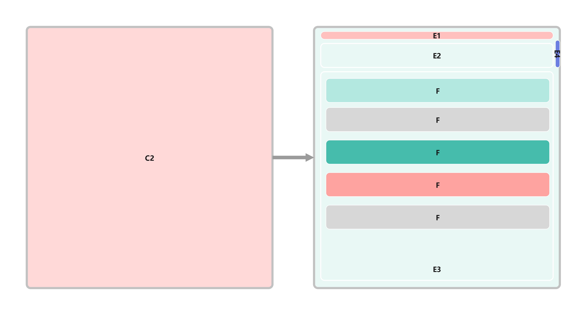
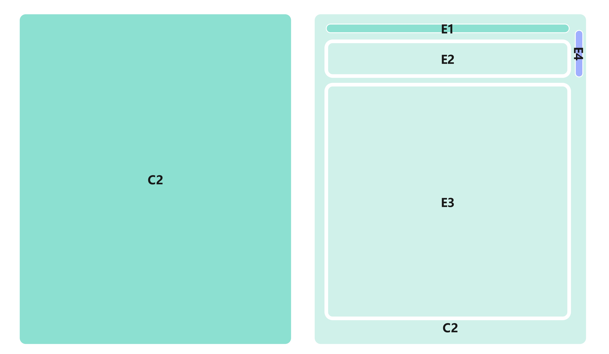
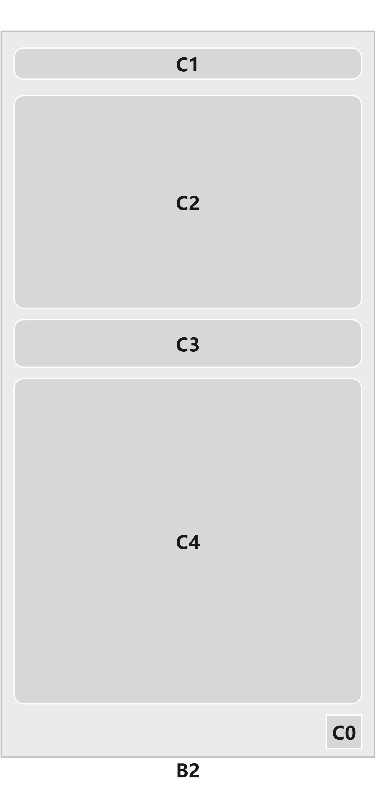

# 界面基础说明


图注：默认界面示意图，其中元素`A`为控制边栏，元素`B1`为主要工作区，元素`B2`为次要工作区


## A 控制边栏-说明


图注：控制边栏元素排列示意图。控制边栏中的元素以图标形式呈现，纵向排列。


**简介：**


控制边栏位于界面左侧，其中元素纵向排列。


**元素含义**：

元素`A0`表示菜单，**包含所有功能选项**（一些功能已经默认添加至控制边栏中，如`A1-A4`。其他不在控制边栏中直接显示的功能依然可以在控制边栏-菜单中找到），需要预留元素`A0`拓展空间。

元素`A1`表示 `Task State` ，含义是任务状态；

元素`A2`表示 `Stage State` ，含义是阶段状态；

元素`A3`表示 `Agent State` ，含义是Agent状态；

元素`A4`表示 `Step State` ，含义是步骤状态；


**呈现方式：**

元素`A0-A4`均默认以图标（具体图标暂未确定）的形式呈现。

鼠标悬停在对应元素上时显示元素对应含义的文字说明，

例如：菜单、Task 任务状态、Stage 阶段状态、Agent 智能体状态、Step 步骤状态。


**功能：**

控制边栏的主要功能是为右侧主要工作区（`B1`）呈现不同层级的内容。

1.用户点击元素`A1-A4`时：右侧主要工作区（`B1`）则显示该元素对应层级状态的内容。

2.用户点击元素`A0`时：展开控制边栏-菜单总览的第一层级目录，点击在第一层级目录中某个元素时，展开对应的第二层级目录。示意图如下：


图注：控制边栏-菜单（`A0`）操作示意图。鼠标首先点击元素`A0`展开第一级目录`A0_1-A0_9`，随后点击元素`A0_4`，展开其对应的第二级目录并最终选择元素`A0_4_3`。


**特殊说明：**

控制边栏默认元素是`A0-A4`，是为了方便用户而预设的常用功能。然而**所有的功能都可以在元素`A0`控制边栏-菜单中找到**


## B1 主要工作区-说明

对于主要工作区的第一级元素（一般是元素`C`），我们努力将其所展示的子信息限制在3-4个元素以内，其余的完整信息，通过一个按钮可以单独展开。


### A1. 显示任务状态

当点击控制边栏-任务状态（元素`A1`）时，主要工作区`B1`展示MAS所有任务状态。


图注：Task状态展示。每个Task State以一个独立的元素容器`C`显示在主要工作区`B1`中


**简介：**

点击选择 控制边栏-任务状态（`A1`） 时 主要工作区（`B1`）呈现 Muti-Agent System 中全部任务状态信息。每个任务状态信息以一个单立的元素容器（`C`）呈现，默认以行列对齐排布。


**呈现方式：**

每一个任务状态的元素容器`C`所包含的具体内容如下：


图注：任务状态示意图。展示一个任务状态时，在元素容器`C`中所包含的内容。其中C1展示任务状态，C2展示任务名称，C3展示任务阶段完成情况，C4展示任务群组中所有Agent的状态。C5为固定按钮，点击弹出Task完整信息。


**数据来源：**

任务状态的数据来源通过接口：

```python
GET /api/states?type=task
```

返回格式：

```python
{
    "StateID_1": { "task_id": "...", "task_name": "...", ... },
    "StateID_2": { ... },
    ...
}
```

返回字典，每个键值对代表一条任务状态。

任务状态的详细属性同样以字典的形式包含在内。


#### C1 任务状态

元素`C1`表示任务执行状态，包含（"init"、"running"、"finished"、"failed"）

**呈现方式：**

填充字符串，"init"、"running"、"finished"、"failed"

并显示对应颜色，init 灰色，running 黄色，finished 绿色，failed 红色

**数据来源：**

获取任务状态 `execution_state (str)` 字段内容；

**交互功能：**

鼠标悬停时显示原始字段值：init、running、finished、failed


#### C2 任务名称

元素`C2`表示任务名称。一个任务简介的名称，向人类使用者提供基本的信息区分。

**呈现方式：**

填充字符串

**数据来源：**

获取任务状态 `task_name (str)` 字段内容；

**交互功能：**

允许复制字符串内容


#### C3 任务阶段

元素`C3`用于展示任务中所有阶段，每一个阶段用一个元素`D`表示

**呈现方式：**

元素`C3`中将该任务下的每个阶段都以一个方块（元素`D`）的形式呈现，方块中不显示文字，方块颜色随着阶段的`execution_state`字段变化：init 灰色，running 深绿色，finished 浅绿色，failed 红色

方块从左往右对应获取字段的列表的顺序（该任务下的第一个阶段在最左侧，最后一个阶段在最右侧）

**数据来源：**

获取任务状态中 `stage_list (list[Dict[str,str]])` 字段内容；

字段值为一个记录了多个阶段Stage的列表，列表中的每个Stage以字典形式表示：

```python
{
    "stage_id": str,
    "stage_intention": str,
    "execution_state": str,
}
```

**交互功能：**

对于元素`D`：

鼠标悬停时显示对应的`stage_intention`字段值


#### C4 任务群组

元素`C4`展示任务群组，包含参与这个任务的所有Agent，每个Agent以一个独立的元素方框`E`表示。
其中任务管理Agent比较特殊，需要突出描边标明，一般放在左上角第一位置。

**呈现方式：**

元素`C5`中将该任务群组的每个Agent都以一个方块（元素`E`）的形式呈现。

方块中不显示文字，方块颜色随着Agent的状态变化：
idle 灰色，working 绿色，waiting 黄色

管理Agent用特殊描边标明。

**数据来源：**

- 直接获取：

获取 `task_group (list[str])` 字段内容，为所有Agent的agent_id。

获取 `task_manager (str)` 字段内容，为管理Agent的agent_id。需要为对应的元素进行特殊标明。

- 间接获取：

在获取了所有Agent的agent_id后，如何知晓Agent的状态以填充元素方块`E`和`E_0`的颜色呢？

目前后端并未直接提供根据`agent_id`查询Agent的`working_state`的接口，但是查询Agent状态的API包含了Agent的全部信息：

```python
GET /api/states?type=agent
```

返回MAS中所有Agent的状态：

```
{
    "StateID_1": { "working_state": "...", "role": "...", "name": "...",  ...  },
    "StateID_2": { "working_state": "...",  ...  },
    ...
}
```

**交互功能：**

鼠标悬停在元素`E`时，显示该Agent对应的角色和名字：`[<role>] <name>`，例如`[工程师]小白`


#### C5 显示完整信息

元素`C5`作为一个固定按钮用于弹出该任务完整信息的窗口

**呈现方式：**

红色竖向长条状色块

**数据来源：**

/

**交互功能：**

鼠标悬停时显示”完整信息“字样

鼠标点击元素`C5`时弹出完整Task信息，[T1 Task完整信息](#Task)


------

### A2. 显示阶段状态

当点击控制边栏-阶段状态（元素`A2`）时，主要工作区`B1`展示MAS所有阶段状态。


图注：Stage状态展示。每个Stage State以一个独立的元素容器`C2`显示在主要工作区`B1`中。同属于相同任务的Stage State阶段状态排列在一行；该行的最左侧有该任务的基本信息展示（元素`C1`）。

**简介：**

点击选择 控制边栏-阶段状态（`A2`） 时 主要工作区（`B1`）呈现 Muti-Agent System 中全部阶段状态信息。属于同意一个任务的阶段信息排列在同一行中，每个阶段信息以一个单独的元素容器（`C2`）呈现，该行的最左侧展示该任务状态基本信息。


**呈现方式：**

每一行最左侧的任务基本信息的元素容器`C1`所包含的具体内容如下：


图注：阶段状态展示中左侧任务信息（`C1`）示意图。其中`D1`用于展示任务状态，`D2`用于展示任务名称`task_name`，`D3`用于展示任务意图`task_intention`。`D4`为固定按钮，用于打开显示该任务完整信息的窗口。


每一行中，每一个阶段状态的元素容器`C2`所包含的具体内容如下：

图注：阶段状态展示中每一个阶段信息的示意图。Stage状态展示中的元素`C2`表示一个阶段。其中`E1`用来展示阶段状态，`E2`用于展示阶段意图`stage_intention`，`E3`用于展示阶段中Agent协作情况：其中每个Agent使用一个独立元素`F`表示。`E4`为一个固定按钮，用于展开该阶段的详细信息。

**数据来源：**

- 直接获取：

任务状态的数据来源通过接口：

```python
GET /api/states?type=stage
```

返回格式：

```python
{
    "StateID_1": { "task_id": "...", "stage_id": "...", ... },
    "StateID_2": { ... },
    ...
}
```

返回字典，每个键值对代表一条阶段状态。

阶段状态的详细属性同样以字典的形式包含在内。

- 间接获取：

对于需要展示的Agent信息与Task信息，可以通过调用接口进行筛选：

```
GET /api/states?type=task
GET /api/states?type=agent
```


**交互形式（特殊功能！！）：**

关于阶段状态反映在颜色上：

当打开这个界面时，元素容器`C2`默认为一个**不显示内容的纯色色块**，**颜色与`C2`中的`E1`保持一致**。当用户鼠标经过`C2`容器时，`C2`容器才从一个纯色色块，变为显示内部的`E1,E2,E3`元素内容。显示详细内部元素内容时，`C2`容器背景颜色变为非常浅的绿色。

（`C2`容器状态的改变，如果能用卡片翻面的效果就好了）

如果用户鼠标从`C2`上移开后30秒，该`C2`元素则从展示详细`E1,E2,E3`内容恢复为一个纯色色块。



图注：C2元素从默认状态只显示色块，变为活跃状态展示内部详细元素。触发条件：用户鼠标经过则触发30秒的活跃状态。


#### D1 任务状态

在Stage状态展示中，左`C1`元素中的`D1`用于表示该任务状态

**呈现方式：**

纯色色块（状态指示灯），init 灰色，finished 绿色，running 黄色，failed 红色

**数据来源：**

已知任务ID `task_id`；

查找对应任务状态 `execution_state (str)` 字段内容；

**交互功能：**

鼠标悬停时显示原始字段值：init , finished , running , failed


#### D2 任务名称

`C1`中元素`D2`表示任务名称。个任务简介的名称，向人类使用者提供基本的信息区分。

**呈现方式：**

填充字符串

**数据来源：**

已知任务ID `task_id`；

查找对应任务状态 `task_name (str)` 字段内容；

**交互功能：**

允许复制字符串内容


#### D3 任务意图

`C1`中元素`D3`表示任务意图，较为详细的任务目标说明

**呈现方式：**

填充字符串

**数据来源：**

已知任务ID `task_id`；

获取 `task_intention (str)` 字段内容；

**交互功能：**

允许复制字符串内容


#### D4 显示完整信息

元素`D4`作为一个固定按钮用于弹出该任务完整信息的窗口

**呈现方式：**

红色竖向长条状色块

**数据来源：**

/

**交互功能：**

鼠标悬停时显示”完整信息“字样

鼠标点击元素`D4`时弹出完整Task信息，[T1 Task完整信息](#Task)


#### E1 阶段状态

在Stage状态展示中，右`C2`元素中的`E1`用于表示该阶段状态

**呈现方式：**

纯色色块（状态指示灯），init 灰色，finished 绿色，running 黄色，failed 红色

**数据来源：**

已知阶段ID `stage_id`；

查找对应任务状态 `execution_state (str)` 字段内容；

**交互功能：**

鼠标悬停时显示原始字段值：init , finished , running , failed


#### E2 阶段意图

元素`E2`展示阶段的意图，是较为详细的阶段目标

**呈现方式：**

字符串填充

**数据来源：**

获取对应阶段状态 `stage_intention (str)` 字段内容；

**交互功能：**

鼠标点击时显示完整字段值，点击其他地方关闭完整内容的展开。


图注：鼠标点击`E2`时，展开`E2`信息向下到覆盖整个容器（`C2`）


#### E3 Agent协作情况

`E3`表示Agent协作情况

在`E3`中，每一行用一个元素`F`表示一个Agent信息

**呈现方式：**

元素`F`纵向排列与`E3`内：

`F`的颜色取决于该Agent的状态（**Agent在这个阶段的状态，不是全局状态**）：idle 灰色，working 黄色，finished 绿色，failed 红色

`F`填充Agent角色和姓名组合而成的字符串：

```python
[<role>] <name>
```

例如： [工程师] 小白

**数据来源：**

- 直接获取

Agent被分配阶段目标：

获取 `agent_allocation (Dict[<agent_id>, <agent_stage_goal>])` 字段内容；阶段中Agent的分配情况，key为Agent ID，value为Agent在这个阶段职责的详细说明。

Agent阶段工作状态：

获取 `every_agent_state (Dict[<agent_id>, <agent_state>])` 字段内容；包含：idle 空闲，working 工作中，finished 已完成，failed 失败（agent没能完成阶段目标）。这里的状态是指Agent在这个阶段的状态，不是全局状态。

- 间接获取

已知agent_id；

则可以筛选获得agent的`role`字段和`name`字段内容

```python
GET /api/states?type=agent
```

**交互功能：**

`E3`中鼠标点击`F`时展开`F1`的详细信息，点击其他地方关闭详细信息的展开：


图注：鼠标点击`F`时展开对应的`F1`的详细信息，显示对应Agent被分配的阶段目标。

**呈现方式：**

`F1`填充该Agent被分配的阶段目标的字符串

**数据来源：**

Agent被分配阶段目标：

获取 `agent_allocation (Dict[<agent_id>, <agent_stage_goal>])` 字段内容；阶段中Agent的分配情况，key为Agent ID，value为Agent被分配的阶段目标。


#### E4 显示完整信息

元素`E4`作为一个固定按钮用于弹出该任务完整信息的窗口

**呈现方式：**

紫色竖向长条状色块

**数据来源：**

/

**交互功能：**

鼠标悬停时显示”完整信息“字样

鼠标点击元素`E4`时弹出完整Stage信息，[T2 Stage完整信息](#Stage)


------

### A3 显示Agent状态

当点击控制边栏-Agent状态（元素`A3`）时，主要工作区`B1`展示MAS所有Agent的状态。


图注：Agent状态展示。每个Agent State以一个独立的元素容器`C`显示在主要工作区`B1`中。容器`C`的背景色保持和工作区背景一致，避免干扰到其内部信息展示。**注：如果是人类操作端HumanAgent卡片，则用红色细线描边**


**简介：**

点击选择 控制边栏-Agent状态（`A3`） 是 主要工作区（`B1`）呈现 Muti-Agent System 中全部Agent状态信息。每个Agent信息以一个单独的元素容器（`C`）呈现


**呈现方式：**

每个元素容器`C`所包含的具体内容如下：


图注：Agent状态容器内容图。其中`C1`展示Agent状态，`C2`展示Agent名字和角色，`C3`展示Agent的执行步骤。`C4`为固定按钮点击弹出Agent完整信息的窗口。

**数据来源：**

Agent状态的数据来源通过接口：

```python
GET /api/states?type=agent
```

返回格式：

```python
{
    "StateID_1": { "working_state": "...", "name": "...", ... },
    "StateID_2": { ... },
    ...
}
```

返回字典，每个键值对代表一条Agent状态。

Agent状态的详细属性同样以字典的形式包含在内。


#### C1 Agent状态

元素`C1`展示Agent状态

**呈现方式：**

纯色色块（状态指示灯），idle 灰色，working 绿色，waiting 黄色

**数据来源：**

获取Agent状态 `working_state (str)` 字段内容；

**交互功能：**

鼠标悬停时显示原始字段值：idle , working , waiting


#### C2 Agent角色与名字

元素`C2`展示Agent名字和Agent角色

**呈现方式：**

字符串填充，填充内容：

```markdown
[<role>] <name>
```

例如：[工程师]小灰

**数据来源：**

Agent角色 role：从Agent状态中获取 `role (str)` 字段
Agent名字 name：从Agent状态中获取 `name (str)` 字段

**交互功能：**

鼠标点击`C2`时展开显示详细信息，点击其他地方时取消展开：

------


图注：鼠标点击`C2`时展开显示详细信息，展开后元素`C2_1`填满整个Agent容器`C`

**呈现方式：**

字符串填充，填充内容：

```markdown
[<role>] <name>

<profile>
```

**数据来源：**

Agent角色 role：从Agent状态中获取 `role (str)` 字段
Agent名字 name：从Agent状态中获取 `name (str)` 字段
Agent简介 profile：从Agent状态中获取 `profile (str)` 字段

**交互功能：**

允许复制


#### C3 Agent步骤

元素`C3`展示Agent的具体执行步骤，每一个元素`D`都表示一个步骤状态Step State

**呈现方式：**

在元素`C3`中展示所有的AgentStep，每个Step以一个纯色方块呈现, Step的颜色反映其执行状态`execution_state`：init 灰色 ，pending 黄色， running 深绿色，finished 浅绿色，failed 红色。

所有Step按照`todo_list`的顺序从左到右，从上到下依次排列。


**数据来源：**

AgentStep顺序：从Agent状态中获取 `todo_list (List[str])` 字段

获取到由`step_id`组成的顺序列表。Agent执行顺序由`todo_list`决定，`step_list`只负责记录内容，不负责记录顺序。


AgentStep内容：从Agent状态中获取 `step_list (List[Dict[str,str]])` 字段

由列表装载的Step基础内容（字典形式）：

```python
{
    "step_id": str,
    "step_intention": str,
    "execution_state": str,
}
```

`execution_state`决定`C3`中元素`D`的颜色；

`step_intention`提供鼠标悬停展开的详细信息。

**交互功能：**

鼠标悬停在元素`D`时，显示元素`D`对应步骤的意图（`step_intention`内容）。

鼠标点击元素`D`时，弹出完整Step信息[T4 Step完整信息](#Step)


#### C4 显示完整信息

元素`C4`作为一个固定按钮用于弹出该Agent完整信息的窗口

**呈现方式：**

紫色竖向长条状色块

**数据来源：**

/

**交互功能：**

鼠标悬停时显示”完整信息“字样

鼠标点击元素`C4`时弹出完整Agent信息[T3 Agent完整信息](#Agent)


------

### A4 显示步骤状态

当点击控制边栏-步骤状态（元素`A4`）时，主要工作区`B1`展示MAS所有步骤的状态。


图注：Step状态展示。每个Step State以一个独立的元素容器`C2`显示在主要工作区`B1`中。同属于相同Agent的Step State步骤状态排列在一行；该行的最左侧有该Agent的基本信息展示（元素`C1`）。

**简介：**

点击选择 控制边栏-步骤状态（`A4`） 时 主要工作区（`B1`）呈现 Muti-Agent System 中全部步骤状态信息。属于同一个Agent的步骤信息排列在同一行中，每个步骤信息以一个单独的元素容器（`C2`）呈现，该行的最左侧展示该Agent状态基本信息。


**呈现方式：**

每一行最左侧的Agent基本信息的元素容器`C1`所包含的具体内容如下：


图注：元素`C1`展示Agent信息。其中`D1`展示Agent状态，`D2`展示Agent角色与名称。`D3`为固定按钮，点击弹出Agent详细信息。


每一行右侧的Step步骤元素容器`C2`所包含的具体内容如下：



图注：步骤状态详细内容。左侧为一个步骤状态（`C2`）默认形式，右侧为该步骤状态的活跃形式（用户鼠标扫过则活跃一定时间）。其中`C2`活跃状态显示：`E1`展示Step状态，`E2`展示Step类别，`E3`展示Step步骤意图。`E4`为固定按钮，点击则弹出该步骤的详细信息弹窗。


**数据来源：**

- 直接获取：

步骤状态的数据来源通过接口：

```python
GET /api/states?type=step
```

返回格式：

```python
{
    "StateID_1": { "task_id": "...", "stage_id": "...", ... },
    "StateID_2": { ... },
    ...
}
```

返回字典，每个键值对代表一条步骤状态。

步骤状态的详细属性同样以字典的形式包含在内。

- 间接获取：

对于需要展示的Agent信息，可以通过调用接口进行筛选：

```
GET /api/states?type=agent
```


**交互形式（特殊功能！！）：**

关于阶段状态反映在颜色上：

当打开这个界面时，元素容器`C2`默认为一个**不显示内容的纯色色块**，**颜色与`C2`中的`E1`保持一致**。当用户鼠标经过`C2`容器时，`C2`容器才从一个纯色色块，变为显示内部的`E1,E2,E3...`元素内容。显示详细内部元素内容时，`C2`容器背景颜色变为非常浅的绿色

如果用户鼠标从`C2`上移开后30秒，该`C2`元素则从展示详细内容恢复为一个纯色色块。

（容器转变到活跃状态，如果能用卡片翻面的效果就好了）


#### D1 Agent状态

元素`D1`展示Agent状态

**呈现方式：**

纯色色块（状态指示灯），idle 灰色，working 绿色，waiting 黄色

**数据来源：**

- 间接获取

已知Agent ID：

获取对应Agent状态 `working_state (str)` 字段内容；

**交互功能：**

鼠标悬停时显示原始字段值：idle , working , waiting


#### D2 Agent角色与名字

元素`D2`展示Agent名字和Agent角色

**呈现方式：**

字符串填充，填充内容：

```markdown
[<role>] <name>
```

例如：[工程师]小灰

**数据来源：**

- 间接获取

已知Agent ID：

Agent角色 role：从Agent状态中获取 `role (str)` 字段
Agent名字 name：从Agent状态中获取 `name (str)` 字段

**交互功能：**

/


#### D3 显示完整信息

元素`D3`作为一个固定按钮用于弹出该Agent完整信息的窗口

**呈现方式：**

紫色竖向长条状色块

**数据来源：**

/

**交互功能：**

鼠标悬停时显示”完整信息“字样

鼠标点击元素`D3`时弹出完整Agent信息[T3 Agent完整信息](#Agent)


#### E1 步骤状态

在Step步骤状态展示中，右`C2`元素中的`E1`用于表示该步骤状态

**呈现方式：**

纯色色块（状态指示灯），init 灰色，finished 浅绿色，running 深绿色，pending 黄色，failed 红色

**数据来源：**

查找对应步骤状态 `execution_state (str)` 字段内容；

**交互功能：**

鼠标悬停时显示原始字段值：init , finished , running , pending , failed


#### E2 步骤类型和执行器

元素`E2`展示Step的类型和执行器

**呈现方式：**

字符串填充，填充内容：

```markdown
[<type>] <executor>
```

例如：[skill] planning，[tool] google_research

其中，如果`<type>`是技能skill则 ”skill“ 用绿色字体；如果是工具tool 则 ”tool“ 用蓝色字体

**数据来源：**

Step类型 type：从步骤状态中获取 `type (str)` 字段
Step执行器 executor：从步骤状态中获取 `executor (str)` 字段

**交互功能：**

/


#### E3 步骤意图

元素`E3`展示步骤的意图，是较为详细的步骤说明

**呈现方式：**

字符串填充

**数据来源：**

获取对应步骤状态 `step_intention (str)` 字段内容；

**交互功能：**

允许复制


#### E4 显示完整信息

元素`E4`作为一个固定按钮用于弹出该Step完整信息的窗口

**呈现方式：**

紫色竖向长条状色块

**数据来源：**

/

**交互功能：**

鼠标悬停时显示”完整信息“字样

鼠标点击元素`E4`时弹出完整Step信息[T4 Step完整信息](#Step)


## B2 次要工作区-说明

次要工作区的目的可能是在主要工作区监控状态的同时依然能够操作人类操作端发起与Agent的对话，以干涉/协作/影响任务进行。



图注：右侧B2元素为用于展示人类操作端的次要工作区。

**交互功能：**

其中B1元素和B2元素的分界线应当可以左右拖东，使得任意比例地平衡两个工作区的大小。

**详细构成：**


图注：次要工作区`B2`的详细构成。其中元素`C1`为绑定HumanAgent组件，元素`C2`展示HumanAgent的消息管理界面，元素`C3`为多功能区，元素`C4`为工具使用区，元素`C0`为消息提醒组件。


### C0 消息提醒组件

消息提醒组件位于`B2`次要工作区的右下角

`C0`用于展示已绑定的HumanAgent状态中的conversation_pool字典里的`global_messages`信息


图注：展示`C0`元素的缩略状态（左）和展开状态（右），其中`C0`展开后呈现一个个全局消息，每个`D`元素代表一条消息。

**呈现方式：**

- 缩略状态（默认状态）：

  显示喇叭状图标，当出现新的全局消息global_messages时图标闪烁（用户点击`C0`展开后图标恢复）

- 展开状态（点击图标后）：

  每一行元素`D`展示一条global_mesages全局消息内容，其中新的消息（列表末尾）在上面，旧的消息（列表开头）在下面。

  其中每一条元素`D`展示global_mesages列表中的一个元素（字符串）。

  > 如果其中存在超链接标签格式，以[超链接](#Link)形式呈现

**数据来源：**

根据C1 HumanAgent绑定组件所绑定的HumanAgent，获取其`AgentState["conversation"]["global_mesages"]`列表的内容

**交互形式：**

用户鼠标悬停`C0`时，显示”全局消息“字样

用户点击`C0`时，展开`C0`；用户点击除了展开的`C0`外的任意地方时，关闭`C0`


### C1 绑定HumanAgent组件

在次要工作区`B2`中的`C1`元素里绑定一个人类操作端Agent。绑定后，用户在次要工作区`B2`中执行的任何操作与行为，均已MAS中该绑定的人类操作端Agent的身份执行。

`C1`元素的作用就是用于将 次要工作区`B2` 与 MAS系统中的某一个Human-Agent 联系起来：


图注：`B2`次要工作区中用来绑定人类操作端Agent的元素`C1`。图中左侧为`B2`未完成绑定时，`C1`元素展开的情况。右侧为`B2`已完成绑定时，C1缩略为最小化的情况。

------

#### 展开时


图注：展开时`C1`元素的详细构成。其中元素`D1`用于输入你要绑定的HumanAgent的 `agent_id` ；元素`D2`用于输入该HumanAgent对应人类操作员登录密码；元素`D3`为一个按钮, 用于在输入完`D1`和`D2`的内容后进行确认绑定

**呈现方式：**

元素`D1`：

一个输入框，输入框中默认提示信息为：

```markdown
请输入要绑定的Agent ID (或拖入要绑定的Agent详细信息窗口)
```

元素`D2`：

一个输入框，输入框中默认提示信息为：

```markdown
请输入要绑定的Agent的访问密码
```

元素`D3`：

一个按钮，呈现”确认“字样

**数据来源：**

用户输入

**交互功能：**

元素`D1`：

一个输入框，支持用户输入/复制文字

当用户将Agent状态详细信息弹窗拖入元素`D1`时，自动识别该Agent的agent_id并显示在输入框中。

元素`D2`：

一个输入框，支持用户输入/复制文字

元素`D3`：

当用户点击该元素`D3`时调用 [接口5：验证HumanAgent访问密码](#api_5) 将元素`D1`和元素`D2`的内容分别作为该API的`human_agent_id`和`password`参数值传递。

- 如果接口返回验证密码成功，则`C1`有展开状态切换到缩略状态，并且后续在次要工作区`B2`的任意操作的发起者均为该`human_agent_id`

- 如果接口返回验证密码失败，则提醒用户重新输入密码重试。


------

#### 缩略时


图注：缩略时`C1`元素的构成。其中元素`D4`用于展示已绑定的HumanAgent的名称；元素`D5`为一个按钮，按下则重新展开`C1`元素以支持换绑。

**呈现方式：**

元素`D4`：

元素展示已绑定HumanAgent的名字和角色字符串：

```python
[<role>] <name>
```

元素`D5`：

元素按钮呈现”更换“字样

**数据来源：**

已知agent_id，调用Agent状态查询API获取agent详细信息

**交互功能：**

元素`D4`：

鼠标双击时弹出完整Agent信息[T3 Agent完整信息](#Agent)

元素`D5`：

鼠标悬停显示”更换绑定的HumanAgent“字样；

鼠标点击，元素`C1`展开，以支持更换人类操作端Agent绑定。


### C2 消息管理组件（TODO）


### C3 多功能区（TODO）


### C4 工具使用区（TODO）


## C 特殊机制


<a id="Link"></a>

### C1 超链接


**显示超链接**

如果文本中存在以以下标签包裹的字符：

```markdown
<task_id>...</task_id>
<stage_id>...</stage_id>
<agent_id>...</agent_id>
<step_id>...</step_id>
```

则自动生成一个**深黄色**文字的超链接

> 例如，文本中存在字符：
>
> ```markdown
> <agent_id>4d68f8ca-b074-4a3c-8f3d-5755f177fa86</agent_id>
> ```
>
> 则获取其agent id为`4d68f8ca-b074-4a3c-8f3d-5755f177fa86`的AgentState，并替换原文本，改为显示对应Agent的名字`name`：
>
> ```
> 灰风
> ```


| 显示超链接的触发标签  | 超链接展示的字段                                             |
| --------------------- | ------------------------------------------------------------ |
| <task_id></task_id>   | [Task]`task_name`                                            |
| <stage_id></stage_id> | [Stage] `task_name` <br />注：这里需要通过StageState.task_id获取task_name |
| <agent_id></agent_id> | `name`                                                       |
| <step_id></step_id>   | `executor`                                                   |


------

**生成超链接**

用户在操作任意可输入文本的窗口中（聊天框或其他文本输入框）时，

用户可以将 任意状态的完整信息弹窗 拖动到 输入框中，生成包含相应状态ID的超链接标签。

用户也可以将任意“头像”（例如在聊天列表中的Agent的头像，或其他地方的任意状态的图标头像）拖动到输入框中，生成代表该状态的超链接标签。

> 例如：
>
> 1. 此时用户将 Agent详细弹窗 拖拽到 输入框中，输入框触发生成超链接事件
>
> 2. 输入框内会生成相应的超链接标签，在这个示例中即生成： `<agent_id>30df39fe-c988-4a63-93b6-ef0b4d9c9ece</agent_id>`
>
> 3. 生成的这个标签会被所有展示文本时的逻辑检测到，并自动将该超链接标签替换为实际可点击的对应**深黄色**字符串： `[多智能体系统管理者]灰风`

若别人发给你的文本消息中包含超链接，则你也可以拖动该超链接到自己的文本输入框中，以形成对该超链接的复制。


------

**超链接交互逻辑**

当用户点击某个**深黄色**超链接时，弹窗对应状态弹窗。

> 例如：
>
> 1. 用户点击 `[Task]MAS基础任务进程` 字样的深黄色超链接时，触发超链接跳转事件
> 2. 获取到实际该的超链接标签，例如 `<task_id>53d5abf0-8a5d-45f8-b0d8-64fd7a27c757</task_id>`，获取其中对应状态ID
> 3. 通过该状态ID，打开该状态的完整信息弹窗，结束该超链接的跳转事件。

超链接支持复制：

- 可以直接复制超链接的文本（本质上就是由<XXX_id>包裹的字符串）

- 也可以通过拖动到文本框复制：

  超链接支持拖动到文本输入框，以在文本输入框中也复制一份相同的超链接。


## T 状态弹窗-说明


### 窗口通用功能说明

在许多场合下，点击元素会弹出其代表状态的完整信息的弹窗。本小节介绍弹窗的具体内容。

以下内容均在主要工作区`B1`以独立容器窗口（弹窗）的形式呈现。这里首先介绍完整信息窗台**弹窗的通用功能**：


图注：完整信息弹窗。其中`C0`表示该弹窗展示的状态类别，`K1`,`K2`,`K3`为窗口功能按钮。`C1`,`C2`,`C3`,`C4`等为内容栏`D`的选项，选择不同的`C1-C4`按钮，则元素`D`呈现相应不同的内容。

关于`C1-C4`与`D`的说明，会在各种不同的状态小节中详细介绍，每种状态需要呈现的`C1-C4`与`D`内容各异。


#### C0 状态类别与多个窗口合并

**呈现方式：**

元素`C0`用于标明该窗口显示的是什么类别的状态，填充字符串：

Task，Stage，Agent，Step

**交互功能：**

当有多个相同属性的窗口时，（例如都是Task，或都是Agent）。则可以进行窗口合并。

具体方式：拖拽元素`C0`到目标窗口的上边栏。


图注：窗口合并。按住起始窗口的元素`C0`


图注：窗口合并。拖拽起始窗口的元素`C0`到目标窗口的元素`C0`附近


图注：窗口合并。合并成功后，可以在一个窗口中切换不同的内容。


#### K1 窗口最小化

点击窗口的`K1`元素实现将窗口最小化到左侧控制边栏。


#### K2 窗口固定

点击窗口的`K2`元素则固定窗口位置，想要拖拽拉伸该窗口必须在此点击`K2`元素解锁后才可操作


#### K3 关闭窗口

点击窗口`K3`元素则关闭窗口


------

<a id="Task"></a>

### T1 Task完整信息


#### C1 属性

在`C1`属性一栏时元素`D`展示：

- task_id：任务ID
- task_name：一个任务简介的名称
- task_intention：任务意图
- task_manager：任务管理者Agent ID
- task_group：任务群组，包含所有参与这个任务的Agent ID


图注：`Task-C1`执行一栏呈现两个元素，`D1`元素文字展示Task基本信息，`D2`元素展示参与任务的Agent。

**呈现方式：**

- 元素`D1`

task_id，task_name，task_intention 在元素`D1`中集中显示，以字符串形式呈现。

```markdown
Task ID: <task_id>
Task Name: <task_name>
Task Intention: 
<task_intention>
```

- 元素`D2`

task_manager，task_group在元素`D2`中展示。

任务群组task_group获取到包含agent_id的列表。该任务群组的每个Agent都以一个块（元素`E`）的形式呈现。管理Agent用特殊描边标明。

方块上显示文字：

```markdown
[<role>] <name>
```

方块颜色随着Agent的状态（`working_state`）变化：idle 灰色，working 浅绿色，waiting 浅黄色


**数据来源：**

- 直接获取

直接调用Task状态查询API获取task详细信息

- 间接获取

已知`agent_id`，调用Agent状态查询API获取agent详细信息


**交互功能：**

元素`D1`允许复制

鼠标双击元素`E`时弹出对应完整Agent信息[T4 Agent完整信息](#Agent)


#### C2 执行

选择`C2`执行一栏中元素`D`展示：

- execution_state 当前任务的执行状态，"init"、"running"、"finished"、"failed"
- stage_list 当前任务下所有阶段的列表
- task_summary 任务完成后的总结


图注：`Task-C2`执行一栏展示两个元素。D1元素展示任务下的阶段情况，D2元素文字展示任务状态和任务总结。

**呈现方式：**

- 元素`D1`

展示`stage_list`（包含stage_id的列表）所对应的阶段，每个阶段（元素`E`）默认以竖条纯色条展示，颜色取决于对应阶段的`execution_state`：init 灰色，running 深绿色，finished 浅绿色，failed 红色。

当鼠标停留在元素`E`上时，该元素展开，并文字显示对应阶段的`stage_intention`阶段意图字段内容。


- 元素`D2`

文字展示 execution_state 和 task_summary  内容：

```markdown
Execution State: <execution_state>
Task Summary:
<task_summary>
```


**数据来源：**

- 直接获取

直接调用Task状态查询API获取task详细信息

- 间接获取

已知`stage_id`，调用Stage状态查询API获取stage详细信息

**交互功能：**

当鼠标停留在元素`E`上时，该元素展开，并文字显示对应阶段的`stage_intention`阶段意图字段内容。

鼠标双击元素`E`时弹出对应完整Stage信息[T2 Stage完整信息](#Stage)


#### C3 通讯

选择`C3`执行一栏中元素`D`展示：

- communication_queue 当前未分发消息的通讯队列

- shared_info_pool 任务群组共享信息池


图注：`Task-C3`通讯一栏展示两个元素。`D1`展示任务下还未被分发的通讯数量，`D`呈现全部共享信息池内容。

**呈现方式：**

元素`D1`：

元素`D1`为元素`D`右上角的一个固定位置，当元素`D`页面上下滑动时，依然不改变`D1`位置。用于展示`communication_queue`字段内容，填充字符串。


元素`D`：

shared_info_pool 内容 是一个包含字典的列表，每个字典代表一条消息：

```python
{"agent_id": str,
 "role": str,
 "stage_id": str,
 "content": str，}
```

在元素`D`中文字展示 shared_info_pool  内容：

```markdown
[<role>] <name> | <content>
[<role>] <name> | <content>
...
```

**数据来源：**

- 直接获取

直接调用Task状态查询API获取task详细信息

- 间接获取

已知`agent_id`，调用Agent状态查询API获取agent详细信息

**交互功能：**

允许复制


------

<a id="Stage"></a>

### T2 Stage完整信息


#### C1 属性

选择`C1`属性一栏时，元素`D`展示：

- task_id
- stage_id

- execution_state 阶段的执行状态
- stage_intention 阶段意图


图注：`Stage-C1`属性一栏展示一个元素。呈现阶段执行状态和阶段意图的文本信息。

**呈现方式：**

task_id，stage_id，execution_state ，stage_intention 在元素`D`中集中显示，以字符串形式呈现。

```markdown
Task ID: <task_id>
Stage ID: <stage_id>
Execution State: <execution_state>
Stage Intention: 
<stage_intention>
```

**数据来源：**

直接调用Stage状态查询API获取stage详细信息

**交互功能：**

允许复制


#### C2 协作

选择`C2`属性一栏时，元素`D`展示：

- every_agent_state  (Dict[<agent_id>, <agent_state>])：

  涉及到的每个Agent在这个阶段的状态

- agent_allocation (Dict[<agent_id>, <agent_stage_goal>]：

  阶段中Agent的分配情况，key为Agent ID，value为Agent在这个阶段职责的详细说明。


图注：`Stage-C2`协作一栏展示两种。每一行代表一个Agent，`D1`展示Agent在这个阶段的状态（不是Agent自身状态），`D2`提供Agent协作目标的文本说明。

**呈现方式：**

在`D`中每一行代表一个Agent，其中左侧`D1`为Agent状态指示灯，`D2`为展示该Agent协作目标文本说明。


元素`D1`为竖状长条指示灯，**表示这个阶段的状态，不是全局状态**。颜色随着`every_agent_state`变化：idle 灰色，working 黄色，finished 绿色，failed 红色

元素`D2`文本展示Agent的角色，名字，和其被分配的Agent目标（agent_allocation字典以<agent_id>为key，以<agent_stage_goal>为value）：

```markdown
[<role>] <name> ： <agent_stage_goal>
```

**数据来源：**

- 直接获取

直接调用Stage状态查询API获取stage详细信息

- 间接获取

已知`agent_id`，调用Agent状态查询API获取agent详细信息

**交互功能：**

`D2`允许复制

鼠标双击元素`D1`时弹出对应完整Agent信息[T3 Agent完整信息](#Agent)


#### C3 总结

选择`C3`属性一栏时，元素`D`展示：

- completion_summary (Dict[<agent_id>, <completion_summary>]): 

  阶段中每个Agent的完成情况


图注：`Stage-C3`协作一栏展示两种。每一行代表一个Agent，`D1`展示Agent在这个阶段的状态（不是Agent自身状态），`D2`提供Agent在这个阶段的完成目标的总结。

**呈现方式：**

在`D`中每一行代表一个Agent，其中左侧`D1`为Agent状态指示灯，`D2`为展示该Agent完成目标总结的文本说明


元素`D1`为竖状长条指示灯，**表示这个阶段的状态，不是全局状态**。颜色随着`every_agent_state`变化：idle 灰色，working 黄色，finished 绿色，failed 红色

元素`D2`文本展示Agent的角色，名字，和其被分配的Agent目标（completion_summary字典以<agent_id>为key，以<completion_summary>为value）：

```markdown
[<role>] <name> ： <completion_summary>
```

**数据来源：**

- 直接获取

直接调用Stage状态查询API获取stage详细信息

- 间接获取

已知`agent_id`，调用Agent状态查询API获取agent详细信息

**交互功能：**

`D2`允许复制

鼠标双击元素`D1`时弹出对应完整Agent信息[T3 Agent完整信息](#Agent)


------

<a id="Agent"></a>

### T3 Agent完整信息


#### C1 属性

选择`C1`属性一栏时，元素`D`展示：

- agent_id 唯一标识符
- name 名称
- role 角色
- profile 角色简介
- working_state 当前工作状态


图注：`Agent-C1`属性一栏展示两个元素。`D1`展示Agent自身状态，`D`呈现Agent角色，名称，简介等信息

**呈现方式：**

元素`D1`：

一个固定条状指示灯，颜色随`working_state` 变化：idle 灰色, working 绿色, waiting 黄色

元素`D`：

agent_id ，name ，role ，profile 在元素`D`中集中显示，以字符串形式呈现。

```markdown
Agent ID: <agent_id>
Name: <name >
Role: <role >
Profile: 
<profile >
```

**数据来源：**

直接调用Agent状态查询API获取agent详细信息

**交互功能：**

允许复制


#### C2 执行

选择`C2`执行一栏时，元素`D`展示：

- agent_step  执行步骤：

  ```python
  "agent_step":{
  	"step_list": List[Dict] # 包含多个步骤的列表，每个步骤以字典形式存储信息，（这里step_list的顺序即是实际执行顺序，直接展示即可）
  }
  ```
  

其中step_list中每个步骤字典内容：

```python
  {
      "step_id": str,
      "step_intention": str,
      "execution_state": str,
  }
```


图注：`Agent-C2`执行一栏展示一个元素`D`。`D`中展示每个步骤的信息，每个步骤为一个元素`E`。

**呈现方式：**

每一个元素`E`代表一个步骤，其颜色随步骤的`execution_state`变化：init 灰色，pending 黄色，running 深绿色，finished 绿色，failed 红色


同时元素`E`填充字符串：

```
任务名称 [步骤类型] 步骤执行对象
Step Intention: 步骤意图
```

```markdown
<task_name>[<type>]<executor>
Step Intention: <step_intention>
```

**数据来源：**

- 直接获取

直接调用Agent状态查询API获取agent详细信息

- 间接获取

已知 `step_id` 调用Step状态查询API获取step详细信息

已知 `task_id` 调用Task状态查询API获取task详细信息

**交互功能：**

允许复制

双击元素`E`时弹出对应完整Step信息[T4 Step完整信息](#Step)


#### C3 任务

选择`C3`任务一栏时，元素`D`展示：

- working_memory 参与的任务与阶段

  ```python
  {<task_id>: {<stage_id>: [<step_id>,...],...},...}
  ```


图注：`Agent-C3`任务一栏展示两种元素`D1`和`E`。展示Agent参与的任务和任务下的阶段。`D1`展示任务信息，`E`展示该任务下的阶段。

**呈现方式：**

`working_memory` 表示该Agent参与哪些任务中的哪些阶段。其涉及到的每个任务都以一个元素`D1`表示，`D1`背景色为蓝紫色，显示`task_name`信息。

`D1`的右侧为该任务下**所有的阶段**，每个阶段用元素`E`表示。其中有本Agent参与的阶段（在`working_memory`中的阶段）使用绿色填充，其余没有本Agent参与的阶段均用灰色填充。

鼠标停留在元素`E`时`E`横向展开显示该阶段的阶段意图`stage_intention`内容；鼠标移开则恢复缩略状态。


**数据来源：**

- 直接获取

直接调用Agent状态查询API获取agent详细信息

- 间接获取

已知 `task_id` 调用Task状态查询API获取task详细信息

已知 `stage_id` 调用Stage状态查询API获取stage详细信息

**交互功能：**

允许复制

鼠标停留在元素`E`时`E`横向展开显示该阶段的阶段意图`stage_intention`内容

双击元素`E`时弹出对应完整Stage信息[T2 Stage完整信息](#Stage)

双击元素`D1`时弹出对应完整Task信息[T1 Task完整信息](#Task)


#### C4 记忆

选择`C4`记忆一栏时，元素`D`展示：

- persistent_memory 永久持续性记忆


图注：`Agent-C4`记忆一栏元素`D`展示多个元素`E`。展示Agent自身记录的持续性记忆，其中每个元素`E`代表一条持续性记忆

**呈现方式：**

直接将`persistent_memory`字段内容(字段)在元素`D`中显示，字典中每一条记忆用一个元素`E`表示，元素`E`的高度随着该条记忆的文本内容动态变化，用于完全展示该条记忆的文本内容。

其中每个`E`元素内展示字符串如下：

```markdown
<key> >
<value>
```

示例

```markdown
20250613T103022 > 
当前阶段目标：作为管理Agent的初始活动环境，需持续等待或主动向人类询问指令，根据指示创建新任务。关键操作：需先明确HumanAgent ID，再通过send_message建立通信。
```

**数据来源：**

直接调用Agent状态查询API获取agent详细信息

`agent_stage["persistent_memory"]`持续性记忆格式为 `Dict[str,str]`  其中Key为时间戳，值为纯文本：

```python
{"20250613T103022":"当前我完成了...", "20250613T103523":"当前我正在..."}
```

**交互功能：**

允许复制


#### C5 技能与工具 

选择`C5`技能与工具一栏时，元素`D`展示：

- skills 可使用技能权限
- tools 可使用工具权限


图注：`Agent-C5`技能与工具一栏中展示两种元素`E1`和`E2`。左侧`E1`展示技能权限，一个`E1`代表一个技能；右侧`E2`展示工具权限，一个`E2`代表一个工具。

**呈现方式：**

`E1`和`E2`中直接显示技能与工具的名字，例如“planning”，“reflection”

`E1`技能呈浅绿色，`E2`呈浅蓝色

**数据来源：**

直接调用Agent状态查询API获取agent详细信息

**交互功能：**

双击元素`E1`或`E2`时弹出对应完整技能与工具信息[T5 技能与工具说明](#skill_and_tools)


#### C6 对话消息（仅HumanAgent）

> Agent有两种类别，由语言模型驱动的LLM-Agent和人类操作端HumanAgent。
> 可以从MutiAgent System的状态监控器获取ID区分：
>
> LLM-Agent获取到的状态名称一般为：AgentBaseXXXXXXXXXXXXX
> HumanAgent获取到的状态名称一般为：HumanAgentXXXXXXXXXXXX
>
> 仅有HumanAgent类别拥有 `C6` 的信息展示

选择`C5`技能与工具一栏时，元素`D`展示：

- global_messages 人类操作端的全局消息
- conversation_privates 私聊消息


图注：`Agent-C6`对话消息一栏中展示两种元素`D1`和`E`。上方`D1`展示最新的全局消息，下方堆叠的多个`E`元素，每个代表一个聊天组（其中私聊聊天组呈绿色背景，群聊聊天组呈黄色背景）。

**呈现方式：**

元素`D1`：

以字符串的形式呈现 global_messages 列表中最后一个字符串。（只显示最新消息）

元素`E`：

每个元素`E`代表一个对话组，如果是私聊对话组，则背景呈浅绿色；如果是群聊对话组，则背景呈浅黄色。

- 如果是私聊对话组，则元素`E`上呈现对应聊天对象的Agent名称和Agent角色信息：

  ```
  名称
  [角色]
  ```

  ```markdown
  <name>
  [<role>]
  ```

  

- 如果是群聊对话组，则元素`E`上呈现对应聊天所属的任务名称：

  ```
  任务名称
  [会话人数]
  ```

  ```markdown
  <task_name>
  [<task_group>]
  ```

  

同时**始终展示和当前任务相关的群聊对话组**，需要根据AgentState.working_memory获取自身参与的任务，然后展示全部对应任务的TaskState.shared_conversation_pool


**数据来源：**

- 直接获取

直接调用Agent状态查询API获取agent详细信息，如果该Agent状态属于HumanAgent，则HumanAgent会存在 conversation_pool 字段，该字段下：

```python
agent_state["conversation_pool"] = {
    "conversation_groups": List[Dict], # 所有群聊对话组
    "conversation_privates": Dict[str,List],  # 以agent_id为key的所有私聊对话组
    "global_messages": List[str],  # 全局消息, 用于提醒该人类操作员自己的信息
}
```

其中 conversation_privates 格式如下：

```python
# 每个 <conversation_private> 是一个字典，包含与其他Agent的私聊对话信息：
"agent_id":[
    {
        "sender_id": str,  # 发送者Agent ID
        "content": str,  # 消息内容
        "stage_relative": str,  # 如果消息与任务阶段相关，则填写对应阶段Stage ID，否则为"no_relative"
        "timestamp": str,  # 消息发送时间戳
        "need_reply": bool,  # 是否需要回复
        "waiting": bool,  # 如果需要回复，发起方是否正在等待该消息回复
        "return_waiting_id": Optional[str], # 如果发起方正在等待回复，那么需要返回的唯一等待标识ID
    }
]
```


- 间接获取

已知 `agent_id` 调用Agent状态查询API获取agent详细信息

根据 `working_memory` 中Agent参与的任务，获取对应任务状态的`shared_conversation_pool`以获取任务群聊消息记录。


**交互功能：**

双击元素`E`弹出对应完整消息记录[T6 消息记录](#conversation)


------

<a id="Step"></a>


### T4 Step完整信息


#### C1 属性

选择`C1`属性一栏时，元素`D`展示：

- execution_state 步骤执行状态
- task_id 唯一标识符
- stage_id 唯一标识符
- agent_id 唯一标识符
- step_id 唯一标识符
- type 步骤类型
- executor 执行该步骤的对象
- step_intention 步骤的意图


图注：`Step-C1`属性一栏中展示两种元素`D1`和`D2`。`D1`为状态指示灯，`D2`展示步骤基本属性

**呈现方式：**

元素`D1`：

`D1`颜色由`execution_state`决定：init 灰色，finished 浅绿色，running 深绿色，pending 黄色，failed 红色

元素`D2`：

task_id ，stage_id ，agent_id ，step_id ，type ，executor ，step_intention在元素`D2`中集中显示，以字符串形式呈现。

```markdown
Task ID：<task_id>
Stage ID: <stage_id>
Agent ID: <agent_id>
Step ID: <step_id>
Type and Executor: [<type>] <executor>
Step Intention：
<step_intention>
```

**数据来源：**

直接调用Agent状态查询API获取agent详细信息

**交互功能：**

允许复制


#### C2 内容

选择`C2`内容一栏时，元素`D`展示：

- text_content 文本内容
- instruction_content 指令内容


图注：`Step-C2`内容一栏中展示一个元素`D`。其中展示步骤的文本内容和指令内容。

**呈现方式：**

字符串填充，需要markdown编译

text_content，insruction_content在元素`D`中集中显示，以字符串形式呈现。

```markdown
|---------Text content----------|
<text_content>
|-------Insruction content------|
<instruction_content>
```

**数据来源：**

直接调用Agent状态查询API获取agent详细信息

**交互功能：**

允许复制


#### C3 执行结果

选择`C3`执行结果一栏时，元素`D`展示：

- execute_result (Dict[str, Any])  用来记录LLM输出解析或工具返回的结果


图注：`Step-C3`执行结果一栏中展示一个元素`D`。其中展示步骤的执行结果。

**呈现方式：**

字符串填充

execute_result 在元素`D`中集中显示，以字符串形式呈现。

```markdown
<execute_result>
```

**数据来源：**

直接调用Agent状态查询API获取agent详细信息

**交互功能：**

允许复制


------

<a id="skill_and_tools"></a>

### T5 技能与工具说明（TODO：暂未实现）


------

<a id="conversation"></a>

### T6 消息记录

对话消息聊天窗口如下图所示：


图注：完整对话窗口执行结果一栏中展示四个元素：`D0`展示当前任务群组会话中的任务信息与显示筛选；`D1` 展示所有历史对话信息；`D2` 展示所有参与该对话的Agent，其中每个Agent用一个元素 `E` 表示；`D3` 为聊天输入框。

**注：聊天窗口需要支持多个聊天窗口合并**


#### D0 任务信息与显示筛选

元素`D0`的缩略和展开两种状态示意图如下：


图注：展示元素`D0`的缩略状态（上图）和展开状态（下图）。当缩略状态时，`D0`展示任务名称，用于显示当前聊天属于哪个任务。当展开状态时，元素`D0`起到筛选聊天消息的作用，用于提供筛选聊天记录的界面：
	其中左侧展示阶段，`E_0`表示与阶段无关，每个`E`表示一个阶段；
	右侧展示该阶段下参与的Agent，每个`F`表示一个Agent。


**呈现方式：**

`D0`缩略状态：

显示当前聊天属于的任务名称`task_name`，右侧`D0_1`显示“完整信息”

`D0`展开状态：

展开状态下，每一行代表阶段（左侧`E`元素）和参与该阶段的Agent（右侧`F`元素）。每个`E`元素代表一个阶段，每个`F`元素代表一个Agent

> 其中，特别注意`E0`元素这行，代表不参与任何阶段的Agent

- 元素`E0`

  灰色背景。

  固定显示文字”不与任何阶段相关“。

  - 当元素`E0`被选中，且该不与任何阶段相关的元素`F`均为选中状态时：元素`E0`有明显描边
  - 当元素`E0`被选中，但该不与任何阶段相关的元素`F`不全为选中状态时：元素`E0`有明显虚线描边

- 元素`E` 

  背景颜色反映对应`StageStage.execution_state`（init灰色，running深绿，finished浅绿，failed红色）

  呈现文字内容为`StageStage.stage_intention`的部分内容，不需要在这里展示完整内容，这里保持元素`E`的尺寸统一为优先。大约只展示两三行，多余的以省略号代替。

  - 当元素`E`被选中，且该阶段的元素`F`均为选中状态时：元素`E`有明显描边
  - 当元素`E`被选中，但该阶段的元素`F`不全为选中状态时：元素`E`有明显虚线描边

- 元素`F`

  `F`为Agent头像图标，如果没有头像则用首字符头像表示

  - 当元素F被选中时，有明显描边


**数据来源：**

直接获取：获取`TaskState`中`task_name`，`stage_list`

间接获取：已知任务下的阶段ID，获取相应阶段的`stage_intention`和`agent_allocation`得到阶段意图和参与Agent

**交互功能：**

`D0`缩略状态：

单击元素`D0_1`时弹出完整Task信息，[T1 Task完整信息](#Task)

单击元素`D0`时展开成展开状态。

`D0`展开状态：

鼠标点击非`D0`处，`D0`恢复成缩略状态

- 元素`E`

  单击选中元素`E`，同时默认选中该阶段下（通一行）的所有Agent（元素`F`）；再次单击取消选中，同时取消选中该阶段下的所有Agent。

  双击弹出 [T2 Stage完整信息](#Stage) 。

  鼠标悬停显示该阶段状态`execution_state`

- 元素`F`

  单击选中元素`F`；再次单击取消选中。

  双击弹出 [T3 Agent完整信息](#Agent) 。

  鼠标悬停显示该Agent角色和名称

  ```markdown
  [<role>]<name>
  ```


**注：**元素`E`和`F`的选中与否，影响 `D1 历史对话信息` 的呈现。元素`D1`中的历史对话信息根据元素`D0`的筛选条件而显示。具体筛选方式见`D1 历史对话信息`/`筛选方式`的说明


#### D1 历史对话信息


图注：完整对话窗口中的`D1`元素详细构成：


**呈现方式：**

元素`E`：

消息发送者的头像

元素`F`：


图注：元素`F`的结构的内容组成（图示仅表示内容排列，并不代表`F`的每个子元素有边框区分）。其中`F0`为消息发送的时间；`F1`为发送者的名字；`F2`为具体消息内容；`F3`为消息类型；`F4`为接收者的超链接（这里超链接不是默认深黄色，而是淡蓝色和深蓝色）

- 元素`F0`：消息发送的时间

  ```markdown
  <timestamp>
  ```

  > 群聊消息中每条消息的Key为时间戳

- 元素`F1`：发送者的名称

  ```markdown
  <name>
  ```

  > 由sender_id字段获取到对应Agent名称

- 元素`F2`：消息内容

  注意消息内容的起始行与`F0`,`F1`元素为同一行，其中与`F1`元素用“>”隔开，例如：

  ```markdown
  <timestamp> <name>  >  <content/message>
  ```

  > 私聊的消息内容字段名是content，群聊消息内容的字段名是message

- 元素`F3`：消息类型

  `F3`另起一行，不与`F2`的结尾在同一行；该元素由字段`need_reply`，`waiting`决定消息类型：

  - 如果`need_reply = True`不需要回复，则元素`F3`什么都不显示，故此时不应该留有`F3`的空位，元素`F4`直接为这一行的开头。

  - 如果`need_reply = True`，`waiting = None` 需要回复不需要等待，则元素`F3`呈现黄色“<span style="color:darkgoldenrod">需要回复</span>”字样
  - 如果`need_reply = True`，`waiting != None` 需要回复且正在等待，则元素`F3`呈现红色“<span style="color:darkred">立即回复</span>”字样

- 元素`F4`：接收者超链接

  元素`F4`与`F3`位于同一行，呈现所有接收者的[超链接](#Link)，这里的超链接并非正常的深黄色，而是呈现浅蓝色。其中如果接收者为自己的超链接，则该超链接显示深蓝色。

  > 例如，本聊天窗口中自己作为小黑，则一条发送给五个人的消息中，元素`F4`呈现的最终样貌：
  >
  > <span style="color:lightblue">小白</span> <span style="color:lightblue">小黄</span>  <span style="color:lightblue">小绿</span> <span style="color:darkblue">小黑</span>  <span style="color:lightblue">小蓝</span> 
  >
  > 以上每个Agent名字都是超链接

  私聊中不存在元素`F4`，群聊中展示元素`F4`。获取receiver列表，生成其中所有接收者Agent的超链接。


元素`F`的边框反映该条消息当前的状态：

默认为无明显边框状态

> **如何判定自己是否回复某条消息：**
>
> 1. 判断目标是否发给自己：
>
>    群聊中判断目标消息的receiver列表中是否包含自己的ID
>
>    私聊中则不需要判断，就是发给自己的
>
> 2. 如果waiting字段不为空，需要回复则获取自己对应的**唯一等待ID**：
>
>    则找到waiting列表中自己对应的唯一等待ID（receiver列表和waiting列表元素位置一一对应，如果waiting第N个元素含义为receiver第N个Agent对应的唯一等待ID）
>
> 3. 检查唯一等待ID是否被回收：
>
>    若以上两条均满足，且已经获取目标消息的唯一等待ID。则检查后续消息中的return_waiting_id字段是否出现该唯一等待ID。
>
> 如果以上三条均通过判断，则说明自己已经回复了该条消息。

如果消息类型是需要自己回复，但是当前自己尚未回复，则整个F边框为细<span style="color:darkgoldenrod">黄色</span>描边。回复后恢复为无边框。

如果消息类型是需要自己**立即**回复，但是当前自己尚未回复，则整个F边框为<span style="color:darkred">红色</span>描边。回复后恢复为无边框。


------

**数据来源：**

- 直接获取

调用Agent状态查询API获取agent详细信息中，HumanAgent的agent_state["conversation_pool"]

对于私聊消息["conversation_privates"]，其中：

```python
"agent_id":[
    {
        "sender_id": str,  # 发送者Agent ID
        "content": str,  # 消息内容
        "stage_relative": str,  # 如果消息与任务阶段相关，则填写对应阶段Stage ID，否则为"no_relative"
        "timestamp": str,  # 消息发送时间戳
        "need_reply": bool,  # 是否需要回复
        "waiting": bool,  # 如果需要回复，发起方是否正在等待该消息回复
        "return_waiting_id": Optional[str], # 如果发起方正在等待回复，那么需要返回的唯一等待标识ID
    },
    ...
]
```

对于群聊消息，获取任务状态的`shared_conversation_pool`字段，该字段`(List[Dict[str, Message]])`包含`str`时间戳和`message`对应的消息内容。其中：

```python
[
    {
        "20250710T100803":
        {
        	"task_id": str,  # 任务ID
    		"sender_id": str,  # 发送者ID
    		"receiver": List[str],  # 接收者ID列表
    		"message": str,  # 消息内容
    		
            "stage_relative": str,  # 是否与任务阶段相关，是则填对应阶段Stage ID，否则为'no_relative'的字符串
    		"need_reply": bool,  # 发送者是否要求回复

    		"waiting": Optional[List[str]],  # 等待回复的唯一ID列表。（由发起方填写）包含与 receiver (List[str]) 中对应的每个接收者的唯一等待ID。如果发送者需要等待回复，则为所有发送对象填写唯一等待标识ID；不等待则为 None。如果等待，则发起者Agent将在回收全部等待标识前不会进行任何其他操作
    		"return_waiting_id": Optional[str],  # 返回的唯一等待标识ID，如果该消息是用于回复此前正在等待回复的消息的，则通过此字段传递唯一等待ID，使发起者得以回收等待标识。
        }
    },
    {"20250710T100819":{...}},
    {"20250710T100838":{...}},
    ...
]


```

- 间接获取

已知 `agent_id` 调用Agent状态查询API获取agent详细信息


------

**筛选方式：**

筛选方式针对于群聊消息，我们`D1`元素所展示的消息内容遵从`D0`元素的选择的筛选条件。

首先默认排除（不显示）所有`receiver`列表中仅有一个接收者且该接收者等于发送者`sender_id`的消息（自己发送给自己的系统消息）

其次按筛选条件显示：

- 当`D0`完全选定某个Stage（或阶段无关）时，展示`TaskState.shared_conversation_pool`中`stage_relative`字段符合该StageID（或”no_relative“）的消息

- 当`D0`不完全选定某个Stage（或阶段无关）时，即`D0`中该阶段部分Agent被选中，展示：

  `TaskState.shared_conversation_pool`中`stage_relative`字段符合该StageID（或”no_relative“）**且** `sender`属于该阶段被选中的Agent **且** `receiver`列表中存在至少一个接收者属于该阶段被选中的Agent 的消息

  > **例如A,B,C三人的群聊中，会允许显示C单独发送给B的消息，也允许显示C同时发送给[B,D]的消息**


------

**交互功能：**

- 允许复制`F`下的内容（不需要单击复制全部文本，而允许鼠标选中部分文本复制部分文本）

- 拖动头像`E`到文本框可以生成对应Agent的[超链接](#Link)

- `F4`的[超链接](#Link)可以支持拖动到文本框中

- 右键元素`F`可以选择"回复该消息"，此时[D3 聊天输入框](#T6_D3)进入群聊中回复该消息的逻辑分支（交互功能部分）。

- 右键元素`E`可以选择"私聊"，点击私聊打开与对应Agent的私聊窗口

  > 此时如果从未和该Agent私聊过，则HumanAgent的`agent_state["conversation_pool"]["conversation_privates"]`不存在该AgentID的key，也没有任何记录。但是没关系，只要自己主动发送了第一个私聊消息，`agent_state["conversation_pool"]["conversation_privates"]`就会由该AgentID的key了，其value为已有的私聊消息记录


#### D2 聊天参与者 （TODO Agent头像功能暂未实现）

在元素`D2`中，每个元素`E`表示一个聊天参与者。

私聊中应当只有对方Agent和自己两个人。如果是群聊，则应当包含每一个参与Agent。

**呈现方式：**

元素`E`展示Agent头像

如果没有头像，则默认展示Agent名字的首字符。

**数据来源：**

直接调用Agent状态查询API获取agent详细信息

**交互功能：**

鼠标双击元素`D1`时弹出对应完整Agent信息[T3 Agent完整信息](#Agent)

头像可以被拖动到聊天输入框生成[C1 超链接](#Link)


<a id="T6_D3"></a>

#### D3 聊天输入框 

在`D3`元素 聊天输入框，支持将用户输入的消息以接口形式在MAS中实际发送给相应的Agent


图注：上图为元素`D3`的组成部分，下图（左）为元素`D3_2`的展开状态，下图（右）为元素`D3_3`的另外两种形态。其中元素`D3_0`为供用户输入的文本框，元素`D3_1`为


**呈现方式：**

元素`D3_0`：

用户主要文本输入框，显示一般聊天窗口的用户文本输入即可

------

元素`D3_1`：


图注：整体`D3_1`为消息发送按钮。其中元素`K`为阶段相关滑块。

元素`D3_1`为发送消息按钮，

- 若元素`D3_3`选择类型为不需要回复，元素`D3_1`显示“发送周知消息”
- 若元素`D3_3`选择类型为需要回复但不需要立即回复，元素`D3_1`显示“发送待办消息”
- 若元素`D3_3`选择类型为需要立即回复，元素`D3_1`显示“发送紧急消息”

在元素`D3_1`中还有一个元素`K`为抉择阶段相关性按钮

- 若滑块在右侧，开启状态，则表示发送的消息与阶段相关：

  此时`K`呈现”阶段相关“字样，滑槽背景色为绿色

- 若滑块在左侧，关闭状态，则表示发送的消息与阶段无关：

  此时`K`呈现”阶段无关“字样，滑槽背景色为灰色

------

元素`D3_2`：

元素`D3_2`作用是选择消息发送的对象，元素展开状态可以提供选择界面，元素缩略状态显示已选择的对象。

- 元素`D3_2`缩略时：

  元素`D3_2`默认选择当前群聊中所有人，此时`D3_2`缩略状态显示：

  ```markdown
  接收者：所有人
  ```

  如果选择的并非所有人，且接收者较少，此时`D3_2`缩略状态显示：

  ```markdown
  接收者：<name>,<name>,<name>
  ```

  如果接收者较多，则显示：

  ```markdown
  接收者：<name>,<name>,<name>，...（共{N}人）
  ```

- 元素`D3_2`展开时：

  

  图注：`D3_2`的两种展开形式。左侧为列表式展开，其中元素`E`为Agent头像，元素`E_1`为Agent的角色和名称。右侧为图标式展开，其中元素`E`为Agent头像。

  - 列表式展开

    展示当前群聊窗口中的所有Agent，每行表示一个Agent，其中左侧`E`元素为头像，右侧`E_1`元素为角色和名字：

    ```markdown
    [<role>]
    <name>
    ```

    选中的Agent的头像和名字均有深蓝色粗描边

  - 图标式展开

    **一次性展示当前聊天组里的所有Agent**，每个Agent仅有图标展示（鼠标悬停显示名字）。

    选中的Agent的头像有深蓝色粗描边

  > 选中方式见**交互功能**中对于元素`D3_2`的说明


------

元素`D3_3`：

元素为三段式滑块，可以滑动也可以点击切换到下一种状态（可以通过点击在三种状态之间循环切换）


图注：元素`D3_3`的三种状态，从上到下分别为：
	滑块最左侧，此时若发送消息，则类型为不需要回复的消息；
	滑块最右侧，此时若发送消息，则类型为需要立即回复的消息；
	滑块在中间，此时若发送消息，则类型为需要回复但不需要立即回复的消息。

- (默认状态) 当滑块在左侧时，滑块`D3_3`显示“无需回复”，滑动槽背景色为 灰色

- 当滑块在右侧时，消息为需要紧急回复类型，滑块`D3_3`显示“立即回复”，滑动槽背景色为 红色

- 当滑块在右侧时，消息为一般回复类型，滑块`D3_3`显示“需要回复”，滑动槽背景色为 黄色

**数据来源：**

用户输入

**交互功能：**

元素`D3_0`：

允许复制，允许输入文本；

允许拖拽其他状态进入文本框以生成[超链接](#Link)，允许拖拽其他超链接到文本框以在文本框中复制[超链接](#Link)；

当在文本框中输入"@"时，元素 `D3_2` 进行列表式展开，（同时符号不显示在文本框中，@仅用于在文本框中触发`D3_2`元素的选择界面，不允许最终输入@文本）

------

元素`D3_1`：

- 私聊中直接发送消息

  使用 [接口3：人类操作端发送私聊消息](#api_3) 其中传入参数：

  - `task_id` 由 元素`D0`决定
  - `sender_id` 为自己
  - `receiver` 为该私聊对象
  - `message` 为`D3_0`文本框输入内容

  

  - `stage_relative` 为`D3_1`的元素`K`决定：

    若`K`选择为与阶段相关，则填充当前Task正在活跃的Stage的ID（Task有且仅有一个Stage活跃）

    若`K`选择与阶段无关，则填入字符串"no_relative"

  - `need_reply` 由`D3_3`决定：

    若`D3_3`为**不需要回复**的消息 时，传入布尔值 False

    其余两种情况均传入布尔值 True

  

  - `waiting` 由`D3_3`决定：

    若`D3_3`为需要**立即回复**的消息 时，传入布尔值 True

    其余两种情况均传入布尔值 False


- 群聊中直接发送消息

  使用 [接口4：人类操作端发送群聊消息](#api_4) 将用户的输入进行发送，传入参数：

  - `task_id` 由 元素`D0`决定
  - `sender_id` 为自己
  - `receiver` **为`D3_2`中所有选中的Agent**
  - `message` 为`D3_0`文本框输入内容

  

  - `stage_relative` 为`D3_1`的元素`K`决定：

    若`K`选择为与阶段相关，则填充当前Task正在活跃的Stage的ID（Task有且仅有一个Stage活跃）

    若`K`选择与阶段无关，则填入字符串"no_relative"

  - `need_reply` 由`D3_3`决定：

    若`D3_3`为**不需要回复**的消息 时，传入布尔值 False

    其余两种情况均传入布尔值 True

  

  - `waiting` 由`D3_3`决定：

    若`D3_3`为需要**立即回复**的消息 时，传入布尔值 True

    其余两种情况均传入布尔值 False

  - `return_waiting_id` 为空，传入None


- 群聊中回复消息

  > 右键某一条消息元素`F`可以选择"回复该消息"，此时进入群聊中回复该消息的逻辑分支

  使用 [接口4：人类操作端发送群聊消息](#api_4) 将用户的输入进行发送，传入参数：

  - `task_id` 由 元素`D0`决定
  - `sender_id` 为自己
  - `receiver` **为`D3_2`中所有选中的Agent**
  - `message` 为`D3_0`文本框输入内容

  

  - `stage_relative` 为`D3_1`的元素`K`决定：

    若`K`选择为与阶段相关，则填充当前Task正在活跃的Stage的ID（Task有且仅有一个Stage活跃）

    若`K`选择与阶段无关，则填入字符串"no_relative"

  - `need_reply` 由`D3_3`决定：

    若`D3_3`为**不需要回复**的消息 时，传入布尔值 False

    其余两种情况均传入布尔值 True

  

  - `waiting` 由`D3_3`决定：

    若`D3_3`为需要**立即回复**的消息 时，传入布尔值 True

    其余两种情况均传入布尔值 False

  - `return_waiting_id` 的由本次回复的目标消息决定：

    获取本条消息回复的目标消息的`waiting`列表中属于自己的那一个waiting_id。

    > `waiting`列表和`receiver`列表元素一一对应，找到`receiver`中自己Agent所在的位置，获取`waiting`列表中相同位置的元素

    将属于自己的waiting_id作为`return_waiting_id`的传入值。

  

> 前端不需要考虑私聊中回复消息，因为 [接口3：人类操作端发送私聊消息](#api_3) 可以自动判断私聊中的消息是否用于回复，并且可以在私聊中判定为回复消息时自动添加Message回复所需的`return_waiting_id`
>


------

元素`D3_2`：

点击元素`D3_2`进行图标式展开；

> **私聊中元素`D3_2`无法展开，试图展开时显示“私聊中发送对象不可变更”**

在元素`D3_2`的展开中（不论是列表式展开还是图标式展开），都支持以下选取方式：

- 点击元素选取，再次点击元素取消选取
- 长按左键，鼠标经过的元素自动被选取；再次经过的元素自动取消选取

------

元素`D3_3`：

允许拖动滑块到左，中，右任意状态

允许点击元素`D3_4`，以`左 -> 中 -> 右`的顺序切换滑块的状态


# 接口说明


<a id="api_1"></a>

## 接口1：获取指定类型的所有状态

端口

```python
5000
```

URL

```python
GET /api/states?type=xxx
```

| 参数名 | 必填 | 描述                                               | 示例值  |
| ------ | ---- | -------------------------------------------------- | ------- |
| `type` | 是   | 状态类型，可选值：`task`、`stage`、`agent`、`step` | `agent` |

功能说明根据指定类型，返回所有该类型的状态信息。

- 状态 ID 是通过前缀（如 `TaskState_`、`AgentState_`）判断类型；
- 若类型为 `agent`，还会额外包含以 `Human` 开头的状态 ID

返回格式

```python
{
  "TaskState_abc123": { "task_id": "...", "task_name": "...", ... },
  "TaskState_def456": { ... }
}
```


<a id="api_2"></a>

## 接口2：查询指定 ID 的状态详情

端口

```python
5000
```

URL

```python
GET /api/state/<state_id>
```

| 参数名     | 描述           | 示例               |
| ---------- | -------------- | ------------------ |
| `state_id` | 状态唯一 ID 值 | `TaskState_abc123` |

返回格式

```python
{
  "TaskState_abc123": { "task_id": "...", "task_name": "...", ... },
}
```


<a id="api_3"></a>

## 接口3：人类操作端发送私聊消息

> 私聊接口与群聊接口的区别就是私聊不需要传入return_waiting_id字段，这个字段在私聊中可以由方法自己生成

端口

```python
5000
```

URL

```python
POST /api/send_private_message
```

| 参数名           | 描述                                                         | 示例                                                         | 格式      |
| ---------------- | ------------------------------------------------------------ | ------------------------------------------------------------ | --------- |
| `human_agent_id` | Agent ID                                                     | `74f5da18-fff9-4bef-b13e-0846f86f6f19`                       | str       |
| `task_id`        | 任务ID                                                       | `082db0b7-86f9-4dd4-a56d-e27f271615e0`                       | str       |
| `receiver`       | 包含接收者ID的列表                                           | `[286a854e-7404-4dad-b1c3-08ff6ab36e67,40da361c-cc6a-4b8c-9478-9066e67c0ff5,...]` | List[str] |
| `content`        | 消息内容                                                     | `你好`                                                       | str       |
| `stage_relative` | 如果消息与任务阶段相关，则填写对应阶段Stage ID，否则为"no_relative" | `61f36019-8a47-4a6c-b376-9dc6eecd15d8`                       | str       |
| `need_reply`     | 是否需要回复                                                 | `True`                                                       | bool      |
| `waiting`        | 是否等待其回复/需要其立即回复                                | `False`                                                      | bool      |

返回格式

```python
{
    "success": true,
    "message": "消息已发送"
}
```


<a id="api_4"></a>

## 接口4：人类操作端发送群聊消息

> 私聊接口与群聊接口的区别就是私聊不需要传入return_waiting_id字段，这个字段在私聊中可以由方法自己生成

端口

```python
5000
```

URL

```python
POST /api/send_group_message
```

| 参数名              | 描述                                                         | 示例                                                         | 格式          |
| ------------------- | ------------------------------------------------------------ | ------------------------------------------------------------ | ------------- |
| `human_agent_id`    | Agent ID                                                     | `74f5da18-fff9-4bef-b13e-0846f86f6f19`                       | str           |
| `task_id`           | 任务ID                                                       | `082db0b7-86f9-4dd4-a56d-e27f271615e0`                       | str           |
| `receiver`          | 包含接收者ID的列表                                           | `[286a854e-7404-4dad-b1c3-08ff6ab36e67,40da361c-cc6a-4b8c-9478-9066e67c0ff5,...]` | List[str]     |
| `content`           | 消息内容                                                     | `你好`                                                       | str           |
| `stage_relative`    | 如果消息与任务阶段相关，则填写对应阶段Stage ID，否则为"no_relative" | `61f36019-8a47-4a6c-b376-9dc6eecd15d8`                       | str           |
| `need_reply`        | 是否需要回复                                                 | `True`                                                       | bool          |
| `waiting`           | 是否等待其回复/需要其立即回复                                | `False`                                                      | bool          |
| `return_waiting_id` | 如果消息发送者需要等待回复，则返回消息时填写接收到的消息中包含的来自发送者的唯一等待ID | `8gfk6019-82g7-1g4y-t7j3-9356esdd15d8`                       | Optional[str] |

返回格式

```python
{
    "success": true,
    "message": "消息已发送"
}
```


<a id="api_5"></a>

## 接口5：验证HumanAgent访问密码

端口

```python
5000
```

URL

```python
POST /api/bind_human_agent
```

| 参数名         | 描述                     | 示例                                   | 格式 |
| -------------- | ------------------------ | -------------------------------------- | ---- |
| human_agent_id | 用户要绑定的目标agent_id | `d196643b-483b-4769-86df-eded54fa6d42` | str  |
| password       | 用户输入的密码           | `123456`                               | str  |

返回格式：

```python
{
    "success": true,
    "human_agent_id": "<传入的HumanAgent的ID>"
    "message": "<调用成功或失败的消息>"
}
```

