## 高效SAM总结

该总结基于一篇综述https://arxiv.org/abs/2410.04960 回顾了一些高效SAM模型，以及对它们之间的评估比较。以便为我们轻量化EfficientTAM提供指导方向。

### 第2节 

回顾了

**（1）可能取代SAM原有vision encoder的高效backbone**

基于transformer类模型，提高视觉transformer效率，通常可以分为两种方法：

​	1)设计更高效的架构；2)重构注意力机制

​	1)设计更高效的架构：

MobileViT（MobileNetV2 Block 与Transformer Block 集成 到一个单一模 型中）、TinyViT、EfficientFormerV2、EfficientViT、MetaFormer（将注意力机制抽象为token mixer）、PoolFormer（使用池化操作作为token mixer，而不引入额外的可学习参数）、token聚类和重建（利用token聚类和token重建机制来加速视觉Transformer）

​	2)重构注意力机制：

EfficientViT（提出了一种新的ReLU线性注意力，以实现更高效率的全局感受野）、FlashAttention（分块、kernel融合）

transformer替代模型在效率和性能方面也有一些潜力：

​	vision Mamba（近线性计算复杂度）、visual RWKV（线性时间复杂度）、MobileNetV2+VRWKV

**（2）可应用于SAM的模型压缩技术（蒸馏、量化、剪枝、低秩分解）**

### 第3节

回顾了现有SAM的有效变体及其分类

SAM解决了两个主要任务：分割任意物体（SegAny）和分割一切物体（SegEvery）。讨论主要从这两个任务的角度讨论一些改进工作。

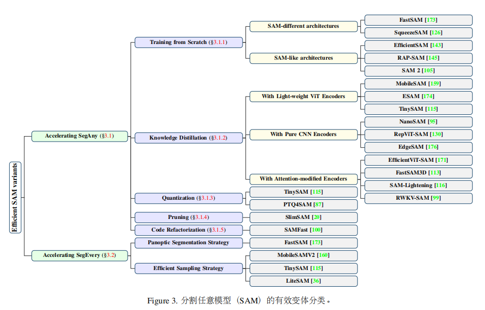

#### 3.1 加速SegAny任务

SegAny任务的主要瓶颈在于SAM的笨重架构。一个简单的解决方案是用一个更高效的backbone替换编码器。另一种方法是采用不同的体系结构，保留与SAM相同的分割功能。遵循这些策略的工作要么完全从头开始训练轻量级模型（3.1.1），要么使用适当监督的知识蒸馏训练模型（3.1.2）。此外，一些研究探索了量化、剪枝或局部优化等方法来直接压缩SAM，而无需替换编码器或构建新架构（3.1.3、3.1.4、3.1.5）

##### 3.1.1从零开始训练

**SAM different体系结构**

- FastSAM

由于实例分割已被许多基于cnn的方法有效解决，FastSAM采用YOLOv8-Seg模型，使用YOLACT方法以提高性能。然而，作为SAM的早期高效变体，FastSAM仍然有一些限制，例如为较小的物体生成低质量的mask，以及生成边界不那么平滑的mask。

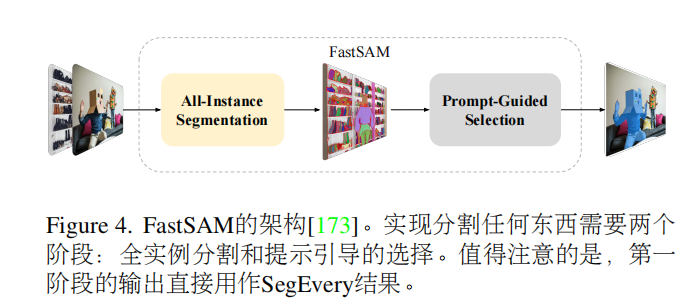

- SqueezeSAM

由于cnn在FastSAM中的成功应用，SqueezeSAM进一步用U-Net结构取代了SAM的基于transformer的架构。SqueezeSAM保留了一般的U-Net架 构， 但在U-Net的最低尺度上 合 并了两个Transformer层，以在速度和精度之间取得平衡。此外，SqueezeSAM具有几个微观层面的优化，如将输出通道限制在256，使用BatchNorm而不是LayerNorm以提高效率，并在编码器和解码器之间引入跳跃连接架构。

SqueezeSAM的一个独特之处在于处理提示。与SAM在解码阶段使用提示符不同，SqueezeSAM采用了早期融合策略，在将编码的提示作为额外的输入通道输入编码器之前，将其添加为额外的输入通道。SqueezeSAM主要是为部署在摄影应用程序而设计的，在这些应用程序中需要高效的交互式分割。如图所示，其工作流程涉及生成显著对象的初始掩码，然后通过用户点击进行细化的细粒度分割。

**SAM-like体系结构**

- EfficientSAM

  EfficientSAM [143]保留了SAM的原始架构，使用ViT-tiny或ViT-small作为轻量级编码器，利用基于SAM的掩码图像（SAMI）预训练策略从头开始重新训练，SAMI改编自掩码自动编码器（MAE）框架。SAMI遵循一个编码器-解码器管道：编码器从未掩码patch中生成潜在特征表示，而解码器重建掩码patch的缺失嵌入。该过程由重建损失监督，将SAM的ViT-H编码器产生的嵌入与SAMI管道产生的嵌入进行比较。预训练后，从SAMI流水线中提取轻量级编码器，并与SAM的其他组件集成，形成EfficientSAM。最后一步涉及在SA-1B数据集上对整个模型进行微调，以进一步对齐和细化。

  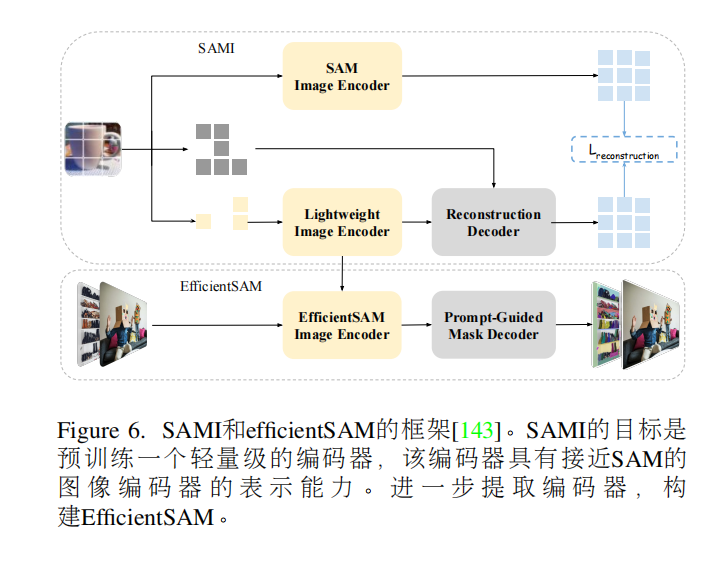

- RAP-SAM

  RAP-SAM保留了SAM的基本编码器-解码器架构，但加入了更有效的组件以提高性能。RAP-SAM将特征金字塔网络（FPN）与可变形卷积相结合，从图像和视频中提取特征，同时使用提示编码器嵌入视觉提示。在解码器中，RAP-SAM采用了一个三级流水线，利用新的基于池化的动态卷积来细化掩码标记。

- SAM2

  SAM 2的目标是提供高质量、实时的图像和视频分割。在图像分割任务中，与原始SAM相比，SAM 2取得了更高的精度和6倍的效率提升。这一重大进步在很大程度上归功于其高效的图像编码器Hiera，这是一个分层的ViT，通过删除冗余组件并利用MAE框架进行训练，已从MViTv2简化。Hiera是一种流线型的，纯粹基于transformer的架构，在图像和视频任务中，比传统的vit运行得更快，并提供更好的准确性。

  

##### 3.1.2 基于知识蒸馏的方法

回顾采用高效骨架进行图像编码器的SAM变体。根据编码器类型将这些模型分为三组：具有（i）轻量级ViT编码器的模型，（ii）CNN编码器和（iii）注意力修改编码器。

（i）轻量级ViT编码器的模型

- MobileSAM

  提出了一种仅编码器的蒸馏策略，如图所示，旨在将ViT-H的视觉表示能力迁移到TinyViT。使用的损失函数是两个编码器的输出图像嵌入之间的简单均方误差（MSE）

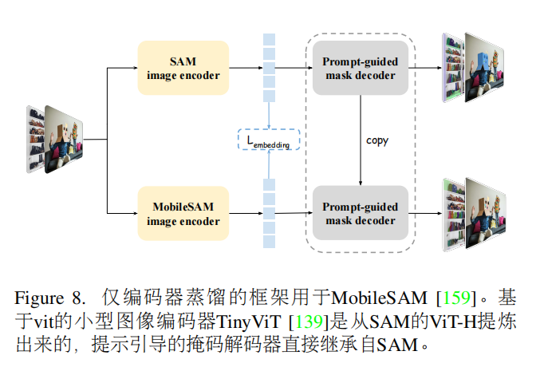

- ESAM

  ESAM [174]利用EfficientFormerV2 [69]作为其主干，旨在提高CPU环境中的性能，特别是资源受限的医疗设备。ESAM引入了一种新的知识蒸馏（KD）策略，称为整体知识蒸馏（HKD），以将知识从专家模型转移到ESAM。HKD包括两个部分：对特征图的蒸馏和对输出掩模的蒸馏。对于特征图蒸馏，结合三种不同侧重点的方法来指导学习过程。对于输出掩码蒸馏，ESAM使用教师和学生掩码之间的均方误差（MSE）损失，辅以教师掩码和ground truth掩码之间的二进制交叉熵（BCE）损失。引入教师引导模块（Teacher Guided Module，TGM），进一步对齐专家模型和ESAM之间的特征图。

- TinySAM

  为了解决仅编码器蒸馏会导致性能显著下降，提出了硬挖掘全阶段知识蒸馏策略，以实现更有效的蒸馏。如图该策略不仅监督图像嵌入，还监督输出token和输出掩码，所有都使用L1损失。引入了硬掩码加权策略，该策略为更难预测的掩码分配较大的权重，从而提高了学习效率。

（**ii**）CNN的编码器

- NanoSAM

  基于MobileSAM的推出的NanoSAM。NanoSAM用纯卷积网络（ResNet18）取代 基 于ViT的 编 码 器 ，同时保 留 了MobileSAM的其他组件。NanoSAM是从MobileSAM提炼出来的，两个模型都用TensorRT进行了重新训练，以优化性能。MobileSAM的图像编

  码器采用FP32精 度 进 行 优 化 ，而NanoSAM的图像编码器采用FP16精度进行优化，以提高执行速度。

- RepViT-SAM

  提出基于cnn的主干RepViT作为图像编码器，将ViT的设计原则集成到轻量级CNN中，设计原则适用于三个层次：块级、宏观级和微观级。在块级，RepViT将令牌混频器和通道混频器分离，降低扩展比，并增加块的宽度。对于宏设计，它将早期卷积作为 输 入 干 ，深化下采样层，采用更简单的分类器，并调整各阶段的块比例。在微观层次上，仅使用3x3卷积，而挤压-激励层仅应用于奇数块。RepViT-SAM使用知识蒸馏进行训练，遵循与MobileSAM相同的管道，与MobileSAM相比，实现了10倍的推理速度提高。

- EdgeSAM

  用更轻量和高效的纯cnn的RepViT取代了基于transformer的编码器，旨在在资源受限的设备上获得更好的性能。与ESAM类似，这篇文章认为，仅编码器蒸馏是不充分的，因为它是任务无关的，不能完全捕获模型的特定任务需求。他们提出了提示在环蒸馏方法，该方法为输出掩码添加了额外的监督。“在环提示”是指一种动态采样策略，从教师和学生的预测掩模的非重叠区域中迭代采样新的提示。经过多次迭代后，通过反向传播累积的损失来更新编码器和解码器。为了进一步提高输出质量，EdgeSAM提供了一个可选模块，该模块嵌入了特定数据集的粒度先验。

（iii）注意力修正编码器

- EfficientViT- SAM

  使用EfficientViT作为图像编码器。EfficientViT的主要优势是它使用了ReLU线性注意力机制而不是softmax操作，在提高硬件效率的同时促进了全局信息交互。EfficientViT-SAM的训练分为两个步骤。第一步是从ViT-H提取到EfficientViT，第二步是在SA-1B数据集上端到端的训练整个模型。该方法几乎没有精度损失，但在效率上有很大的提高。

- FastSAM3D

  一种专门为3D体医学图像设计的高效SAM模型。该工作的关键贡献是开发了3D稀疏Flash注意力机制。这种注意力方法结合了3D扩张注意力和FlashAttention的优点，以加速计算。FastSAM3D使用改进的ViT-Tiny作为图像编码器，从ViT-Base编码器中提取，确保了效率而不影响性能。作者实现了一种逐层渐进蒸馏策略，以迭代地对齐两个编码器之间的特征映射，如图所示

  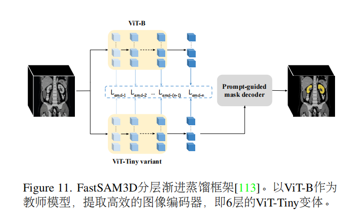

- SAM-Lightening

  结合了稀疏/扩张注意力和闪光注意力作为标准注意力机制的替代品，同时保留了相同的图像编码器。关键的区别在于知识蒸馏（KD）策略，称为动态分层蒸馏（DLD）。在DLD中，应用一系列时变权重*∈* [0*,* 1]来确定需要更新哪些层以及每一层对更新过程的贡献有多大。随着训练的进行，整个架构逐渐优化。整个蒸馏框架类似于FastSAM3D，主要变化是将蒸馏策略替换为动态分层蒸馏。

- RWKV-SAM

  基于rwkv的方法来构建一个轻量级的SAM版本。骨干是混合设计，前两个阶段由移动卷积块组成，最后一个阶段使用Vision RWKV块构建。模型使用“蒸馏-微调”策略进行训练，即首先从SAM-H中提取知识到主干，然后对整个模型进行微调。RWKV-SAM在保持与SAM相当的分割性能的同时，显著提高了分割效率。

  

  ##### 3.1.3 基于量化的方法

- TinySAM

  为了进一步缩小TinySAM的规模，对TinySAM的编码器进行训练后量化，量化后的版本被命名为Q-TinySAM

- PTQ4SAM

  可以直接在SAM上进行训练后量化。他们首先发现了传统PTQ之后的两个挑战：1)双峰分布的存在对量化质量有负面影响；2)不同注意力机制的分布存在明显差异。因此，研究人员提出了两种策略分别解决这两个问题：双峰集成（BIG）和自适应粒度量化（AGQ）。对于双峰积分，一个符号因子*γ* ，将双峰分布转换为正态分布。对于自适应粒度量化，关键是采用自适应参数*τ* 调整Log2量化器的底座。通过使用AGQ策略，可以有效缩小不同注意力的post-softmax分布之间的差异。PTQ4SAM是即插即用的SAM变体，可以很容易地部署到下游任务中。

##### 3.1.4 基于剪枝的方法

- SlimSAM

剪枝应用于SAM的重型编码器时，第一步涉及估计权重和激活值的重要性，以确定应该修剪哪些编码器。评估重要性背后的核心思想是评估给定参数和不给定参数产生的损失的差异。SlimSAM引入了扰动泰勒重要性方法，该方法使用一阶泰勒展开来近似参数的重要性，并引入高斯噪声*N*来防止梯度变为零。

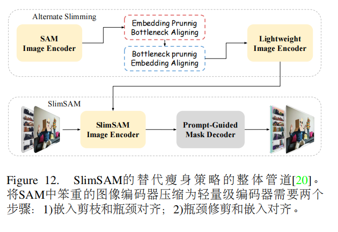

##### 3.1.5 基于代码重构的方法

- SAMfast

  PyTorch团队重写原版SAM，比原来的实现快8倍。最初，该团队确定了导致同步阻塞的长函数调用，从而导致他们重写相应的代码。另一个重要的瓶颈是耗时的矩阵乘法，这可以通过使用bfloat16精度来缓解。在这些调整之后，团队使用了torch.compile来融合较小的操作，并采用了PyTorch的缩放点积注意力（SDPA）来加速GPU上的注意力计算。此外，通过集成与Triton构建的新内核，GPU上的内存使用进一步减少。当SAM使用批预测方法时，将不同大小的输入张量统一到网式张量中，显著提高了吞吐量。进一步，为解决矩阵乘法的瓶颈，又实现了int8量化和使用半结构稀疏性实现近似矩阵乘法

#### 3.2 加速SegEvery任务

SegAny任务的主要效率瓶颈在于重图像编码器，然而SegEvery任务的主要挑战来自于密集的网格采样策略。该策略首先基于一个点网格预测大量的mask，然后选择有效的mask，这意味着计算成本很高。因此，设计一个更有效的采样策略来减少预测mask的数量已经成为加速SegEvery的核心方法。另一个潜在的解决方案是将SegEvery转换为另一个成熟的任务，如全实例分割，就像在FastSAM中所做的那样。在这部分中，回顾了一些从优化采样策略以加速SegEvery任务的工作。

- MobileSAMv2

  引入了一种对象感知的提示采样策略来提高分段分析任务的效率。MobileSAMv2中，研究人员使用YOLOv8模型，该模型在SA-1B的一个小子集上进行训练，以发现物体。该模型生成了大量与潜在对象相对应的边界框。高度重叠的框使用非极大值抑制（NMS）进行过滤，其余的框用作框提示。通过使用这些过滤后的方框作为提示，MobileSAMv2消除了过滤预测掩码的需要——这是一个更耗时的过程。由于最大提示数设置为320，新策略据报告比传统的32*32网格采样策略快16倍。此外，MobileSAMv2可以与MobileSAM集成，创建一个统一的模型，在SegAny和Seg每任务中实现高效率。

- TinySAM

  用密集的点网格（例如，32*32,64*64）通常会产生大量冗余的掩码，然后在后处理期间被过滤掉，这一操作会导致大量的时间成本。事实上，只有网格内的几个点就需要产生自信的口罩。为了解决这种低效率问题，TinySAM提出了一种高效采样的分层策略，逐步选择最优点生成掩模。

  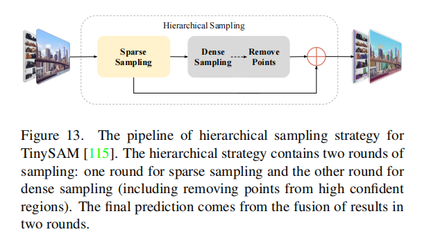

- Lite-SAM

  Lite-SAM采用了一种称为Lite-ViT的CNN-transformer混合结构，它由四个阶段组成，分别有2、2、6和2个Lite-ViT块。Lite-ViT的关键创新是多尺度池模块（MSPM），它是传统注意机制的替代品。MSPM利用通道级的层规范，并将池化操作扩展到多个尺度。如前所述，SAM中的另一个主要瓶颈是耗时的网格采样策略。为了解决这个问题，Lite-SAM引入了一个自动提示建议网络（AutoPPN）来提高采样效率。AutoPPN将编码器生成的特征映射作为输入，并直接预测点和框提示。为了确保高质量的提示，Lite-SAM使用了一个更强大的基于MSPM的网络，而不是cnn，并结合距离变换来估计点提示的置信度。虽然Lite-SAM主要是为了加速SegEvery的任务，但由于其轻量级的图像编码器，它也证明了SegAny任务的效率提高。

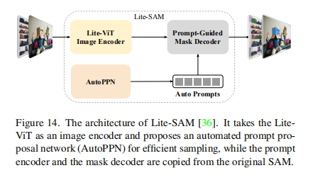

#### 3.3 几个潜在的未来研究方向

**探索更高级的架构**

如1. 对transformer替代模型的探索（Mamba ，RetNet ，KAN，TTT），2. 改进跨图像编码器和掩码解码器的注意机制的效率（线性注意力、低秩因子分解或结合卷积和基于注意力设计的混合架构等方法）

**探索稀疏化和加速技术**

蒸馏、量化、剪枝方法可以从理解SAM架构中稀疏性的分布和动态上下功夫。这包括研究可以在不影响性能的情况下进行修剪或稀疏化的SAM的最优层或组件。此外，诸如稀疏注意机制、推理过程中的动态剪枝和低精度训练还有进一步探索的空间。

**硬件特定的优化**

在现代硬件平台上部署SAM时，硬件感知模型优化技术，如算子融合、量化感知训练和定制CUDA内核，可以最大限度地提高吞吐量和减少延迟。

未来的研究可以探索分层的云-边缘架构，将计算成本高昂的任务转移到云上，同时在边缘设备上本地运行轻量级模型。此外，利用专门的人工智能硬件，如FPGAs，或使用硬件感知神经体系结构搜索（NAS）和混合精度量化等技术，可以进一步优化SAM的低延迟、资源有限的环境，确保模型在不同的硬件平台上有效运行。

**对视频和多模态数据的高效分割**

视频数据包含时间冗余，而多模态数据通常显示出模态之间的相关性。通过时间聚合和跨模态特征共享等技术，利用这些固有的冗余，可以显著降低计算成本。最近一项名为SurgicalSAM2的研究提出了一种高效的帧剪枝策略，该策略只保留内存库中信息最丰富的帧，以减少内存使用和加速推理，为视频的高效分割提供了一个很有前途的想法。未来的工作可以集中于通过利用时空注意、有效的时间数据记忆机制和早期融合技术来减少特定模式计算的数量，从而优化SAM的运行时复杂性。

### 第4节 评估

本节系统地比较了前面描述的SAM变体的效率和准确性。参考这些工作中进行的实验，选择了大多数工作已经完成的任务，并在相应的常用数据集上对它们进行评估。我们的评估是在一个24GB的RTX 3090 GPU上进行的，它带有一个14 vCPU的Intel (R) Xeon (R)Gold 6330处理器@2.00 GHz。为了进行公平的比较，我们确保所有的模型都在相同的环境下进行测试，并且所有被测试的图像都保持在其原始分辨率下。第4.1节介绍了用于评估的数据集和指标；第4.2节和第4.3节分别报告了效率和准确性的定量结果。

##### 4.1 数据集和指标

数据集：COCO2017、LVIS v1
效率指标：\#*Params*, *FLOPs*, *Memory Usage*、效率误差率（EER）

runtime 、throughput

精度指标：mIoU、AP

##### 4.2 效率比较

利用工具*calflops*获得的结果：

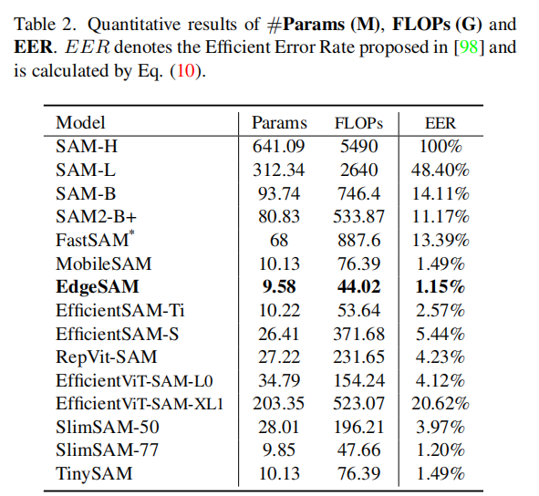

EdgeSAM的参数量最低、FLOPs最低、EER最低。EfficientViT-SAM-XL1EER最高。

对于SegAny任务，每个图像都会提示50个固定的bbox。我们记录了每10个bbox的累积时间，并通过一个曲线图来说明结果。在此基础上，我们计算了SegAny任务的推理延迟（处理一张图中个框提示所需的平均时间）

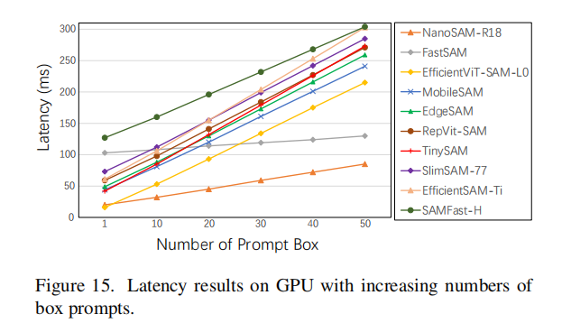

在COCO验证集上测试了执行SegAny任务时每个模型的吞吐量，使用grouding truth 目标框作为提示

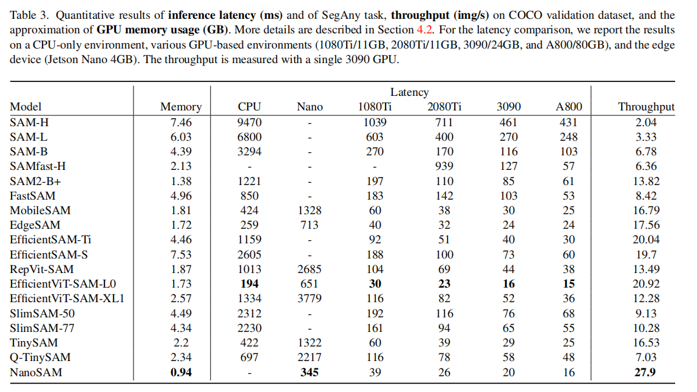

EfficientViT-SAM-L0表现出最短的推理时间（CPU、GPU）。

EdgeSAM也比较低延迟 CPU259 ms 和边缘设备713 ms。

而NanoSAM在Jetson Nano到最短的运行时间，在GPU上仅次于最优。

在吞吐量测试中，NanoSAM遥遥领先，每秒处理27.9张图像。EfficientSAM-Ti和EfficientViT-SAM-L0，也显示出了很强的吞吐量，每一种都超过了每秒20张图像。

对于SegEvery任务，使用不同的点网格大小（16X16、 32X32、64X64）或专门的采样策略为图像生成所有mask所需的平均时间，结果如表下所示：SAMfastH展示了最高的效率，延迟为848ms---比SAM-H快两倍多。
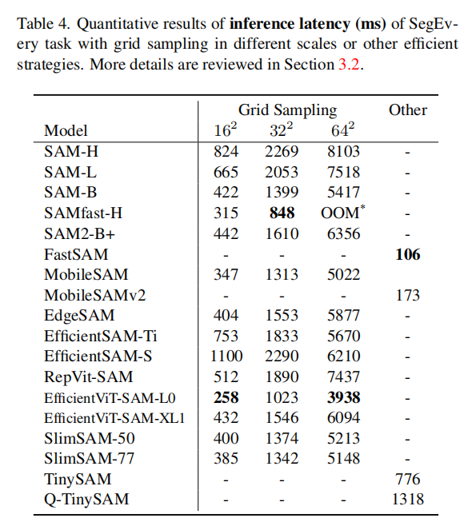

在采样策略上，FastSAM效率最高

##### 准确性比较

为了评估SegAny任务，我们采用两种类型的点作为提示： 1)ground truth边界框的中心点，2)从地面真实掩模中均匀采样的随机点。我们在COCO和LVIS上评估了mIoU。当提示中心点时，SAM2-B+和EfficientViT-SAM-XL1的mIoU在COCO数据集上达到最高，为54.3%，超过SAM-H为53.6%，而在LVIS数据集上，SAMfast-H的mIoU为53.6%，在所有模型中表现最好。在随机点提示设置下，当有3个点提示时，EfficientViT-SAM-XL1在两个数据集上的性能都优于SAM-H，分别增加了2.7%和0.7%。从数据集的角度来看，我们观察到LVIS的结果普遍低于COCO。

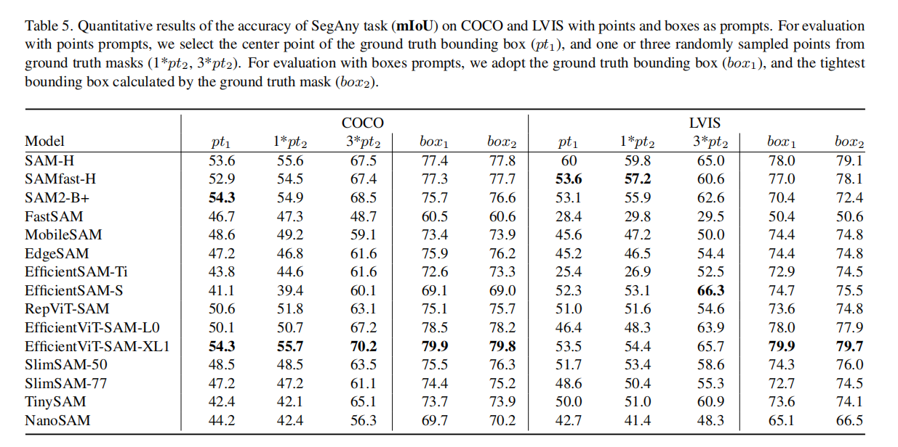

此外，还通过两种类型的框提示来评估SegAny任务的准确性： 1)ground truth边界框和2)对应ground truth的最紧边界框。

EfficientViT-SAM-XL1在每个box提示设置中的准确率最高。

例如分割任务，我们采用ViTDet、YOLOv8 、Grounding DINO、Detic和H-Deformable-DETR和Swin-L作为对象探测器，生成潜在对象的边界框。我们评估了所有物体的平均精度（AP），以及小、中、大物体的AP，结果如下。与之前的结果相似，我们发现在COCO数据集上，EfficientViT-SAMXL1对任何探测器都具有最高的AP（除了H-Deformable-DETR）。在设置装备ViTDet作为检测器和LVIS数据集的测试下，SAMfast-H超过了所有其他变体，AP为44.5%

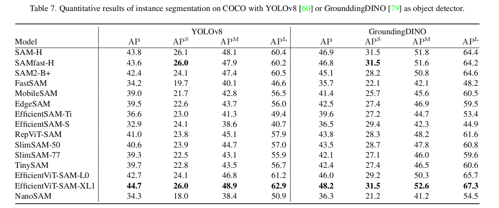

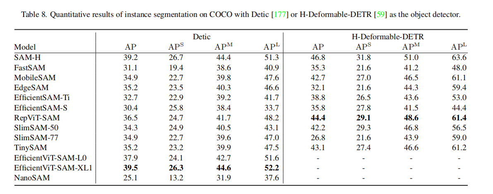

用吞吐量-mIoU散点图来观察效率-精度之间的权衡。（COCO数据集上评估的吞吐量和mIoU，以ground truth边界框作为提示)

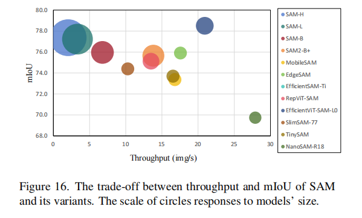

### 第5节 总结

这篇综述主要讨论和评估了基于SAM轻量化以减少资源消耗和降低延迟的方法。对于高效的SegAny任务，大多数工作都采用了用轻量级的替代方案替换图像编码器或整个架构的方法，然后从头开始进行训练或通过知识蒸馏。其他工作的目的是通过利用诸如量化、剪枝或局部优化等技术来压缩原始模型。对于SegEvery任务，有效的采样策略是必要的。在详细回顾了这些方法之后，我们还概述了五个可能的未来研究方向，在这个领域可能推动新的趋势。此外，我们还评估了这些模型在环境一致的情况下，效率、准确性和相应的权衡，提供了一个公平、有价值的比较，这些分析表明，一些变体在特定的场景中已经优于原始的SAM，未来在该领域还有进一步探索和创新。