#### 1. 机器人操作的缩放定律 论文分享

《Data Scaling Laws in Imitation Learning for Robotic Manipulation》

机器人操作模仿学习中的数据缩放定律

论文地址：https://arxiv.org/abs/2410.18647

本文目标是研究以下基本问题：适当的数据扩展能否产生能够在任何环境中对任何对象进行操作的机器人策略？

#### 1.1 摘要

本文主演研究环境级泛化与对象级泛化（验证任务级泛化需要更大数量级的数据，难以承受），得出以下结论：
- 简单的幂铝。该策略对新对象/新环境的泛化能力大致按幂律进行扩展，分别与训练对象、训练环境或训练环境-对象对的数量相叠加。
- 多元化is all you need。增加环境和对象的多样性比增加每个环境或对象的演示的绝对数量要有效的多。
- 泛化比预期要容易。在尽可能多的环境（例如，32个环境）中收集数据，每个环境都有一个唯一操作对象和50个演示，从而可以训练一个可以很好地泛化（90%成功率）到任何新环境和新对象的策略。

#### 1.2 方法

1. 泛化维度。

我们使用行为克隆（BC）来训练单任务策略，这是学习真实世界操作技能的主要方法。许多BC训练表现出交叉的泛化性能，体现在两个维度上：（1）环境-泛化到以前没见过的环境；（2）对象-泛化到与人类演示中对象属于同一类别的新对象，在颜色大小几何属性上有所不同。

领域先前的研究试图通过独立控制特定因素来隔离每个维度内的变化，例如特殊照明来仅限更改照明颜色，或者3D大于对象仅改变大小而不改变其形状。然而，实际性能不取决于推广到单个因素，而是取决于同时处理变化的多个因素的复杂相互作用。为了解决这个问题，我们专注于两个维度（环境和对象）的泛化，这两个维度共同包含策略在自然、真实场景中遇到的所有因素。

2. 数据缩放定律指导。

我们考虑一个场景，其中操作任务的演示数据集是跨M个环境和N个同一类别的操作对象。每个环境可以包含任意数量的演示对象，前提是他们与操作对象不属于同一类别。对于每个对象，在环境中有k条演示被收集。我们使用测试分数来评估训练期间看不到的环境和对象上策略的效果S。本文缩放定律旨在：（1）描述S与变量M,N,K两者之间的关系，具体来说，泛化能力如何取决于环境、对象的演示和数量；（2）根据这种关系确定有效的数据收集策略以达到所需的泛化水平。

3. 数据源。

现有的机器人操作数据集无法为单个任务提供足够的环境和对象来满足我们的要求。 因此，我们选择使用通用操作接口 （UMI）用于独立收集大量演示。

图注：UMI，DiffusionPolicy一作的续作，一个通用操作夹爪，可以单独取下以供人类标注者方便的收集数据

4. 策略学习。

我们使用 Diffusion Policy 来对我们收集的大量数据进行建模。为了进一步提高性能，我们进行了两项改进：

1） DINOv2 可视编码器：在我们的实验中，对 DINOv2 ViT 进行微调优于 ImageNet 预训练的 ResNet。我们将这一改进归功于 DINOv2 功能能够显式捕获图像中的场景布局和对象边界。这些信息对于增强空间推理至关重要，这对机器人控制特别有益。为了确保模型容量在扩展数据时不会成为瓶颈，我们使用了足够大的模型 ViT-Large/14

2） 时态集成：扩散策略预测每个T_1步骤，每个序列的长度为T_2 (T_2>T_1），并且只有第一个T_1执行步骤。我们观察到，执行的动作序列之间的不连续性会导致切换过程中的生涩动作。为了解决这个问题，我们实现了 ACT 中提出的时态集成策略。具体来说，该策略在每个时间步进行预测，从而导致操作序列重叠。在任何给定的时间步长，使用指数加权方案对多个预测动作进行平均，从而平滑过渡并减少运动不连续性。

5. 评估。

我们将操作任务分为几个阶段/步骤（通常为2-3个）。每个阶段或步骤都有明确定义的评分标准。每个步骤最多可以获得3分，我们报告一个标准化分数，定义为标准化分数=考试总分/3*步数，最大值为1。与常用的成功率不同，成功率是一个过于稀疏的信号，缺乏区分策略的粒度，我们的评分机制可以捕获更细微的行为。

#### 1.3 实验

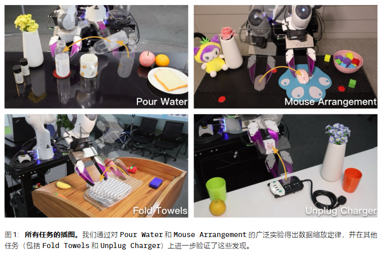

我们首先关注两个操作任务：Pour Water 和 Mouse Arrangement。 

在 Pour Water 中，机器人执行三个步骤：首先，它抓住随机放在桌子上的一个水瓶;其次，它将水倒入杯子中;最后，它将瓶子放在红色杯垫上。这项任务需要精确性，尤其是在将瓶口与杯子对齐时。 

在 Mouse Arrangement 中，机器人完成两个步骤：拿起鼠标并将其放置在鼠标垫上，正面朝前。鼠标可能会倾斜，需要机器人采用非抓握动作（即推动）来首先对齐它。

#### 对象泛化

（1）随着训练对象数量的增加，该策略在看不见的对象上的性能在所有演示部分中都持续提高。

（2） 训练对象越多，每个对象所需的演示就越少。例如，在 Pour Water 中，当使用 8 个对象进行训练时，使用 12.5% 的演示的性能明显滞后于使用 100% 的演示;但是，当使用 32 个对象进行训练时，这种差距几乎消失了。

（3）对象泛化相对容易实现。性能曲线的初始斜率非常陡峭：只有 8 个训练对象，两项任务的标准化分数都超过 0.8。当训练对象数量达到 32 个时，分数超过 0.9。这些分数对应于已很好地推广到同一类别内的任何新对象的策略。

#### 环境泛化

探索训练环境数量对泛化的影响

（1） 增加训练环境的数量可以提高策略在看不见的环境中的泛化性能。即使演示总数保持不变，这种趋势仍然存在。虽然增加每个环境中的演示分数最初会提高性能，但这种改进很快就会减弱，如代表 50% 和 100% 演示使用的线条重叠所示。

（2） 对于这两项任务，环境泛化似乎比对象泛化更具挑战性。我们观察到，当环境或对象数量较少时，与增加对象数量相比，增加环境数量会导致较小的性能提升。这反映在环境泛化性能曲线的较低斜率中。

#### 跨环境和对象的泛化

我们探索训练环境和对象同时变化的设置

（1） 增加训练环境-对象对的数量大大提高了策略的泛化性能，这与之前的观察结果一致。

（2） 有趣的是，尽管跨新环境和对象进行泛化更具挑战性，但在这种情况下，额外演示的好处会更快地饱和（25% 和 100% 演示使用的重叠线证明了这一点）。这表明，与单独更改环境或对象相比，同时更改两者会增加数据*多样性*，从而提高策略学习效率并减少对演示数量的依赖。这一发现进一步强调，扩大环境和对象的多样性比仅仅增加每个环境或对象的演示数量更有效。

#### 幂律拟合

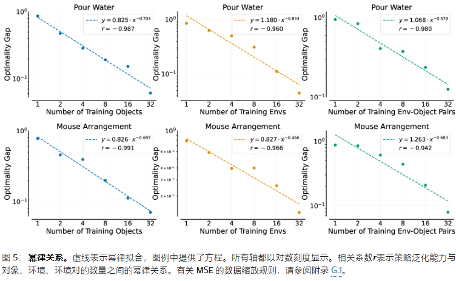

接下来，我们探索我们的实验结果是否遵循幂律缩放定律，就像在其他领域中看到的那样。具体来说，如果两个变量Y和X满足关系 $Y=β⋅X^α$ ,它们表现出幂律关系。基于所有结果，我们总结了以下数据缩放定律：

- 该策略对新对象和/或新环境的泛化能力大致按*幂律*进行扩展，分别与训练对象、训练环境或训练环境-对象对的数量相叠加。相关系数证明了这一点r在图 [5](https://arxiv.org/html/2410.18647v1#S4.F5)

- 当环境和对象的数量是固定的时，演示的数量与策略的泛化性能之间没有明确的幂律关系。虽然性能最初随着演示的增加而迅速提高，但最终趋于平稳。

#### 高效的数据收集策略

在本节中，我们提出了一种以数据缩放定律为指导的有效数据收集策略。回想一下，我们的数据收集跨越Menvironments 和N操作对象，K每个环境中每个对象的演示。我们试图回答的主要问题是：对于给定的操作任务，我们如何以最佳方式选择M,N和K以确保策略的强大泛化，而不会产生过于费力的数据收集过程？为了探索这一点，我们继续使用任务 Pour Water 和 Mouse Arrangement 作为示例。

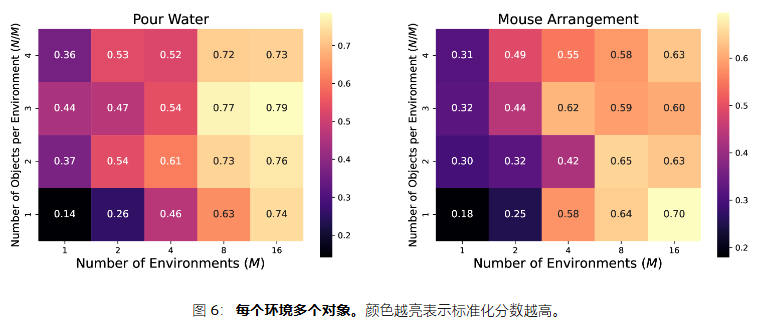**如何**

**如何选择环境和对象的数量？**以前，我们只考虑每个环境都包含单个唯一操作对象的设置。但是，在实际数据收集中，每个环境收集多个对象可能会提高性能，因此是一种更有效的方法。

热力图6表示当环境数量较少时，在每个环境中收集多个对象可以提高性能。但是，随着环境数量的增加（例如，增加到 16 个），每个环境收集多个对象与仅收集单个对象之间的性能差距变得可以忽略不计。对于环境数量通常超过 16 个的大规模数据收集，在同一环境中添加多个对象不会进一步提高策略性能，这表明这种方法可能是不必要的。根据我们的实验结果，我们建议如下：

*在尽可能多的不同环境中收集数据，每个环境中只有一个唯一的对象*。当环境-对象对的总数达到 32 时，通常足以训练一个能够在新环境中运行并与以前看不见的对象交互的策略。

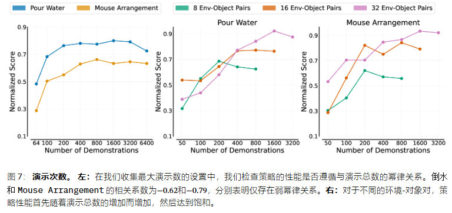

**如何选择演示数量？**

在泛化性的实验结果表明，将演示数量增加到某个点之后，产生的好处最小。本节旨在确定该阈值。我们首先检查其中环境M=16和对象N=64（与前面的实验一样）。我们将用于训练的演示总数从 64 到 6400 不等，并训练 8 个策略。结果显示在图 7 的最左侧图中：显示当演示数量达到 800 个时，两个任务的得分都处于平稳状态。

接下来，我们考虑收集环境-对象对的推荐设置（即M=N)。结果如图 7 最右侧的两个图所示：表示当环境-对象对的数量较少时，达到饱和所需的演示总数较少。具体来说，对于 8、16 和 32 对，性能分别稳定在 400、800 和 1600 次演示。

基于这些发现，我们建议*为每个环境-对象对收集 50 个演示（即K=50） 完成与我们的任务难度相似的任务*.更具挑战性的灵巧操作任务可能需要更多的演示;我们将这方面的探索留给未来的工作。

#### 1.4 附录

#### A 环境和对象可视化

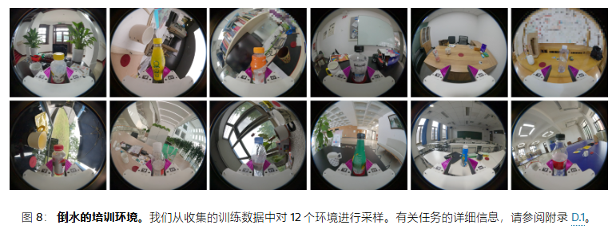

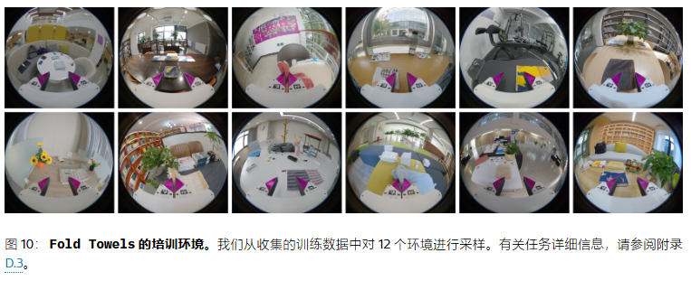

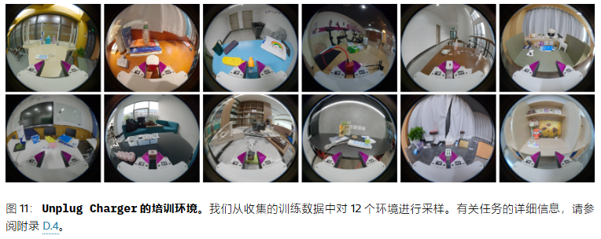

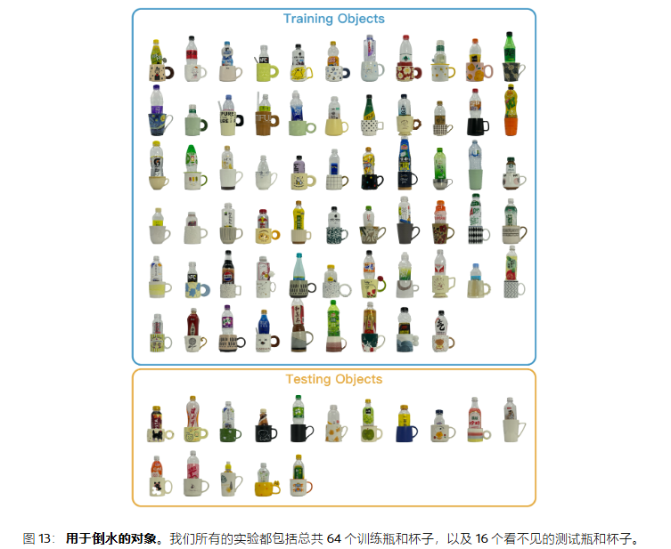

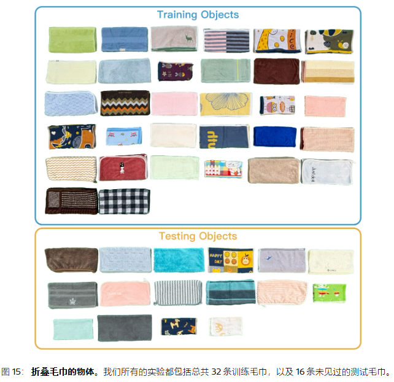

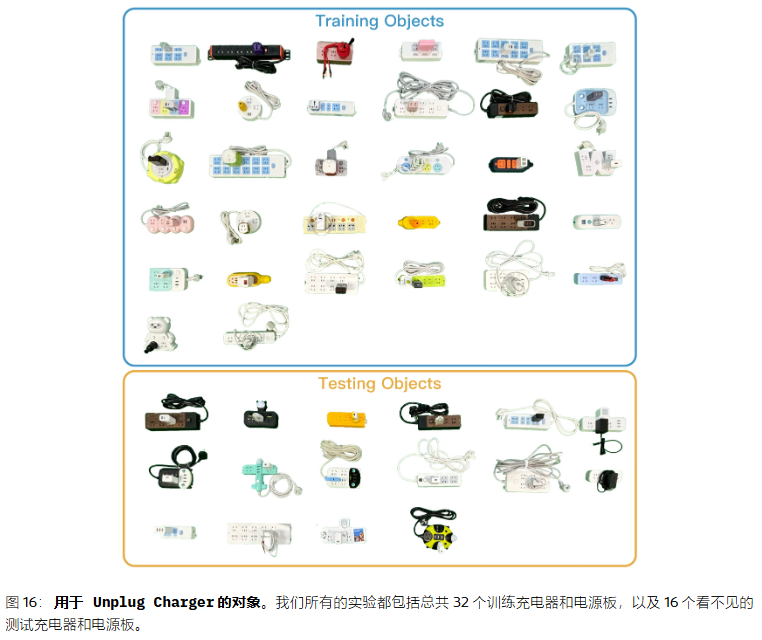

#### B 数据源-使用UMI采集数据的经验

我们分享了从使用 UMI 中获得的关键见解（Chi 等人，[2024](https://arxiv.org/html/2410.18647v1#bib.bib13))要收集大量演示：

**（1） 随机初始姿势至关重要：**对于每个演示，必须随机化手持式夹持器的初始姿势，包括其高度和方向。这种做法有助于涵盖更广泛的起始条件。如果没有这种变化，经过训练的策略会对特定的初始姿势过于敏感，从而将其有效性限制为仅特定位置。同样，物体的初始位置范围应尽可能广泛，同时保持在机器人的运动学和动力学限制范围内。

**（2） 选择具有丰富视觉特征的环境：**由于 UMI 依赖 SLAM 进行相机姿态跟踪，因此缺乏足够视觉特征的环境（如暗区或空白墙壁）可能会导致跟踪失败。为了解决这个问题，我们使用了可视化工具 Pangolin([洛夫格罗夫，](https://arxiv.org/html/2410.18647v1#bib.bib39))验证环境是否具有足够的功能。引入更多干扰对象或向表面添加纹理（例如桌面）既可以增加视觉特征，也可以作为一种数据增强形式，帮助策略学会忽略环境中不相关的变化。此外，执行多轮映射并使用批处理 SLAM 处理可以增加有效演示的数量。

**（3） 使用适当大小的操作对象：**阻碍摄像头视野的大型物体（例如门或抽屉）可能会导致 SLAM 算法将摄像头误解为静止的，从而导致跟踪失败。这个限制影响了我们避免打开抽屉等任务的决定，突出了当前 UMI 的一个关键缺点。集成现成的姿势追踪硬件（例如 iPhone Pro 或 VIVE Ultimate Tracker）可能会提高 UMI 的准确性和稳健性。

**（4） 其他提示：**

- 标准化不同数据收集器之间的行为模式和任务完成时间，以最大限度地减少数据集中的多模态行为。

- 收集数据时，请避免移动非操纵对象（干扰项），并确保其他移动实体不会进入摄像机的视野。

- 关闭夹持器时，轻轻用力以引入轻微变形。

#### C 任务详细信息

在本节中，我们详细介绍四个操作任务和评估过程中的评分标准。

#### C1 倒入水

**任务描述。**机器人执行三个连续的动作：最初，它抓住一个饮料瓶;随后，它将水倒入杯子中;最后，它将瓶子放在指定的红色杯垫上。瓶子被随机放置在桌子上，前提是它在机器人的运动学范围内。瓶子和杯子的相对初始位置也是随机的，确保它们的间距可变，同时在抓住瓶子后保持杯子对相机可见。红色杯垫是一个直径为 9 厘米的圆圈，始终位于杯子右侧约 10 厘米处，可在所有环境中使用。由于瓶子颜色、大小和高度的变化，这项任务对机器人的泛化能力提出了挑战，并且需要将瓶口与杯子精确对齐才能成功完成。该任务还需要大量的旋转运动，这超出了基本的拾取和放置操作。倾倒和放置动作的成功执行关键取决于最初准确抓取瓶子。为了进行测试，瓶盖被紧紧地固定，没有实际的水倒出。

**评分标准。**

第1步：抓住饮料瓶

​	**0 分：**夹具不靠近饮料瓶

​	**1 分：**夹持器接触饮料瓶，但由于小错误而没有抓住它，或者它最初抓住了瓶子，然后在提升过程中滑出。

​	**2 分：**抓手在抓住饮料瓶之前将饮料瓶推了很长一段距离。

​	**3 分：**抓手成功抓住饮料瓶，没有任何滑动。

第2步：将水倒入杯子汇总

​	**0 分：**夹持器不靠近杯子。

​	**1 分：**旋转饮料瓶后，它的嘴巴保持在杯子外面，无法倒出。

​	**2 分：**旋转饮料瓶后，其瓶口位于杯子边缘的正上方，仅允许部分倒出。

​	**3 分：**旋转饮料瓶后，其口完全位于杯子内，便于完全倒出。

第3步：将瓶子放在红色杯垫上

​	**0 分：**夹持器不接近红色杯垫。

​	**1 分：**饮料瓶放在红色杯垫外面，或者放置过程会破坏杯子，导致杯子倾倒。

​	**2 分：**饮料瓶只有一部分放在红色杯垫上。

​	**3 分：**饮料瓶完全稳定地放置在红色杯垫上。

**成功标准。**成功的任务需要在第 1 步中至少获得 2 分，在第 2 步中至少获得 3 分，在第 3 步中至少获得 2 分。

#### C2 鼠标排列

**任务描述。**机器人需要完成两个步骤：拿起鼠标并将其放在鼠标垫上。第一步，鼠标可以放置在桌子上的任何位置，只要它保持在机器人的运动范围之内即可。 鼠标可能正前方，在这种情况下，机器人需要直接从后面抓住它。或者，它可能会略微向左或向右倾斜，这需要机器人采用不可抓握的动作，例如在关闭夹持器之前将鼠标推到正确的方向以拾取它。 鼠标的粗细大大限制了可行抓取姿势的数量，几乎没有出错的余地，因为即使是轻微的位置偏差也可能导致抓取失败。 此外，鼠标不断变化的几何形状和颜色要求机器人的策略具有很强的泛化能力，使其能够根据鼠标的特定形状和大小调整抓取策略。

**评分标准。**

第1步：拿起鼠标

​	**0 分：**抓手不会向鼠标移动，也不会在不接触鼠标的情况下绕着鼠标移动。

​	**1 分：**抓手接近正确的抓握姿势并触摸鼠标，但在稍微抬起鼠标后将其放下。

​	**2 分：**抓手在抓住鼠标之前将鼠标推了很长一段距离，或者鼠标被抓住但在抬起到更高的高度时掉落。

​	**3 分：**夹持器成功抓取鼠标，没有任何滑动。

第二步：将鼠标放在鼠标垫上

​	**0 分：**夹持器要么在空中保持静止，无法移向鼠标垫，要么将鼠标从高处释放，导致鼠标掉落到桌子上。

​	**1 分：**鼠标放置在鼠标垫外面，或者即使整个鼠标落在鼠标垫上，它也会因从高处释放而翻转。

​	**2 分：**只有鼠标的一部分放在鼠标垫上，或者即使整个鼠标都在鼠标垫上，由于从相对较高的高度释放，它也会轻微弹跳和移动。

​	**3 分：**在释放鼠标之前，抓手会降低到适当的高度，确保整个鼠标牢固地放置在垫子上。

**成功标准。**成功的任务需要在第 1 步中获得 3 分，在第 2 步中获得至少 2 分。

#### D 评估指标的比较

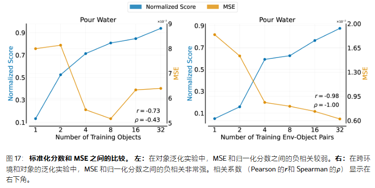

我们使用测试人员分配的分数作为我们的主要评估指标，并承认这种方法本身就引入了测试人员的一些主观性。另一个指标，即验证集上的均方误差 （MSE），提供了一种不需要人工干预的潜在客观度量。在本节中，我们将对这两个指标进行详细比较。为了计算 MSE，我们为每个评估环境或对象收集了 30 个人工演示，形成验证集。然后，我们通过平均策略预测的行动和每个时间步的人工行动之间的平方差来计算 MSE。

我们观察到在某些情况下，MSE 和标准化分数之间存在很强的负相关。例如，在图 [17](https://arxiv.org/html/2410.18647v1#A5.F17) 的右图中，实验设置评估了策略在 Pour Water 上的环境和对象中的泛化。 随着训练环境-对象对数量的增加，归一化分数逐渐上升，而 MSE 稳步下降，其中 Pearson 的r=−0.98和 Spearman 的ρ=−1.00.这表明 MSE 可能会取代人工评分方法。 但是，在某些情况下，MSE 与实际性能的相关性并不高。例如，在图 [17](https://arxiv.org/html/2410.18647v1#A5.F17) 的左图中，该实验评估了策略在 Pour Water 上跨对象的泛化。当训练对象的数量增加到 16 个时，MSE 实际上会增加，从而导致 Pearson 的r的 only−0.73. 同样，在探索模型训练策略的实验中，LoRA 的 MSE 明显低于完全微调的 MSE （0.0049 vs. 0.006）。然而，在实际测试中，LoRA 的策略表现不如完全微调，标准化分数分别为 0.72 和 0.9。

总体而言，验证集上的 MSE 通常与实际性能无关，并且许多异常出现时不可预测且没有可辨别的模式。这使我们相信 MSE 不是一个完全可靠的评估指标。在实践中，我们更多地将 MSE 用作调试工具，以快速识别存在明显问题的策略。

#### 2. RDT-1B 论文分享

《RDT-1B: a Diffusion Foundation Model for Bimanual Manipulation》

论文地址：[arxiv.org/pdf/2410.07864](https://arxiv.org/pdf/2410.07864)

【目前最大的】1.2B参数的具身Diffusion大模型。其在46个不同机器人数据集（一共超过1M条轨迹）上预训练。我们用48张H100训练了1M个迭代（共耗时一个月）。实验结果表明我们模型具有先进的环境和物体泛化性、操作精度、指令跟随、甚至只需【1-5个demo】就能学会全新的技能。
全部代码、权重和数据均已开源。

#### 2.1 摘要

我们提出了Robot Diffusion Transformer（RDT），这是一种用于双手动操作的开创性扩散基础模型。RDT 建立在扩散模型之上，以有效地表示多模态，并采用可扩展 Transformer 的创新设计来处理多模态输入的异质性，并捕获机器人数据的非线性和高频性。为了解决数据稀缺问题，我们进一步引入了物理可解释的统一动作空间，它可以统一各种机器人的动作表示，同时保留原始动作的物理意义，促进学习可转移的物理知识。通过这些设计，我们设法在迄今为止最大的多机器人数据集集合上对 RDT 进行了预训练，并将其扩展到1.2B 参数，这是最大的基于扩散的机器人操作基础模型。最后，我们在自建的多任务双模数据集上微调了 RDT，其中包含超过6K+ 剧集来优化其操作能力。在真实机器人上的实验表明，RDT 的性能明显优于现有方法。它表现出对看不见的物体和场景的零镜头泛化，理解并遵循语言指令，只需 1 次即可学习新技能∼5 次演示，并有效地处理复杂、灵巧的任务。

#### 2.2 相关工作

**基于学习的双手操作。**学习双手操作策略的一个重大挑战是动作空间的高维性，相比单手操作，双手操作可以用左手完成，可以用右手完成，可以双手合作完成任务，双手操作具有远大于单手操作的动作空间。因此要在双手操作任务中学习收敛需要更庞大的数据和更适合多模态行为的算法。

一些工作开发了更具成本效益的数据收集界面，但他们仅限于特定的硬件配置，仍然不足以弥合通用策略的数据差距。其他工作试图通过引入归纳偏差来降低数据要求，例如区分两个臂以实现稳定的功能、参数化移动基元或使用体素表示。这些方法使用强先验或简化建模，成功地缩小了动作空间，但代价是缩小了应用范围，并且无法表达双模的多模态行为。

**机器人的基础模型。**Foundation 模型在通过训练多任务“通才”模型实现可推广行为方面显示出巨大的前景。大多数研究采用大型视觉语言模型来直接预测动作（例如OpenVLA等）。在展示对新对象和任务的泛化时，他们面临着量化错误和行为不协调的问题，当应用于双手操作时，主要原因是它们的动作空间离散化。为了提高精度，扩散模型已被用于连续控制。此前工作在Open X-Embodiment的子集上训练基于Transformer的扩散策略，最多具有93M的参数。

#### 2.3 问题表述和挑战

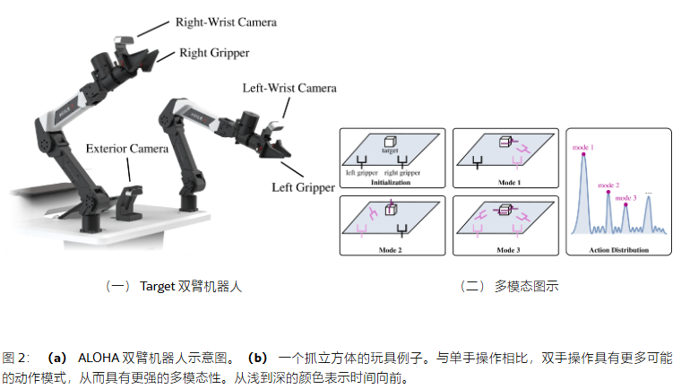

我们考虑了语言条件反射的视觉双手操作的具体任务，这在机器人学中是基础，在家庭等现实世界场景中具有重要价值.

我们的任务表述简单说来就是给定语言指令，策略将一定时间步骤的观测生成一个动作。

**挑战 1：如何设计强大的架构？**一个通用的基础模型需要一个强大的架构。此要求包括两个主要方面。首先，架构必须具有足够的*表现力*，以捕捉动作分布中的多模态。[图 2（b）](https://arxiv.org/html/2410.07864v1#S3.F2.sf2) 说明了一个玩具示例，其中机器人试图抓住一个立方体。我们可以看到，有很多模式可以完成这项任务，相比之下，单手动操作只能控制一个机器人手臂。在收集演示时，人类操作员可能会随机选择其中一个，从而导致收集的动作数据具有多模态。其次，这种架构需要*可扩展性*。作为基础模型，它应该有效地处理来自各种模态（文本、图像、动作等）的异构输入，同时具有可扩展性，以便在大型数据集上稳定训练。

作者认为，语言模型自回归的范式由于将动作空间token化离散化，无法拟合多模态任务中所需要的多峰分布。而扩散概率模型天然能够建模连续多峰的概率分布，极其适合多模态学习

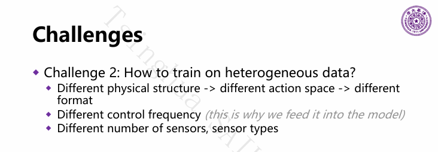

**挑战 2：如何利用异构数据进行训练？**我们的目标是通过模仿学习来训练基础模型策略，以实现泛化。然而，特定双臂机器人的可用数据特别稀缺 （<10K 轨迹），远非训练基础模型的常见要求。为了解决这个问题，我们建议采用预训练和微调管道通过从 unimanual 操作的最新进展中汲取灵感，利用来自多个机器人的数据。通过这种方式，我们将数据大小扩大三个数量级。

然而，基于多机器人数据进行训练带来了数据异构性的独特挑战。不同机器人的物理结构和动作空间可能会有很大差异。之前的尝试要么将自己局限于具有相似动作空间的机器人子集或者只保留共享相同结构的输入子集，但代价是丢失大量信息。关于如何在此类异构数据上训练模型，它在很大程度上仍未得到解决。

#### 2.4 方法

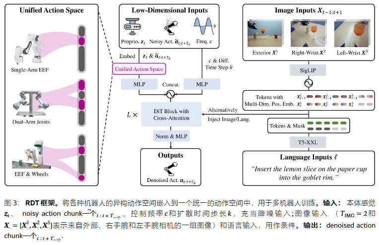

#### 多模态输入编码

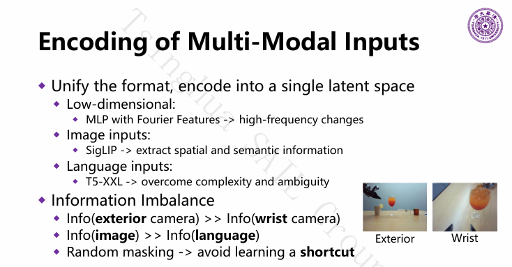

多模态输入的异质性反映在结构中;也就是说，每种模态的格式和维度数量明显不同。这给多模态训练带来了挑战。为了解决这个问题，我们将这些不同的模态编码到一个统一的潜在空间中。以下是编码方法：

-  **Low-Dimensional Inputs** 是代表机器人物理量的低维向量，包括本体感觉、动作块和控制频率。为了对它们进行编码，我们使用 MLP 处理傅里叶变换后的特征，可以有效地捕捉低维空间中的*高频变化*。

- **图像输入**是高维的，包含丰富的空间和语义信息。为了提取紧凑的表示，我们使用图像-文本对齐的预训练视觉编码器 SigLIP。我们在训练期间固定其权重以节省显存。

- **语言输入**的长度各不相同，并且高度抽象，由于其复杂性和模糊性，带来了集成挑战。为了对它们进行编码，我们使用了预先训练的基于 Transformer 的语言模型 T5-XXL。我们还在训练期间固定其权重以节省显存。

除了结构之外，异构性还意味着不同输入中包含的信息量不同。首先，不同模态的数据包含的信息量不同。例如，图像通常比文本包含更多的信息，并且在编码后，它们会产生更多的标记。其次，同一模态的不同输入可能包含非常不同的信息量。例如，与手腕摄像头相比，机器人的外部摄像头具有更全局的视野和更丰富的信息。在这种情况下，模型可能会学习一条捷径：只关注外景，忽略手腕视图，从而失去感知深度的能力。

为了解决这个问题，我们在编码过程中以一定的概率随机独立地屏蔽每个多模态输入，以防止模型过度依赖特定的输入。

#### 网络结构

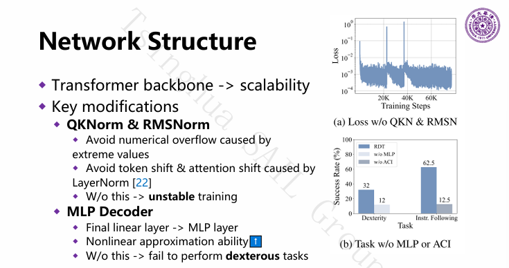

我们选择 Transformer 作为可扩展的骨干网络并通过考虑我们的机器人问题的特性，对 Diffusion Transfomer （DiT） 进行以下三个关键修改：

- **QKNorm & RMSNorm.**输入机器人物理量的*数值范围不稳定*，会导致梯度不稳定和数值溢出等问题，尤其是在训练大型基础模型时。为了解决这个问题，我们添加了 QKNorm 以避免在计算注意力时数值不稳定。此外，我们还注意到，我们的问题可以看作是一个时间序列预测任务，原始 DiT 的 LayerNorm 中的居中操作可能会导致 *token 转移*和*注意力转移*，从而破坏时间序列的对称性。因此，我们将 LayerNorm 替换为 RMSNorm 无需定心操作。图中（a）表明，如果没有这种修改，大规模的预训练往往非常不稳定，甚至会爆炸。

- **MLP 解码器。**为了提高*非线性*机器人动作的近似能力，我们用非线性 MLP 解码器替换了最终的线性解码器，作为从潜在空间回到物理空间的投影。如图中（b）所示，如果没有这种设计，RDT 就无法有效地捕捉非线性动力学，从而失去完成需要精细操作的灵巧任务的能力。

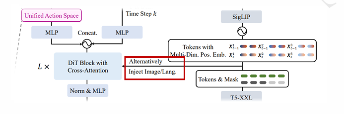

- **交替条件注射 （ACI）。**在我们的模型中，图像和语言输入作为条件，它们是高维且长度可变的，与传统 DiT 中的类标签条件形成鲜明对比。这些信息条件很难压缩成单个标记，这使得原始的自适应层范数方法不适用。因此，我们采用交叉注意来适应不同长度的条件，避免在进一步压缩中丢失信息。此外，我们进一步分析，鉴于图像标记通常比文本标记多得多，同时注入两种模式往往会掩盖与文本相关的信息，从而损害指令跟随的能力（见图中（b）表示定量结果）。为了缓解这个问题，我们战略性地交替在连续层的交叉注意力中注入图像和文本标记，而不是在每个层中同时注入两者。

#### 在多机器人数据上训练

为了实现对异构多机器人数据的训练，我们需要一个由各种机器人共享的统一动作空间，这可以为多机器人动作提供统一的格式。从机器人的原始动作空间到统一动作空间的映射应该是物理可解释的，每个维度都应该有明确的物理意义。这可以鼓励模型从不同的机器人数据中学习共享的物理定律，从而提高从不同机器人的数据中学习的效率

空间的设计包括两个步骤。首先，对于每个机器人，我们可以使用一个空间来容纳它的自身感知空间和动作空间。原因是时间步骤t下的动作𝒂t通常是下一个时间步骤的期望自身感知𝒛t+1的一个子集（即𝒂t可以看作𝒛t+1的一部分），所以可以直接将𝒛t的空间包含𝒂t的空间来表示二者（该思路源于Kouvaritakis&Cannon.2016与de Wit.et al.2012）

其次，我们设计了一个统一的空间，其中包含了大多数带有抓手手臂的机器人的所有主要物理量，如图2左侧所示。我们将机器人的动作空间嵌入到了这个统一空间中，将原始动作向量的每个元素根据其物理意义填充到统一动作空间向量的相应位置，其余位置进行填充。统一空间的具体定义在附录 [C](https://arxiv.org/html/2410.07864v1#A3) 中给出。

在这个统一的空间下，我们能够对几乎所有带有抓手手臂的现代机器人的数据进行预训练 RDT，并大大扩展数据规模，以满足基础模型的要求。具体来说，我们的预训练数据集集合包括46各种机器人的数据集，总大小为1M+ 轨迹。

在直播中，作者额外阐述了他们采用统一空间表示方法而非独立地为每一个机器实体的物理输入分配一个编码器的观点。

独立分配编码器：

- 通过Encoder将实际动作转化成一串特征向量，然而这串特征向量表示什么意思？却需要额外的时间和数据去学习
- 每个机器人每个物理量的Encoder权重并不共享！对每个机器人都只有少量的数据并不友好，不足以将每个Encoder都训练充分

统一空间表示：

- 采用直接拼接表示，向量中每个位置都有自己的物理含义。
- 这种格式允许跨机器人之间的物理含义共享，可以在不同异构机器人实体上带来数据上的优势

#### 2.5 实验

我们的目标是通过真实机器人实验来回答以下问题：

𝒬**1**： RDT 零镜头可以推广到看不见的物体和场景吗？

𝒬**2**： RDT 的零样本指令跟踪能力对看不见的模态效果如何？

𝒬**3**： RDT 能否促进以前未见过的技能的小样本学习？

𝒬**4**： RDT 是否能够完成需要精细操作的任务？

𝒬**5**：大模型大小、大量数据和扩散建模对 RDT 的性能有帮助吗？

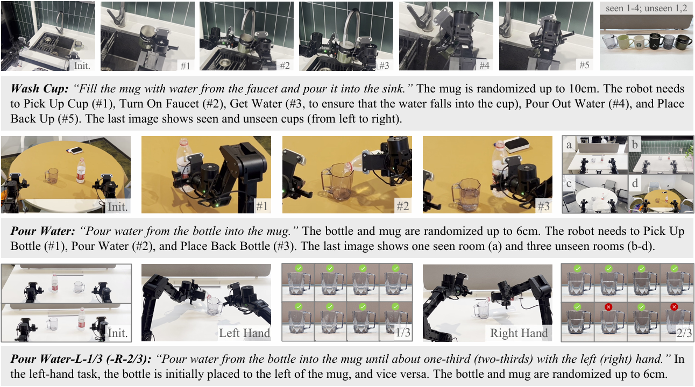

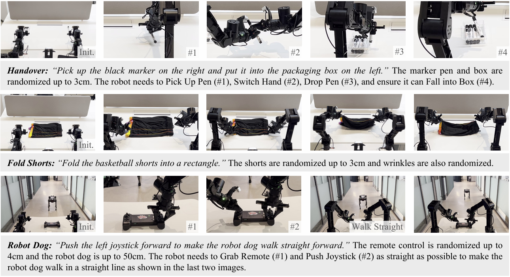

RDT-1B项目展示页：[RDT-1B: a Diffusion Foundation Model for Bimanual Manipulation](https://rdt-robotics.github.io/rdt-robotics/)

#### 结果分析

$A$**1**&$A$**2**:  RDT 可以零镜头泛化到看不见的对象、场景和模态。在 *Wash Cup* and *Pour Water* 中，RDT 在看不见的场景下仍然可以达到很高的成功率，其性能与看不见的场景没有太大区别。相比之下，其他基线甚至无法完成整个任务。在*倒入水-L-1/3* 和*倒入水-R-2/3* 中, 我们可以发现 RDT 准确地理解要操纵哪只手以及要倒多少水，并通过其动作密切遵循指令，即使它从未见过“三分之一”或“三分之二”之类的词。正是因为大规模的预训练，RDT 看到了大量不同的物体、场景和指令，才产生了如此强的zero shot泛化。

$A$**3**:  RDT 可以在少样本下学习新技能。在 *Handover* and *Fold Shorts* 中，RDT 通过小镜头学习学习了新的复杂交接和折叠技能，其动作模式与已知技能有很大不同，而其他人的成功率几乎为零。这种改进也是由于大规模的预训练。小样本学习可以帮助 RDT 快速适应新的工作环境，这对实际应用具有重要意义。

$A$**4**:  RDT 可以处理灵巧的任务。在*机器狗*中，RDT 在推动摇杆时精确控制了角度，而其他人则导致机器狗偏离。这是因为 diffusion 凭借我们强大的网络架构，可以对多模态和非线性动作的分布进行建模，从而使动作精度满足灵巧任务的要求。我们还注意到，操纵杆和遥控器都是黑色的，这使得操纵杆在视觉上不明显。它可能使 ACT 容易失败。相比之下，大规模的预训练使 RDT 学习了更好的操纵杆概念的视觉语言表示，从而提高了识别能力。

$A$**5**:  大模型规模、广泛的数据和扩散都是我们卓越的基本因素。在表 [2](https://arxiv.org/html/2410.07864v1#S5.T2) 中，没有这些因素的情况下，性能出现了严重的下降，这表明了我们贡献的必要性。特别是，*RDT （scratch）* 在看不见的物体和场景上表现不佳，这表明预训练的知识对于泛化至关重要。

#### 2.6 附录

#### 附录C 物理可解释的统一操作空间

我们将各种机器人的动作嵌入到一个统一的空间中，其中包括机器人的所有主要物理量。这个统一动作空间的维数为 128。表 [4](https://arxiv.org/html/2410.07864v1#A3.T4) 描述了此统一操作空间中向量的每个元素。对于特定的机器人，原始动作向量的每个元素都会根据其物理含义填充到统一动作向量的相应位置，其余位置将被填充。

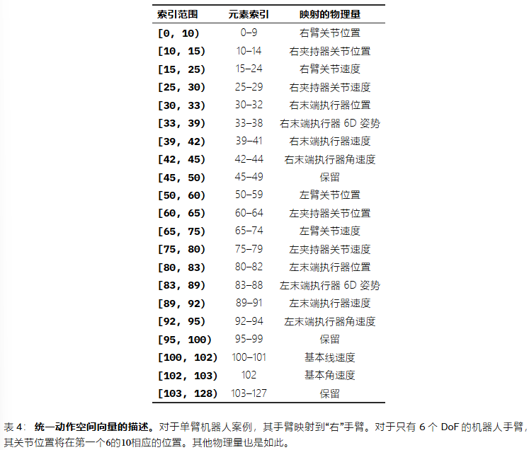

#### 附录D 预训练数据集

我们的预训练数据集集合包括46数据集，总规模为1M+ 轨迹和21TB，使其成为迄今为止最大的机器人数据集预训练集合。表 [5](https://arxiv.org/html/2410.07864v1#A4.T5) 显示了我们的预训练数据集及其采样权重的完整列表。我们分配的初始权重为 根号下N_j 添加到每个数据集中，大小为 N_j 并根据每个数据集的多样性和质量进行调整。与线性加权相比，这种方法可以防止对大型数据集进行过度采样，同时确保对较小的数据集进行充分采样，从而增强每个小批量中预训练样本的多样性。在预训练阶段，我们进一步观察并根据不同数据集的中间损失结果调整了权重。我们增加了那些缓慢收敛数据集的权重。

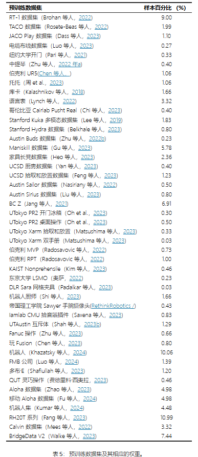

