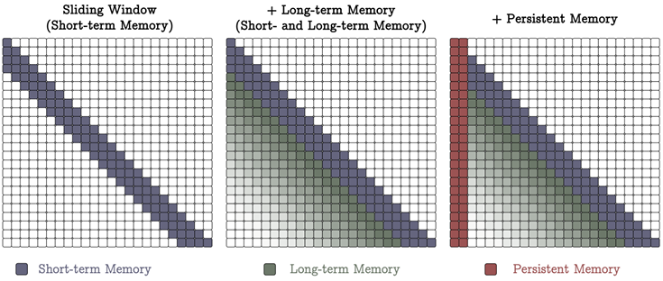
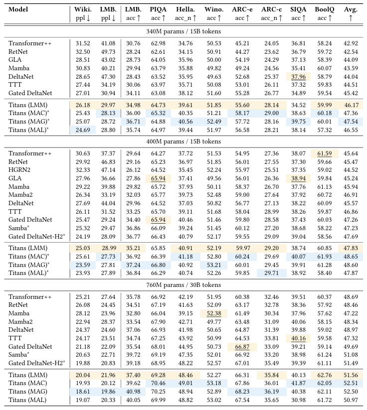

### 记忆Memory机制前沿研究

### Google 最新 Titans 模型中的长时记忆机制

------

论文标题：Titans: Learning to Memorize at Test Time

论文地址：https://arxiv.org/pdf/2501.00663v1

#### 摘要 abstract

关于如何有效利用 RNN 和 Attention，人们在近十年进行了广泛的研究工作。虽然循环神经网络旨在将数据压缩到固定大小的内存（称为隐藏状态）中，但 Attention 允许关注整个上下文窗口，捕获所有标记的直接依赖关系。种更准确的依赖关系建模带来了二次成本，将模型限制在固定长度的上下文中。

本文提出了一种新的神经长期记忆模块，并证明该模块具有快速可并行训练的优势。本文将传统 Attention 作为短期记忆，将提出的神经长期记忆模块充当长期记忆。并对比了Titans模型中长期记忆模块不同插入方式的三种变体。

#### 导言 Introduction

大多数现有架构将记忆视为由输入引起的神经网络更新，并将学习定义为在给定目标情况下获得有效和有用记忆的过程。这个观点可以帮助我们更好地理解现有范式中的关键差异：例如线性Transformers与Transformer之间的主要区别在于记忆结构以及记忆更新步骤，其中线性Transformers将历史数据压缩到固定大小的矩阵值内存中，而Transformers保留所有历史数据（在上下文长度内）而不进行任何压缩。

虽然线性Transformer和线性RNN（包括状态空间模型State Space Model）都在内存更新步骤中压缩信息，但关键区别在于记忆的结构，其中线性RNN（相对于线性Transformer）使用向量值记忆（相对于矩阵值记忆）。因此，这个观点促使我们问：

- **Q1** 什么构成了记忆的良好结构？
- **Q2** 什么是适当的记忆更新机制？
- **Q3** 什么是好的记忆检索过程？

记忆不是一个单一的过程也不是单一的功能，事实上，记忆是系统的集合——短期记忆、工作记忆、长期记忆——每个系统都有不同的功能且能独立与合作。这一事实促使我们继续提出以下问题：

- **Q4** 如何设计一个包含不同互联记忆模块的高效架构？

最后，存储记忆是一个神经网络过程，需要编码和存储过去的摘要。假设单个向量或矩阵（其参数以线性方式编码数据）足以存储长期历史记录，这可能过于简单化。

- **Q5** 是否需要深度记忆模块来有效地存储/记住很久以前的内容？

#### 背景 Preliminaries

文中首先回顾了Transformer中自注意力机制：
$$
Q = x W_Q, \quad K = x W_K, \quad V = x W_V   
\tag{1}
$$

$$
y_i = \frac{\sum_{j=1}^i \exp\left(Q_i^\top K_j / \sqrt{d_{in}}\right) V_j}{\sum_{\ell=1}^i \exp\left(Q_i^\top K_\ell / \sqrt{d_{in}}\right)}
\tag{2}
$$

> **定义变量**：
>
> - 输入变量 x：是输入序列，每个时间步是一个向量，表示模型接收到的特征。
>
> - 投影矩阵 $W_Q, W_k, W_V$ :
>
>   $W_Q$：用于将输入 x 投影为查询向量（Query）
>
>   $W_K$：用于将输入 x 投影为键向量（Key）
>
>   $W_V$：用于将输入 x 投影为值向量（Value）
>
> - 生成的中间向量 :
>
>   Q：查询矩阵，通过 $Q=xW_Q$ 计算得到
>
>   K：键矩阵，通过 $K=xW_K$ 计算得到
>
>   V：值矩阵，通过 $V=xW_V$ 计算得到
>
> 自注意力的核心是计算每个序列元素与其他元素的相似性，然后用这个相似性分布对值向量加权求和，结果用作最终的输出表示。
>
> **具体公式解释**：
>
> 对于第$i$个时间步，输出$y_i$的计算方式如下：
> $$
> y_i = \frac{\sum_{j=1}^i \exp\left(Q_i^\top K_j / \sqrt{d_{in}}\right)}{\sum_{\ell=1}^i \exp\left(Q_i^\top K_\ell / \sqrt{d_{in}}\right)} V_j
> $$
>
> - 查询 $Q$ 与键 $K$ 的点积：
>
>   $Q_i^\top K_j$ : 表示查询向量 $Q_i$ 和键向量 $K_j$ 的点积
>
>   通过点积计算 $i$-位置与 $j$-位置的相关性
>
> - 缩放因子：
>
>   $d_{in}$: 为了缓解点积值过大引起的梯度不稳定问题，进行缩放。这里 $d_{in}$ 是查询和键的维度。
>
> - 指数和归一化：
>
>   $\exp\left(Q_i^\top K_j / \sqrt{d_{in}}\right)$: 将点积相似性值转化为非负数，表示 $i$ 和 $j$ 位置的注意力分数
>
>   分母是所有前 $i$ 个位置的注意力分数的总和，用来归一化
>
> - 值向量加权求和：
>
>   归一化的注意力分数 $\frac{exp⁡(...)}{∑...}$ 对对应的值向量 $V_j$ 进行加权求和，得到输出 $y_i$。
>
> **上下标说明**：
>
> - $Q_i$ : 表示第 $i$ 个位置的查询向量
>
> - $K_j$ : 表示第 $j$ 个位置的键向量
>
> - $\ell$ : 表示归一化时对前 $i$ 个位置的键向量遍历
> - $y_i$ : 表示第 $i$ 个位置的输出
>
> - 求和范围 $\sum_{j=1}^i$ :
>
>   表示只考虑当前及之前的位置，适用于因果注意力机制，确保未来的信息不被使用（例如在语言模型中处理序列预测任务时）
>
> **直观理解**:
>
> - 查询-键相似度：
>
>   通过查询向量 $Q_i$ 和键向量 $K_j$ 计算序列中位置 $i$ 和 $j$ 的相关性。
>
> - 加权求和：
>
>   用这个相似性分布对值向量 $V_j$ 进行加权，得到第 $i$ 个位置的输出。 这种机制允许模型根据上下文动态调整注意力分布，专注于输入序列的相关部分，是 Transformer 的核心计算步骤。

其中 $W_Q,W_K,W_V ∈ R^{𝑑_{in} × 𝑑_{in}}$ 是可学习参数。 尽管其在召回方面具有强大的能力和有效性，但Transformer至少需要 $N × d$ 次操作来计算输出，这导致对于更长的序列，其内存消耗更大，吞吐量更低。

为了降低长序列中softmax注意力机制的内存消耗并提高吞吐量，众多设计出更多通过稀疏化注意力矩阵、近似softmax或开发基于核函数（线性）的注意力机制。在本部分我们重点关注后者——线性注意力机制 Linear Attention，在这种机制中，标准注意力中的softmax被替代为另一种核函数。相应地注意力可以表示为：
$$
y_i 
=
\sum_{j=1}^i
\frac{
\phi(Q_i^\top K_j) V_j
}{
\sum_{\ell=1}^i \phi(Q_i^\top K_\ell)
}
=
\sum_{j=1}^i
\frac{
\phi(Q_i)^\top \phi(K_j) V_j
}{
\sum_{\ell=1}^i \phi(Q_i)^\top \phi(K_\ell)
}
=
\frac{
\phi(Q_i)^\top \sum_{j=1}^i \phi(K_j) V_j
}{
\phi(Q_i)^\top \sum_{\ell=1}^i \phi(K_\ell)
}

\tag{3}
$$
> **主要符号解释**：
>
> - 输入向量和投影：
>
>   $$Q_i,K_j,V_j$$ : 查询/键/值 向量（Query/Key/Value），分别表示第 $i$ / $j$ / $j$ 个序列的特征信息
>
>   $\phi(·)$ : 特征映射函数，用于将输入向量投影到一个新的空间，通常是非线性变换
>
> - 点积注意力的改进:
>
>   传统自注意力使用 $exp⁡(Q_i^⊤ K_j / \sqrt{d})$ 来计算点积相似度，而这里引入了特征映射 $ϕ(⋅)$，从而以更加高效的方式计算点积相似度。
>
> - 归一化因子:
>
>   分母 $\sum_{\ell=1}^i \phi(Q_i^\top K_\ell)$ 表示当前 $i$ 个位置的所有键向量 $K_ℓ$ 与查询 $Q_i$ 的相似度总和，用于归一化注意力权重。
>
> - 值加权求和:
>
>   分子 $\sum_{j=1}^i \phi(Q_i)^\top \phi(K_j) V_j$ 表示每个键向量的权重（与 $Q_i$ 的相似度）对对应值向量 $V_j$ 的加权求和。
>
> **逐步分解解释**：
> $$
> y_i 
> =
> \frac{
> \phi(Q_i)^\top \sum_{j=1}^i \phi(K_j) V_j
> }{
> \phi(Q_i)^\top \sum_{\ell=1}^i \phi(K_\ell)
> }
> $$
>
> - 相似度计算：
>
>   $\phi(Q_i)^\top \phi(K_j)$ 表示查询 $Q_i$ 和键 $K_j$ 在特征空间的相似度
>
> - 加权求和：
>
>   将相似度作为权重，对值向量 $V_j$ 进行加权求和，表示通过查询 $Q_i$ 对历史序列的信息聚合。
>
> - 归一化：
>
>   用 $\phi(Q_i)^\top \sum_{\ell=1}^i \phi(K_\ell)$ 对加权求和结果进行归一化，确保输出 $y_i$ 是一个有效的概率分布表示。
>
> - 最终形式：
>
>   通过将分子和分母表示为矩阵形式，进一步优化计算复杂度，适合处理长序列
>
> **优化特点**：
>
> - 特征映射 $\phi(·)$ : 
>
>   使用特征映射 $\phi$ 替代直接点积操作，能够减少计算开销，尤其适用于长序列。常见的 $\phi$ 选择包括核函数或基于稀疏化的近似方法
>
> - 因果结构 : 
>
>   求和范围 $j=1$ 到 $i$，限制了当前输出 $y_i$ 只依赖过去及当前的信息，保证了因果性
>
> - 矩阵形式简化 ：
>
>   通过将加权求和和归一化写为矩阵运算，可以进一步提高实现效率

由于在每一步中都重复使用了 $\sum_{j=1}^i \phi(K_j)$ 和 $\sum_{\ell=1}^i \phi(K_\ell)$ 这两个项，从而实现了更高的吞吐量。当选择核函数 $\phi$ 为单位矩阵时，上述公式也可以写成递归格式，这使得对线性注意力进行高效推理成为可能：
$$
M_t = M_{t-1} + K_t^\top V_t
\tag{4}
$$

$$
y_t = Q_t M_t
\tag{5}
$$

> $$
> y_i =\frac{\phi(Q_i)^\top \sum_{j=1}^i K_j V_j}{\phi(Q_i)^\top \sum_{j=1}^i K_j}
> $$
>
> 为了避免重复计算累积和，定义累积变量，并将其引入递归形式。
>
> **定义累积矩阵**：
>
> 定义一个累积矩阵 $M_t$，表示到当前时间 $t$ 为止的所有加权和值的累积：
> $$
> M_t = \sum_{j=1}^t K_j^\top V_j
> $$
> 根据递归的性质，我们有：
> $$
> M_t = M_{t-1} + K_j^\top V_j
> $$
> 其中 $M_{t-1}$ 是上一时间步的累积结果，$K_j^\top V_j$ 是当前时间步键和值的贡献。这个递归公式避免了每次都计算和重新求和 $\sum_{j=1}^t$ ，而是通过增量更新。
>
> 根据累积结果 $M_t$ , 可以直接计算出：
> $$
> y_t = Q_t M_t
> $$
> 这是因为归一化因子在特定场景（如选择线性核函数）可以省略，或者被吸收到权重更新中。

现代线性模型将循环神经网络（RNN）的隐藏状态视为一个记忆单元，模型旨在将信息压缩到该记忆单元中。因此，在一般形式的循环神经网络中，隐藏状态可以被视为一个记忆单元，循环（递归）过程可以拆分为读和写操作。即，我们让 $x \in \mathbb{R}^{N \times d_{in}}$ 是输入，$M \in \mathbb{R}^d$ 是记忆单元，$y \in \mathbb{R}^{d_{in}}$ 是输出，那么循环神经网络的一般形式可以定义为：
$$
M_t = f(M_{t-1}, x_t) \hspace{2cm} 
\text{\textcolor{gray}{Write}} \hspace{0.1cm} \text{\textcolor{gray}{Operation}}
\tag{6}
$$

$$
y_t = g(M_t, x_t)  \hspace{2.8cm} 
\text{\textcolor{gray}{Read}} \hspace{0.1cm} \text{\textcolor{gray}{Operation}}
\tag{7}
$$

其中 $f(...)$ 是读取函数，$g(...)$ 是写入函数。这里的 $M_t$ 表示时间 $t$ 时记忆的状态。

从这个角度看，线性Transformer的递推公式（公式4）相当于将键值 ($K_t, V_t$) 加性压缩并写入矩阵值的存储单元 $M_t$​ 中。因此，在处理长上下文数据时，这种加性性质的过程会导致记忆溢出，严重损害模型性能。为了解决这个问题，研究主要集中在两个有前景的方向上：
（1）添加遗忘机制：为线性模型提出了自适应（数据依赖）的遗忘门机制，当需要时可以清除记忆。此类模型包括 GLA、LRU、Griffin、xLSTM 和 Mamba2 。
（2）改进写入操作：为了克服传统递归模型（RNN）中记忆写入操作的加性性质，在添加记忆（即键值对）之前，模型会先清除其过去的值。

#### 测试时学习记忆 Learning to Memorize at Test Time

为了克服长期记忆的缺失，本节中，我们提出了一种神经长期记忆模块，这是一种能在测试时学习记忆的元模型。在本结第一部分中我们首先讨论神经记忆的动机和设计。在本节第二部分探讨了我们的设计如何从快速且可并行化的训练中收益，在最后一部分我们进行扩充。

##### 长期记忆 Long-termMemory

我们需要一个在线的元模型，它能学习在测试期间如何记忆/遗忘数据。在这种设置下，模型正在学习一种能够记忆的功能，而不会仅仅离线地拟合训练时的数据从而限制其在测试数据上的泛化能力。

- 学习过程与意外度量

对于人类而言，违背预期（即令人意外）的时间更令人难忘。受此启发，对于模型而言，意外的一个简单定义可以是相对于输入的梯度。梯度越大，输入数据与过去数据的差异就越大。因此，利用这一意外度量，我们可以对记忆进行更新，具体方式如下：
$$
M_t = M_{t-1} - \theta_t \underbrace{\textcolor{purple}{\nabla \ell(M_{t-1}; x_t)}}_{\text{Surprise}}
\tag{8}
$$
然而这种意外指标可能会导致错过重大意外时刻之后的重要信息，即经历几次意外步骤后梯度变得极小，从而陷入平坦区域（局部最小值），并错过序列中某些部分的信息。从人类记忆的角度看，尽管某个事件令人难忘，但它可能不会在很长的一段时间内持续令人感到意外。为了改进上述意外读指标（公式8），我们将意外度指标分解为（1）过去意外度，用于衡量最近过去的意外程度；（2）即时意外度，用于衡量新输入数据的意外程度：
$$
M_t = M_{t-1} + \textcolor{purple}{S_t}
\tag{9}
$$

$$
S_t = \eta_t \underbrace{\textcolor{purple}{S_{t-1}}}_{\text{PastSurprise}} - \theta_t  \underbrace{\textcolor{purple}{\nabla \ell(M_{t-1}; x_t)}}_{\text{MomentarySurprise}} 
\tag{10}
$$

有趣的是，这种公式与带有动量的梯度下降法类似，其中 $S_t$ 为动量元素。因此，这里的动量起到了对时间（序列长度）内意外情况的记忆作用。在这个公式中，$\eta_t$ 是数据相关的意外衰减（取决于$X_t$）,控制意外情况随时间衰减程度，而 $\theta_t$ 则控制应以数据相关的方式将多少即时意外情况纳入最终的意外度量中。这种数据相关性在这个设计中尤为重要：虽然先前 tokens 的意外情况可能会影响后续 tokens 的意外情况，但只有所在 tokens 都相关且处于相同上下文中时才有效。因此，数据相关的 $\eta$ 可以控制记忆是否需要：
（1）通过将 $\eta_t → 0$ 来忽略上一次意外情况（可能是由于上下文变化），或者（2）通过设置 $\eta_t → 1$ 完全纳入上一次的意外情况（可能是因为该 tokens 与其最近的 past tokens 高度相关）。

我们上述的意外度量是基于一个损失函数 $\ell(.;.)$，该损失函数是我们的记忆模块在学习如何在测试时执行的目标函数。也就是说，我们的记忆模块是一个元模型，它学习基于损失函数 $\ell(.;.)$ 的函数。

在本研究中，我们专注于关联记忆，其中我们旨在将过去的数据存储为键值对。给定 $x_t$，我们使用两个线性层将 $x_t$ 投影到键和值上：
$$
k_t = x_t W_K,\hspace{2cm}v_t = x_t W_V,
\tag{11}
$$
其中，$W_K$和 $W_V ∈ ℝ^{d_{in} \times d_{in}}$。接下来，我们期望我们的记忆模块学习键和值之间的关联。为此，我们定义损失函数如下：
$$
\ell(M_{t-1}; x_t) = \|M_{t-1} (k_t) - v_t\|^2_2
\tag{12}
$$

> 这是一个用于计算损失的公式，目标是通过优化累积矩阵 $M_{t−1}$ 来减少预测值和目标值之间的误差。
>
> **符号定义:**
>
> - 损失函数 $\ell(·)$ :
>
>   $\ell(M_{t-1}; x_t)$ 表示在当前时间步 $t$，给定累积矩阵 $M_{t−1}$ 和输入 $x_t$ 时的损失
>
> - 累积矩阵 $M_{t−1}$ :
>
>   表示到时间 $t-1$ 的累积结果。它总结了之前时间步中的所有历史信息，并以矩阵的形式表示
>
> - 输入 $x_t$ :
>
>   包括当前时间步的键 $k_t$ 和值 $v_t$，其中 $k_t$ 为当前时间步的键向量，$v_t$ 为当前时间步的目标值向量
>
> - 预测值：
>
>   $M_{t-1} (k_t)$ 为累积矩阵 $M_{t-1}$ 作用于键 $k_t$ 后，产生的预测值
>
> - 目标值 $v_t$ ：
>
>   表示当前时间步的真实目标值向量
>
> **公式的意义:**
>
> - 核心思想：
>
>   这个公式的目的是通过损失函数 $\ell$，衡量累积矩阵 $M_{t−1}$ 在预测当前值 $v_t$ 的准确性；
>   $M_{t-1} (k_t)$ 是对 $v_t$ 的预测，公式衡量了预测值与真实值的差距
>
> - 优化目标：
>
>   最小化损失 $\ell(M_{t-1}; x_t)$ ，即通过调整 $M_{t-1}$ ，使预测值 $M_{t-1} (k_t)$ 尽可能接近目标值 $v_t$
>
> - 递归性：
>
>   $M_{t-1}$ 是时间 $t-1$ 的累积结果，优化损失函数会间接影响下一时间步 $M_t$ 的更新
>
> - 在线下学习：
>
>   随着时间 $t$ 的推进，不断更新 $M_{t−1}$，以更好地适应未来的键-值关系

通过优化我们元模型（记忆）中的上述损失函数，模型学习如何在测试时记住键和值之间的映射。需要注意的是，类似于元学习模型，记忆的训练是在内循环中进行的，因此参数 $𝑊_𝐾$ 和 $𝑊_𝑉$ 是上述损失函数中的超参数。因此，在内循环中，我们优化 $M$ 的权重，而在外循环中，我们优化整个架构的其他参数。

- 遗忘机制

我们使用了一种自适应遗忘机制，使得记忆能够忘记不再需要的信息，从而更好地管理记忆的有限容量。也就是说，给定下一个token $𝑥_𝑡$，我们修改更新规则如下：
$$
M_t = (1 - \alpha_t) M_{t-1} + \textcolor{purple}{S_t},
\tag{13}
$$

$$
S_t = \eta_t \textcolor{purple}{S_{t-1}} - \theta_t \textcolor{purple}{\nabla \ell(M_{t-1}; x_t)},
\tag{14}
$$

其中，$𝛼_𝑡 ∈ [0,1]$ 是一个门控机制，灵活地控制记忆的更新，即决定应忘记多少信息。例如，通过让 $𝛼_𝑡 → 0$，它可以在不影响过去特征的情况下更新记忆；而通过让 $𝛼_𝑡 → 1$，它可以清除整个记忆。

- 记忆架构

在本文中，我们将焦点放在简单的 MLP（多层感知机）上，其中 $L_M ≥ 1$ 层作为我们长期记忆的架构。选择这一架构的主要原因是我们希望更好地阐述长期记忆的设计动机以及它如何被融入架构中。然而，我们的公式和架构设计开辟了一个新的研究方向，即设计在数据记忆方面更有效率和高效的神经网络架构。

当使用向量值或矩阵值记忆时，记忆模块会压缩过去的数据并将其拟合到一条线上。也就是说，从元学习或在线学习的角度来看，使用矩阵值记忆 $𝑀 = 𝑊 ∈ ℝ^{d_{in} \times d_{in}}$ 相当于优化损失函数：$$ \ell(W_{t-1}; x_t) = \|W_{t-1} k_t - v_t\|_2^2 $$ 。这是一个在线线性回归目标，因此最优解假设历史数据之间的依赖关系是线性的。另一方面，我们认为深度记忆模块（即 $L_M ≥ 2$）具有更高的效能。与理论结果一致，即至少两层的 MLP 比线性模型具有更强的表达能力，在后续的实验中，我们展示了深度记忆模块在实践中更有效。

- 检索记忆

在上述内容中，我们讨论了如何设计和训练一个长期记忆模块，使其能够在测试时学习并记住信息。一个关键的未解问题是：如何从记忆中检索信息？我们简单地使用前向传播（即推理）来检索与查询对应的记忆。正式地说，给定一个输入 $𝑥_𝑡$ ，我们使用一个线性层 $𝑊_𝑄$ 来对输入进行投影，即 $q_t = x_t W_Q$，然后通过以下方式从记忆中检索相应的（或有用的）信息：
$$
y_t = M^*(q_t)
\tag{15}
$$

##### 如何并行化长期记忆训练 How to Parallelize the Long-term Memory Training

图一注：神经记忆训练如何并行进行并使用矩阵乘法（matmuls)的示意图。

如上所述，我们的长期记忆模块的设计相当于通过优化关联记忆损失函数 $\ell(M_{t-1}; x_t) = \|M_{t-1}(k_t) - v_t\|_2^2$ 来训练一个元模型，采用带动量和权重衰减的梯度下降。因此，理论上，长期记忆模块的训练需要 $O(N)$ 次浮点运算（FLOPs），其中 $N$ 是序列长度。然而，在实践中，我们需要并行化训练过程，并充分利用硬件加速器，因此我们需要张量化过程并使用更多的矩阵乘法（matmuls）。

接下来，我们展示了如何通过小批量梯度下降、数据依赖的学习率和权重衰减来计算内循环中的权重，这些可以被重构为仅使用矩阵乘法和求和操作。我们基于前人的工作，表明优化模型的前向传播（使用常数学习率的小批量梯度下降）可以通过矩阵乘法计算。我们可以将序列拆分为大小为 $b \geq 1$ 的块，并将小批量（mini batch）梯度下降写为：
$$
M_t = (1 - \alpha_t)M_{t-1} - \theta_t \nabla \ell(M_{t-1}; x_t) = \beta_t M_0 - \sum_{i=1}^{t} \theta_i \frac{\beta_t}{\beta_i} \nabla \ell(M_{t'}; x_i)
\tag{16}
$$
其中 $t' = t - \text{mod}(t, b)$，并且 $\beta_i = \prod_{j=1}^{i}(1 - \alpha_j)$。为了简便起见，我们专注于第一个块，即 $t = b$，因此 $t' = 0$。此外，我们解释在 $M_t = W_t$ 线性情况下的过程。对于具有 $N_p \geq 2$ 的 MLPs，过程类似。使用我们的损失函数，我们得到：
$$
\nabla \ell(W_0; x_t) = (W_0 x_t - x_t) x_t^\top \Rightarrow \sum_{i=1}^{b} \theta_i \frac{\beta_b}{\beta_i} \nabla \ell(W_0; x_i) = \Theta_b B_b(W_0 X - X) X^\top
\tag{17}
$$
其中 $\Theta_b = \text{diag}(\theta_1, \theta_2, \dots, \theta_b)$，$B_b$ 类似地定义在 $\frac{\beta_b}{\beta_i}$ 上。需要注意的是，我们不需要存储所有的 $\Theta_{kb}$ 和 $B_{kb}$（对于 $k = 1, \dots, N/b$），而是为每个块存储这些矩阵，从而减少内存使用。接下来，我们扩展这个表示，使得我们也能包含动量项。在具有动量的小批量梯度下降中，如果我们查看动量项，我们得到：
$$
S_t = \eta_t S_{t-1} - \theta_t u_t
\tag{18}
$$
其中 $u_t = \nabla \ell(M_{t'}; x_t)$。需要注意的是，我们可以同时计算所有的 $u_t$，因此方程（公式18）是一个线性递归，$u_t$ 作为输入，$S_t$ 作为隐藏状态，$\eta_t$ 作为输入依赖的过渡值。因此，我们可以使用并行的关联扫描来计算这个块中的 $S_t$。

-  参数作为Chunks的函数 Parameters as the Function of Chunks.

参数作为块的函数，而不是让参数如 $$\alpha_t$$, $$\theta_t$$ 和 $$\eta_t$$ 依赖于输入（作为 token $$x_t$$ 的函数），我们可以将它们定义为依赖于其块的函数。尽管这样做会丧失一些表达能力，但这种形式可以帮助加速训练过程。在这种情况下，我们在每个块中使用相同的 $$\alpha$$、$$\theta$$ 和 $$\eta$$ 值。因此，在公式 (17) 中，我们可以将 $$\Theta$$ 存储为一个标量。类似地，我们也可以加速公式 (18) 的计算。即，当 $$\eta$$ 和 $$\theta$$ 在每个块内是可学习的但时间不变时，该方程变成了一个线性时不变系统LTI（linear time-invariant system），可以通过全局卷积来计算。在我们的实验中，我们将这些参数定义为 token 的函数。然而，这种简化（即作为块的函数）可能是未来研究的兴趣点，以便更高效地训练更大的模型。

##### 持续性记忆 Persistent Memory

我们的长期记忆也可以视为上下文记忆，这意味着输出完全依赖于上下文。因此，除了长期记忆外，我们还使用一组可学习但与输入无关的参数作为任务相关的记忆。这种类型的记忆在文献中被称为持久记忆或元记忆。给定 $𝑁_𝑝 ≥ 1$ ，我们使用可学习的参数 $𝑃 = [𝑝1 \hspace{0.2cm} 𝑝2 \hspace{0.2cm} ... \hspace{0.2cm} 𝑝_{𝑁𝑝}]$ 并将其附加到我们的序列开头：即给定大小为 $𝑁$ 的上下文窗口，我们将输入修改为：
$$
\mathbf{x_{new}} = [p_1 \hspace{0.2cm} p_2 \hspace{0.2cm} \dots \hspace{0.2cm} p_{N_p} ] \hspace{0.2cm} || \hspace{0.2cm} \mathbf{x}
\tag{19}
$$
其中，$||$ 表示连接操作。接下来，我们从三个角度讨论持久记忆的动机：

- 记忆角度

  我们的神经长期记忆是一个上下文记忆，其中所有参数都是输入依赖的。然而，一个有效的记忆系统还需要一些与输入无关的参数来存储任务知识的特征。也就是说，掌握一个任务需要记住如何完成任务的知识，而这些参数负责存储这样的知识。

- 前馈神经网络角度

  在 Transformer 架构中，注意力模块后面有全连接层，这些层与注意力权重类似，但它们有数据无关的参数。也就是说，将全连接层中的 ReLU 替换为 Softmax 可以得到类似注意力的权重，其中权重是数据无关的：$$ \text{FFN}(x) = W_V \hspace{0.2cm} \text{Softmax}(W_K x) $$

  实际上，当 $W_K$ 和 $W_V$ 与输入无关时，它们类似于注意力模块中的 $K$ 和 $V$ 矩阵。持久记忆权重预计具有相同的功能，这意味着在序列的第一部分使用它们将导致具有输入无关的注意力权重。

- 技术角度

  带有因果掩码的注意力对序列中的初始标记具有隐式偏见，因此注意力权重通常对初始标记高度活跃，这会导致性能下降。从技术角度来看，序列开头的这些可学习参数可以通过更有效地重新分配注意力权重来缓解这种影响。

  

#### 如何融入记忆 How to Incorporate Memory?

图三（a）注：不同变种titan的注意力掩码：**记忆作为上下文 (MAC). **我们将序列进行分段，并在每个窗口中使用完全因果注意力。同样，序列中的前 $𝑁_𝑝$ 个标记为持久性记忆，接下来的 $𝑁_𝑙$ 个标记为长期记忆标记。

图三（b）注：不同变种titan的注意力掩码：**记忆作为门控 (MAG).** 我们使用滑动窗口注意力 (SWA) 作为短期记忆，将其与我们的神经记忆模块作为长期记忆结合，通过门控机制进行组合。

如何有效地将设计好的神经记忆模块整合到网络中？Transformer中的 $K$ 和 $V$ 矩阵对可以被解释为一个关联记忆模块。我们将其视为上下文窗口有限、建模准确的短期记忆模块。我们设计的神经记忆模块能够持续从数据中学习并将其存储在权重中，可以充当长期记忆模块。本节将提出三种不同的变体Titans，来探究如何有效将神经记忆模块整合到网络中。

##### 记忆作为上下文 Memory as a Context

图二注：记忆作为上下文（MAC）架构。该架构包括三个分支：（1）核心分支，（2）上下文（长期）记忆分支，和（3）持久记忆分支。核心分支将相应的长期记忆和持久记忆与输入序列进行连接。接下来，注意力机制在序列上执行，并决定哪些部分的信息应该存储在长期记忆中。在测试阶段，与上下文记忆对应的参数仍在学习，而与核心分支对应的参数负责上下文学习，持久记忆的参数则负责存储任务相关的知识，因此是固定的。

在第一个架构设计中（见图2），我们将记忆视为当前信息的上下文。即，给定一个长序列 $ x \in \mathbb{R}^{N \times d_{\text{in}}} $，我们首先将序列分割成固定大小的片段 $ S^{(i)} $，其中 $ i = 1, \dots, N/C $。对于传入的片段 $ S^{(t)} $，我们将其视为当前上下文，并将其过去的片段视为历史信息。因此，设 $ M_{t-1} $ 为片段 $S^{(t)}$ 之前的长期记忆状态，我们使用输入上下文作为查询，向记忆 $M_{t-1}$ 检索对应的历史信息。即，我们检索与 $S^{(t)}$ 相对应的过去信息如下：
$$
h_t = M^*_{t-1}(q_t)
\tag{21}
$$
其中 $$ q_t = S^{(t)} W_Q $$。接下来，我们将这些历史信息与我们的持久性记忆参数一起作为输入序列传递给注意力模块：
$$
\tilde{S}(t) = [p_1 \hspace{0.2cm} p_2 \hspace{0.2cm} \dots p_{N_p}] \hspace{0.2cm} \parallel h_t \parallel S^{(t)}
\tag{22}
$$

$$
y_t = \text{Attn}(\tilde{S}^{(t)})
\tag{23}
$$

整个序列的注意力图结构如图 3(a) 所示。然后，我们使用 $$ y_t $$ 来更新长期记忆模块，以便为下一个片段准备，并得到最终输出：
$$
M_t = M_{t-1}(y_t)
\tag{24}
$$

$$
o_t = y_t \otimes M^*_{t}(y_t)
\tag{25}
$$

在上述过程中，我们通过前向传播更新 $ M_{t-1} $ 的权重

这种架构有两个关键优势：（1）注意力机制由于同时具备历史和当前的上下文，能够决定在给定当前数据的情况下，是否需要长期记忆中的信息。（2）注意力模块有助于长期记忆仅存储当前上下文中有用的信息。也就是说，并非每个分段中的所有标记都是有用的，记住所有标记可能会导致记忆溢出。因此，注意力机制帮助记忆理解哪些信息是有用的，从而更好地管理记忆容量。（3）在测试时：（i）持久记忆参数是固定的，因为它们编码了关于任务的知识，不应改变；（ii）注意力模块的权重是上下文学习器；（iii） 长期记忆模块仍然在测试时学习（记忆）信息。也就是说，即使在测试时，我们仍然更新神经记忆的权重，因为这些权重编码了长时间过去的特征。

##### 门控记忆 Gated Memory

图四注：**Memory as a Gate (MAG) 架构.** 该架构与前述架构类似，具有三个分支：(1) 核心分支，(2) 上下文记忆，(3) 持久记忆。它将持久记忆仅仅融入上下文，并通过门控机制将记忆与核心分支结合。在测试时，其行为与图 2 中相同。

在下一个变体中（见图4），在一个分支中，我们直接使用输入数据来更新长期记忆，而在第二个分支中，我们使用滑动窗口注意力（SWA）：
$$
\tilde{x} = [p_1 \hspace{0.2cm} p_2 \hspace{0.2cm} \dots \hspace{0.2cm} p_{N_p}] \hspace{0.2cm} || \hspace{0.2cm} x
\tag{26}
$$

$$
y = \text{SW-Attn}^*(\tilde{x})
\tag{27}
$$

$$
o = y \otimes M(\tilde{x})
\tag{28}
$$

其中，$SW-Attn^*$ 是带前缀的滑动窗口注意力（见图3b）。需要注意的是，与之前的设计不同，我们并没有对输入数据进行分段。此外，我们在符号上做了一些简化，使用 $M(x)$ 表示经过所有递归计算后的记忆模块的最终输出。在上述公式中，$\otimes$ 可以是任何非线性门控。在我们的实验中，我们使用可学习的向量值权重对输出 $y$ 和 $M(\tilde{x})$ 进行归一化，并接着应用非线性激活函数 $\sigma(.)$。

该设计的整体注意力掩码如图3b所示。在此设计中，滑动窗口注意力充当了精确的短期记忆，而神经记忆模块充当了模型的衰退记忆。这个架构设计也可以看作是一个多头架构，其中各头的结构不同。

##### 记忆单独作为一层 Memory as a Layer

图五注：**Memory as a Layer (MAL) 架构.** 在此架构中，记忆层负责在注意力模块之前压缩过去和当前的上下文。

最后一个变体使用了深度神经网络中的神经记忆层（MAL）（见图 5）。该架构设计在文献中更为常见，混合模型堆叠了递归模型与全窗口或滑动窗口注意力。给定输入  $x$ ，模型的过程如下：
$$
\tilde{x} = [p_1 \hspace{0.2cm} p_2 \hspace{0.2cm} \dots \hspace{0.2cm} p_{N_p}] \parallel x
\tag{29}
$$

$$
y = M(\tilde{x})
\tag{30}
$$

$$
o = \text{SW-Attn}(y)
\tag{31}
$$

在上述设计中，SW-Attn 是滑动窗口注意力。该设计的主要缺点在于，模型的能力受到每个层的限制，因此无法充分利用注意力和神经记忆模块的互补数据处理。在我们的实验中，为了评估该设计中的记忆效果，我们使用了类似 H3 架构，其中我们将序列模型替换为我们的神经记忆模块（LMM）。

- 没有注意力的记忆

尽管在上文中我们讨论了将 LMM 和注意力结合的 MAL 架构，但 MAL 的一个简单变体是将 LMM 作为一个序列模型，而不使用任何注意力机制。从记忆的角度来看，正如第1节所讨论的，我们期望记忆系统的每个部分能够独立工作，即使其他组件受到干扰。因此，即使没有短期记忆（即注意力机制），长期记忆模块仍应是一个强大的模型。在我们的实验中，我们将这个变体称为 LMM 或 Titans（LMM）。我们在附录 C 中提供了关于 Titans 与其他现代RNN模型的联系的进一步讨论。

#### 实验 Experiments

接下来，我们评估了Titans及其变体在语言建模、常识推理、大海捞针、DNA建模和时间序列预测任务中的表现。

##### 实验设置

我们重点关注Titans的三个变体，分别称为：（1）以记忆作为上下文（MAC）的Titan，（2）以记忆作为门控（MAG）的Titan，（3）以记忆作为层（MAL）的Titan，以及（4）单独的神经记忆模块。以上模型中的每一个我们都考虑了四种规模，分别是 170M、340M、400M 以及 760M 参数。前三个模型都是在FineWeb-Edu数据集中采样的15B tokens子集中训练的，最后一个模型是在30B tokens子集上训练的。

在训练过程中，我们遵循（arXiv:2412.06464）训练流程，使用32K tokens 的 LLama2分词器，训练长度为4K tokens。采用AdamW优化器，学习率为4e-4，采用余弦退火学习率策略，batch size为 0.5M tokens，权重衰减率 0.1

##### 大海捞针

表 1：Titan 模型与基于递归和 Transformer 的基准模型在语言建模和常识推理任务上的表现。混合模型用 * 标记。最佳结果的简单模型(黄)和混合模型（蓝）中已加亮显示。

表 2：Titans 和基准模型在 RULER 基准的 S-NIAH 任务上的表现。简单模型（黄）和混合模型（蓝）中的最佳结果已突出显示。

在这一部分，我们使用来自 RULER 基准的 Single NIAH (S-NIAH) 任务，并评估 Titans 和基准模型在长度为 2K、4K、8K 和 16K 的序列上的表现。结果如表 2 所示。神经记忆模块在所有三个任务中均取得了最好的成绩。我们将这种优越的表现归因于 Titans 相较于现有序列模型的三个关键差异：（1）与 TTT 相比，我们的神经记忆通过使用动量以及遗忘机制（即权重衰减）更好地处理了记忆容量。因此，随着序列长度的增加，神经记忆的性能没有下降，且呈现出一致的趋势；（2）与 Mamba2 相比，后者拥有门控（遗忘）机制，Titans 具有更深的非线性记忆，从而实现了更好的记忆管理。此外，与我们的神经记忆和 DeltaNet 不同，Mamba2 无法移除记忆。我们可以看到，当增加序列长度时，性能显著下降；（3）与 DeltaNet 相比，尽管它能够使用 delta 规则移除记忆，但由于缺乏遗忘机制，它不能完全抹除记忆。最后，正如预期的那样，使用 Titans 变种时，我们可以看到相当或更好的结果，其中最佳结果对应于 MAC。

##### BABILong 基准测试

在上一节中，我们讨论了在简单的 NIAH 任务中的结果，其中需要检索单个针头。尽管 Titans 相比基准模型表现更好，但它们在超长序列上的真正优势仍然没有完全显现。为此，在本节中，我们使用了来自 BABILong 基准中的更难任务，在该任务中，模型需要在极长文档中推理分布的事实。

我们遵循基准中的原始实验设置和训练过程。实验有两个设置：（1）少样本设置，在该设置中我们使用大型预训练模型；（2）微调设置，在该设置中我们微调 Titans 的 MAC 变种，并将其与其他微调基准进行比较。 少样本设置的结果如图 6a 所示。在这个设置中，我们可以看到 Titans 超越了所有基准模型——即 Mamba2.8B、RWKV-6-7B、RecurrentGemma-9B、Gemma-9B、Llama3.1-8B、GPT-4 和 GPT4o-mini。这些结果是在 Titans（MAC）的参数远少于基准模型的情况下取得的。 

在微调设置中，我们将微调版的 Titans（MAC）与以下几种模型进行比较：（i）微调的小型模型（与 Titans 参数几乎相同），例如 Mamba、RMT；（ii）带有检索增强生成（RAG）的较大模型，例如 Llama3.1-8B；（iii）极大规模模型，例如 GPT-4、GPT4o-mini、Qwen2.5-72B 和 Llama3.1-70B。基准结果由 Yuri Kuratov 等（2024）报告。

图六注: Titans 和基准模型在 BABILong 基准上的表现。Titans（MAC）超越了所有基准模型，包括极大规模的模型，如 GPT4。

Titans 和基准模型的结果如图 6b 所示。Titans 超越了所有模型，甚至是 GPT4 这样的大型模型。而与带有记忆模块的 Transformer 模型如 RMT 相比，Titans 显示出更好的性能，主要归功于其强大的记忆能力。即，RMT 将历史数据压缩为大小为 16 的向量值记忆，而 Titans 使用上下文在线记忆学习器能够将过去的信息编码到模型的参数中。有趣的是，即使将 Llama3.1-8B 模型与 RAG 进行增强，性能也不如 Titans，且参数量大约少了 70 倍。

##### 深度记忆的影响

在这一部分，我们评估了深度记忆对实际训练时间和模型性能的影响。为此，我们关注不同变体的神经记忆模块，其中 \(L_M = 1, 2, 3, 4\)。我们还使用 Mamba 作为模型性能的基线。为了公平比较，我们对所有模型使用相同的训练过程，并在 Pile 数据集的一个子集上进行训练。 

图七注: 记忆深度对困惑度的影响。较深的长期记忆在较长序列中表现出更好的扩展性。

我们报告了模型和基线在序列长度变化下的困惑度，如图 7 所示。有趣的是，随着记忆深度 \(L_M\) 的增加，模型在整体序列长度上的困惑度表现更好。此外，较深的记忆模块在参数较少的模型上对序列长度更加稳健。随着参数数量的增加，所有模型在较长序列上显示出更好的性能。

图 8: 记忆深度对训练吞吐量的影响

我们还评估了记忆深度（\(L_M = 1, 2, 3, 4\)）对训练吞吐量的影响。我们报告了训练吞吐量（每秒处理的token数）随序列长度变化的情况，如图 8 所示。所有模型在上下文长度上都呈线性扩展（即，随着序列长度的增加，每秒处理的令牌数保持恒定趋势）。此外，随着记忆深度的增加，正如预期的那样，我们看到一个线性趋势，表明更深的记忆导致了较慢的训练。因此，使用更深的记忆模块并不总是高效的，显示出效果与效率之间的权衡。

##### 消融实验

图九注: Titans 和基准模型的训练吞吐量比较。

最后，我们对 Titans 中不同架构选择进行消融研究。我们将神经记忆模块作为基线模型，然后逐个改变一个组件：（1）用线性记忆替代深度记忆，（2）移除卷积，（3）移除在意外度度量中的动量，（4）去除权重衰减（或遗忘机制），以及（5）去除持久记忆。

表 5：Titans 的消融研究。Titans 的所有组件都对其性能做出了积极贡献。

结果如表 5 所示。神经记忆设计的所有组件都对其性能做出了积极贡献，其中最大贡献来自权重衰减、动量、卷积和持久记忆。

为了评估架构设计的效果，我们比较了 Titans 三个变体在以下三个方面的性能：（i）语言建模，（ii）常识推理，以及（iii）长上下文 NIAH（BABILong）任务。

结果如表 5 所示。我们发现 MAC 和 MAG 在语言建模和常识推理任务中表现相近，而 MAC 在长上下文 NIAH 任务中表现显著更好。这两种模型的性能都优于 MAL。这些结果连同图 9 一起，展示了快速训练和更具表现力设计之间的权衡。

#### 附录 

##### C	Long-term Memory Module(LMM) as a Sequence Model

在这一部分，我们讨论 LMM 作为序列模型如何与现代线性递归模型连接。为了简化起见，我们从线性记忆开始，$ M_t = W_t \in \mathbb{R}^{d_{in} \times d_{in}} $。在这种情况下，我们的目标函数变为 $\ell(M; x_t) = \frac{1}{2} \| M_t k_t - v_t \|_2^2$，其中我们使用带动量和权重衰减的梯度下降进行优化。 因此，重新审视方程（公式13）中的递归公式：
$$
M_t = \text{diag}(1 - \alpha_t) M_t + S_t
\tag{32}
$$

$$
S_t = \text{diag}(\eta_t) S_{t-1} - \text{diag}(\theta_t) M_{t-1} k_t^\top - v_t^\top k_t
\tag{33}
$$

**LMM 是广义门控 DeltaNet**

如 DeltaNet 文中讨论，DeltaNet 可以被解释为一种在线学习问题，优化目标为 $L = \frac{1}{2} \| S_t k_t - v_t \|_2^2$ ，从而得到：
$$
S_{t+1} = S_t - \theta_t \nabla L = S_t (I - \theta_t k_t k_t^\top) + \theta_t v_t k_t^\top.
\tag{34}
$$
在这个公式中，门控 DeltaNet 与上述相同，但额外添加了权重衰减项。比较公式32 和公式34，我们可以看到当设置 $\eta_t = 0$ 时，两个公式是等价的。因此，我们可以说 LMM 从以下三个方面对最近的门控 DeltaNet 研究进行了推广：

- 基于动量的规则：Delta 规则基于瞬时的意外，意味着 token 的流动不会影响记忆更新规则。然而，LMM 基于动量规则，考虑了过去和瞬时的意外。

- 深度记忆：虽然门控 DeltaNet 限于线性（矩阵值）记忆，因为它需要找到闭合递归形式，但 LMM 通过使用基于梯度的公式允许使用深度记忆模块，从而带来了更强的表达能力。
- 非线性递归：虽然 DeltaNet 和门控 DeltaNet 基于线性递归，但我们的 LMM 使用了块间非线性递归和块内线性递归。这种设计使得 LMM 拥有更强的表达能力。

在这里，我们将门控 DeltaNet 作为最近一代递归模型的一个示例进行了讨论。类似的方法，如 RWKV-7，也使用相同的公式和损失函数，因此 LMM 所有类似的模型的衍生泛化。

**LMM 是广义的 Longhorn**

与 DeltaNet 类似，Longhorn（B. Liu 等，2024）使用相同的损失函数，但它通过隐式在线学习推导出闭合形式：
$$
S_{t+1} = S_t I - \delta_t k_t k_t^\top + \delta_t v_t k_t^\top
\tag{35}
$$

$$
其中 \hspace{0.2cm} \delta_t = \frac{\theta_t}{1 + \theta_t k_t k_t^\top}
$$

然而，它缺少遗忘门，导致记忆溢出速度较快。因此，除了上述的 (1) 基于动量的规则，(2) 深度记忆，和 (3) 非线性递归这三个方面外，LMM 还具有使用额外的 (4) 遗忘门的优势，从而实现了更好的记忆管理。

**LMM 是广义的 TTT Layer**

据我们所知，TTT 是唯一具有基于梯度的更新规则的现代线性递归模型。除了不同的架构设计和目标函数外，我们的 LMM 与呈现的 TTT 层有三个关键区别：

- 遗忘机制：TTT 层在每个时间点更新记忆，没有机会遗忘过去的数据。因此，当固定记忆大小时，模型无法有效管理长序列的记忆。而 LMM 的遗忘机制允许在不再需要很久以前的信息时清除记忆。我们表明，在一般情况下，这种遗忘机制等同于权重衰减，并提供了一种快速方法将其并行训练纳入模型。

- 基于动量的更新规则：TTT 层基于瞬时意外度量，这意味着token的流动不能影响记忆更新规则。而 LMM 基于动量规则，同时考虑了过去和瞬时的意外。

- 深度记忆：虽然 TTT 层允许更深的记忆，但尚未对这种深度记忆模块的优缺点进行实验评估

据我们所知，我们的神经长期记忆模块是第一个具有基于动量的更新规则的线性递归模型。 

最后，作为与上述所有模型以及其他现代线性递归研究的一个关键区别，请注意，现代线性模型的混合变体——例如 Griffin、DeltaNet、Gated DeltaNet、H3、Mamba2、Samba等——都是基于顺序层设计的。我们提出 Titans 来展示如何有效地将这样的记忆模块融入架构中。

#### Meta 对记忆层的最新研究

------

论文标题：Memory Layers at Scale

论文地址：https://arxiv.org/pdf/2412.09764

##### abstract

