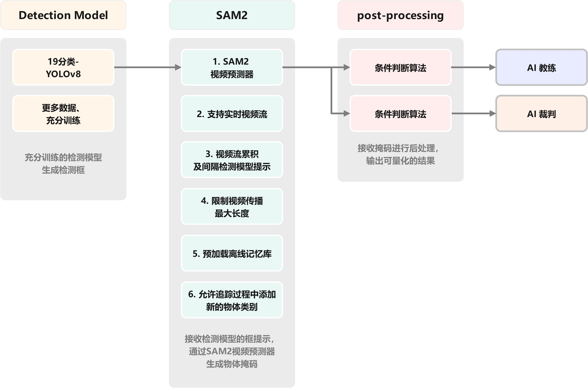

### Det-SAM2-技术报告

图注：SAM2论文中展示的模型框架图，[Meta Segment Anything Model 2](https://ai.meta.com/sam2/)

- SAM2原始框架

图注：SAM2原始框架图，SAM2原文中提到的但是未在SAM2原文图中绘制的是：Memory Decoder不仅接收来自Mask Decoder的输出结果，也接收来自Image Encoder的输出结果。路径如图中下方的跳跃连接。

- Det-SAM2任务概览

图注：Det-SAM2任务概览。整体技术pipeline由三个部分组成：检测部分、SAM2实例的像素级视频追踪部分 和 后处理部分。检测模型提供初步（可能会出错）的检测框，将检测框作为SAM2的条件提示，SAM2视频预测器将离散帧的条件提示传播（propagate_in_video）到视频中所有帧中连续地进行推理，最终SAM2视频预测器输出物体实例在视频时空中的Mask。后处理部分对获取到的Mask做相应的判断以提供准确且量化的结果以支持AI教练或AI裁判功能。
本技术报告重点在Det-SAM2整体框架的搭建与SAM2部分的后续工程优化（新功能实现），其中涉及：2.实时视频流处理，3.视频流累积与间隔检测模型提示，4.限制视频传播的最大长度，5.预加载离线内存库，6.支持追踪过程中新增物体类别而不重置推理状态（reset_state）。

#### 1.Det-SAM2试验Demo

我们希望通过检测模型自动地为SAM2提供条件提示。
Det-SAM2试验Demo：仅在其中一帧上运行检测模型（第一帧提供条件为条件帧，后续帧都是非条件帧）：

图注：Det-SAM2试验Demo框架图。自动地为某一帧添加条件提示，条件提示由检测模型（这里使用的是YOLOv8）给出，检测框结果信息作为框提示输入给Prompt Encoder。

#### 2. 接收在线视频流的实时处理框架Det-SAM2

官方demo只支持读取视频路径，处理预先完结的离线视频。我们希望实现加载视频流，不断对新帧进行推理，且每一帧都运行我们检测模型，为SAM2添加条件提示。

首先我们在流程上的Det-SAM2框架如下：

图注：Det-SAM2框架允许自动地为每一帧都添加条件提示

在接收视频流的时间维度上Det-SAM2处理方式如下：

图注：处理视频流示意图。每一帧都经过Detection Model作为SAM2的条件帧（图中青绿色），随后在整个已有视频帧中进行传播推理propagate in video（图中黄色）。

在实际情况中，传播过程（propagate in video）占用了相当长的时间。在传播过程中，每一次新增视频推理，都会对此前所有帧执行一次SAM2推理。这使得我们对长度为N帧的视频应用当前推理框架时，会对$$ \frac{1}{2} N^2 $$的帧执行推理。

#### 3. 累积视频流和间隔检测模型的条件提示输入

我们希望在接收视频流的基础上，允许新进来的视频帧累积再视频帧缓存中。我们每次送给Det-SAM2框架进行推理的内容不要一帧一帧地频繁给，而是一次送进去一个视频帧累积的序列，这样SAM2一次处理多个帧，减少传播次数。
同时我们还希望间隔检测模型的推理，不需要送给SAM2的每一帧都添加检测模型的条件。经过上一步Demo的实验，我们发现如果每一帧都施加条件的话，SAM2无法修正来自条件帧的内容。

视频流累积和间隔检测条件提示的流程示意图：

图注：Det-SAM2中视频流累积和间隔检测条件提示的流程图。对于视频流接收到的每一帧，会先累积到帧缓存中，当人为设置存储大小的帧缓存累积了一定帧时，则送给Det-SAM2框架进行推理。在推理当前累积的视频序列时，会根据间隔设置判断那些帧是条件帧(cond-frame)那些帧是非条件帧(non-cond-frame)。条件帧则由检测模型提供提示，由SAM2的Prompt Encoder提供特征嵌入。

我们通过累积一定数量的视频帧再进行推理可以极大地缓解SAM2传播的次数。假设我们缓存K帧一并进行推理，则整个长度为N帧的视频执行的传播propagate in video过程只需要对大约$$ \frac{1}{2K} N^2 $$帧进行处理。

#### 4. 限制视频传播propagate in video的长度

我们在了解propagate in video传播机制每次推理都会对所有历史帧中的非条件帧non-cond-frames进行追踪，这也是SAM2之所以能够修正的机制，当获取到新的条件帧时，传播机制可以依赖条件帧的信息对过去的所有非条件帧二次推理并将结果覆盖。
然而，在Det-SAM2流程的实际情况中，需要修正的非条件帧与其所依赖的条件帧之间不会间隔太远。因此我们可以限制每次propagate in video传播时推理所涉及到的帧数。在视频流过程中，相对于本次推理，遥远的视频开始的大多数帧都是已经确定且不需要被修正的，越是靠近新时刻的推理结果越有可能在未来的推理中被颠覆。
因此我们需要对propagate in video传播操作做如下限制：

- 传播中追踪处理顺序为倒序处理，起始帧为当前最新帧
- 传播中限制追踪处理的最大视频帧数，但是本次传播处理的长度（极端情况下）应当至少包含上一次推理的累积视频帧序列，否则传播将不具备任何修正意义。

限制传播长度的流程示意图如下：

图注：限制传播长度的流程示意图。propagate in video部分执行时只追踪人为设置的固定长度，而不需要每次传播都重复追踪视频靠前的帧。

增加视频传播的最大长度可以扩大修正范围，但也会带来更大的计算开销。减小视频传播的最大长度则可以带来更快的推理速度，但也会降低视频流中条件帧能够修正非条件帧的最大范围。

通过限制传播长度为M，累积帧缓存为K，我们在推理长度为N帧的视频时只需要对大约$$ \frac{M}{K} N $$帧做处理。

#### 5. 预加载Memory Bank内存库

SAM2能将图像分割能力迁移到视频分割领域的一个重要改进就是增加了Memory Bank可以提供帧与帧之间的关联（Memory Attention）。然而，Memory Bank内存库的生成与构造是在线的，基于当前传入的视频中已加载的帧（每次加载帧时会将条件提示、掩码输出与原始输入添加在内存库中）。

我们希望能够通过预加载一个在旧视频中已经构建好的内存库，从而可以在新的视频上无需条件提示直接进行推理。即允许SAM2预先加载一个离线内存库，该离线内存库经过精心设计，包含了新视频中可能会需要的所有提示和难样本提示示例，就像“系统提示词”一样。在之后新视频的推理中，新生成的Memory会累加在预加载的内存库上。新生成的Memory与预加载的Memory在人为概念上区分，但是在SAM2实际推理中没有区别。

预加载内存库流程示意图如下：

图注：预加载内存库流程图。Memory Bank预先加载一个离线内存库，源自此前推理过的视频。至此，本次推理的时候可以直接将先前视频中的推理记忆作用于新视频的推理。

在具体实现上，SAM2代码中的inference_state存有memory bank中所有的信息，因此将inference_state迁移到新视频推理中，且新视频不再重新初始化init_state即可。

#### 6. 允许追踪过程中增加新物体ID

在SAM2官方代码中只允许在追踪开始之前事先确定好本次视频推理中需要分割的实例，而不允许在追踪过程中临时新增需要分割的新实例。在我们Det-SAM2处理实时视频流的工作流中，我们大部分情况下无法预知未来会出现什么物体，此前遇到新需要分割的物体时我们就必须执行reset_state重置内存库，相当于丢失前面所有推理结果重此刻重新开始追踪分割。这种情况下就无法利用到此前的条件帧信息了，相当于一个新的视频开始，后续预测时均无法利用前面的预测信息，会影响难样本中分割预测的准确性。

我们希望能够允许追踪过程中自然地增加新物体ID而不需要重置整个内存库，我们通过追踪过程中在线地更新内存库来实现。我们需要更新的内存库内容如下：

1. 初始化，在内存库中注册新ID相应的ID索引列表和信息存储字典

2. 更新此前所有帧的记忆库信息（重新获取输出字典或临时输出字典，通过memory_encoder生成新ID关系下的记忆库信息）

   

追踪过程中在线更新内存库示意图如下：

图注：Det-SAM2追踪过程中输入新增物体ID，在线更新内存库示意图。当框架在追踪开始后接收到新的需要预测的物体时，首先在内存库中注册其相关ID映射，其次基于新的映射关系更新此前所有历史帧在Memory bank记忆库中的信息（每一帧在记忆库中的信息张量的Batch维度大小取决于需要预测的ID数量，如果不更新则会引发张量不匹配无法计算Memory Attention）

至此，我们支持了在追踪开始后在线添加新物体ID的情况。然而，对于长视频追踪中，这种方法一旦使用便会对所有历史帧都进行一次处理（经过Memory encoder）。为了性能高效，我们还需要对两个组件进行限制，一是在线增加新ID时更新memory bank的帧数，二是Memory Attention计算的条件帧数量。

具体做法是：

1. 限制Memory Attention计算的条件帧数量的同时必须保证预加载内存库中所有条件帧参与计算。
2. 追踪过程中在线新增类别时更新内存库信息限制一定时间内的帧更新时也必须保证预加载内存库中所有帧被更新。

追踪过程中在线更新类别（新增客户端ID）的优化示意图：

图注：Det-SAM2追踪过程中输入新增物体ID，在线更新内存库信息的优化示意图。通过限制更新内存库信息的最大帧数和Memory Attention计算的条件帧数量，同时保证预加载内存库Preload Memory中的帧必须被更新和Memory Attention计算来保证效能的同时减小计算开销。
