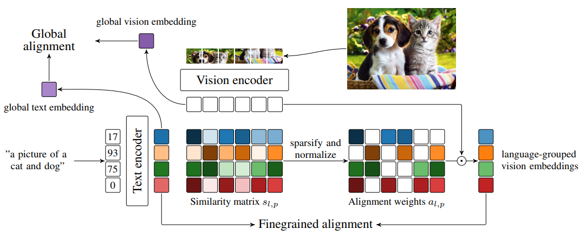
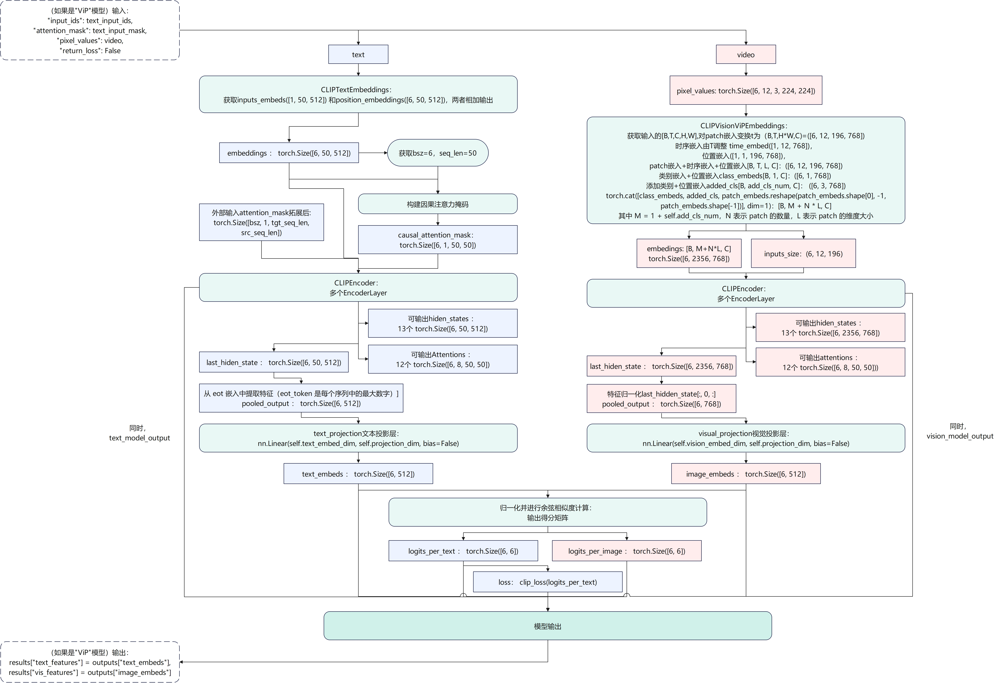
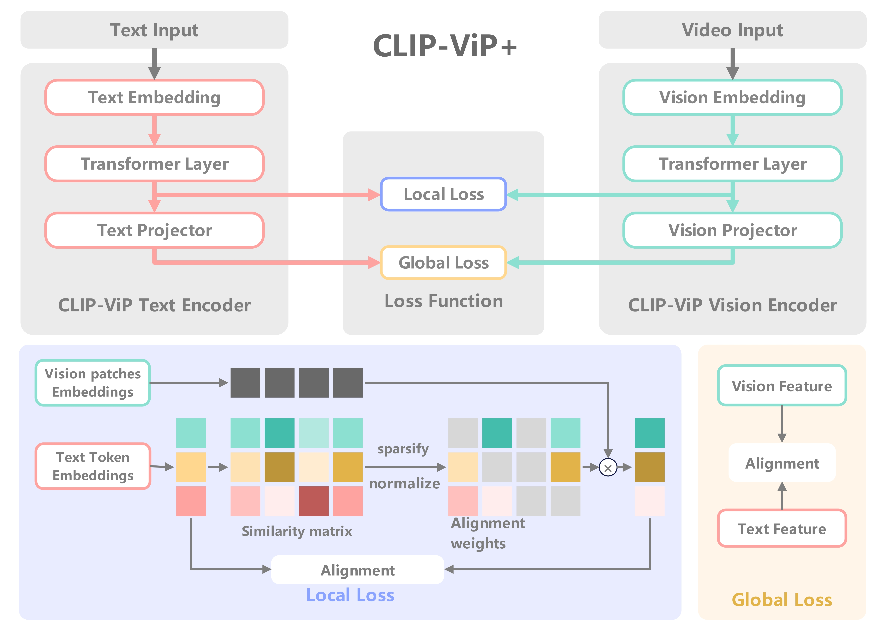
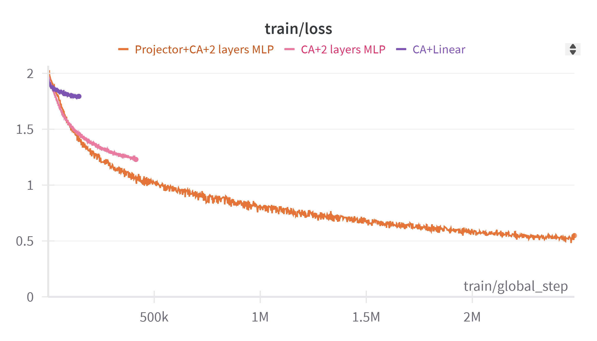
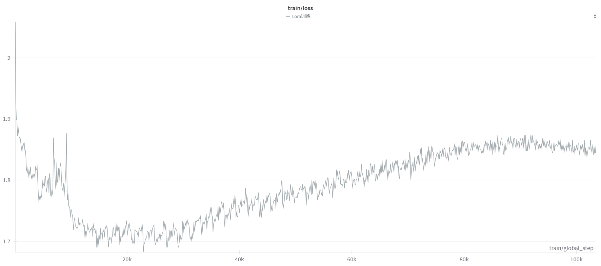
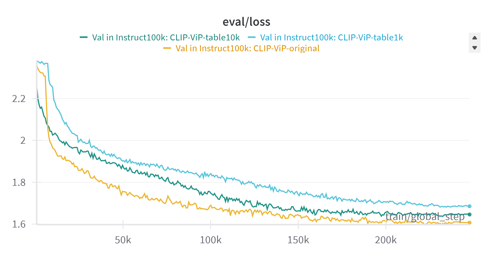
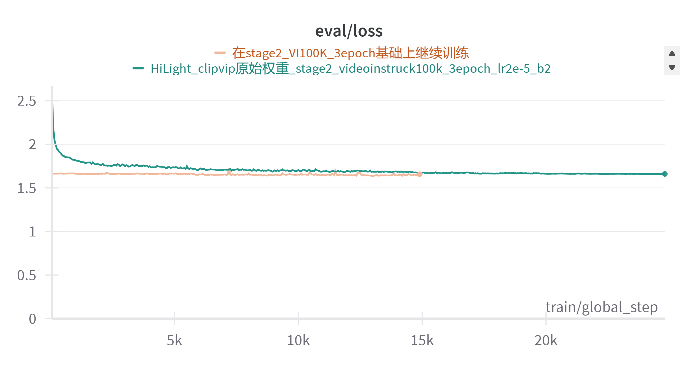

### 1 第一阶段问题-视频与文本模态对齐

#### 1.1 background

本HiLight模型的视觉encoder由视频与文本模态对齐的预训练模型微调而来。

1. 模态不同：本模型与图像-文本对齐模型clip在不同，本模型深层patch中包含了对时间维度的建模

2. 训练阶段不同：预训练权重微调需要考虑的问题与初始化参数重头训练需要考虑的问题不同，需要考虑尽可能不破坏预训练信息避免额外训练开销
3. 数据场景不同：本模型应用的台球数据场景需要更细粒度的区分，而非已有预训练模型的粗粒度数据分布。

#### 1.2 global loss与local loss对齐问题

原文http://arxiv.org/abs/2401.09865中从头预训练clip模型选择global与local损失在同一层级对齐



在已经预训练模型clip—vip中新增local loss与原始global loss是否需要层级对齐？


如果不在同一层级对齐，local loss位于embedding之后encoder之前的浅层进行，global loss位于原始的encoder之后进行将会起到如下可能效果：

1. local loss约束embeding层，global loss约束 embeding后的encoder块。这种效果与逐步冻结浅层权重训练下游任务的后续模块有相似作用，能够加快收敛。
2. embeding层的可约束性是否满足local loss的强度？embeding层很可能没有足够深的网络能够拟合好这样一个细粒度十分高的local loss。（可以从实际训练中local loss下降速率验证）


如果在同一层级对齐，local loss与global loss均位于encoder之后的深层进行，可能导致如下效果：

1. 两者互相起到约束，同时对同一特征作用，loss作用的梯度趋势一致，而不会导致对不同层级影响导致的不同层级学习方向不一致的问题。
2. 深层已经不适合细粒度的学习，patch与patch/token与token之间不具有明显的语义划分了，此时做的细粒度学习是隐式的，而非显示的。这样一来一个很直接的问题就是：对隐式特征做细粒度对比学习是否仍然需要来自显示的文本掩码text_mask？
3. 在深层隐式建模中学习更细粒度local_loss时稀疏化的作用是否与浅层显示建模中的稀疏化一致?很显然是不一致的，那么深层local_loss中是否仍有必要保留稀疏化？稀疏化阈值选择是多少，是否还是1/patch？


折中的方案，local loss与global loss同处深层计算，但是local取值在projecter投影层前的视觉和文本特征[B,2356,768]和[B,50,512]，global loss取值在projecter投影层后的[B,512]和[B,512]计算，这样效果可能如下：

1. 可能避开单纯以global loss进行大量预训练后施加强约束local loss与原始global loss趋势不一致导致的一系列问题？
2. 具备在不同特征层级施加loss的优点，与Freeze权重有异曲同工之妙。
3. 仍然需要考虑深层隐式建模中计算细粒度loss的问题：是否需要保留显示文本mask，是否需要保留稀疏化及如何选择稀疏化阈值？


#### 1.3 local loss 自身的改进

local loss单独计算单一Batch中token与patch之间的一一对应关系，但是从batch的角度上来看可能只有正样本，缺乏负样本？换句话说，local loss学习到的偏置之一便是使得所有的token都保持一致，所有的patch都保持一致，特征在token与patch维度上平滑，这样计算得到的任何token与任何patch之间的相似性均为一致，local loss的梯度始终为0。

1. 我们可能需要为local loss添加两个惩罚项解决：限制token之间与patch之间的相似性

2. 我们是否需要对batch之间计算local loss？需要注意的一点是，不同batch之间的token与不同batch的patch之间也可能出现相似关系，所以不能直接的认为只要是来自不同batch的token-patch对中全部都是负样本。那么怎么设计来绕开相似的部分？


#### 1.4 global loss 自身的改进

##### 数据集标注方式

​	原始CLIP-ViP预训练中使用的数据集，图像与图像差别较大，其标注方式采用图像对应多个文本的图像-文本对。其中的多条文本分别描述视频中的不同对象。（为什么同一图像对应多条文本？因为限于文本最大长度限制，单文本无法完全描述视频中的信息。一味增大文本最大长度，transformer计算开销呈N**2增长）
​	在我们HiLight台球数据集中我们也使用该标注方式：在一个样本集合下，用描述不同对象的多条文本对应同一图像：


​	这样的数据集有一个明显的特征：描述同一视频的中不同对象的文本，其描述的对象在视频中的占比也是不一样的。比如上图示例中video1样本集合中占据主体的是text2：“蓝衣小孩击打白球”，video2样本集合中主要描述对象则是text1：“球杆放在球台上”

##### global loss 计算方式

​	global loss计算如图所示，其随机抽取多个batch（图像文本对，图示中以batch为2举例），将多个batch的文本与图像计算相似性矩阵。其loss设计有意提高对角线的相似性得分，而降低非对角线的相似性得分。即提高属于同一个batch中文本和图像的相似性，降低来自不同batch中文本和图像的相似性。这中方式可以在数据之间形成正负样本对而不用人为额外标注，自动学习到样本之间的差异。

​	然而，在高度相似的台球场景数据集中，随机抽取的图像文本对在做global loss时很可能出现真实相似性错位的情况：即来自video2的次要对象描述-text2，其恰好与video1视频中的主要对象相似。那么来自video2的text2应当与video1得分更高而与video2得分更低，这才是真实的得分。但是在global loss（原始clip损失函数）的作用下，模型学习的趋势则恰恰相反：仅仅因为其不属于同一batch（文本-图像对）而使得文本与图像更接近的组合得分低，使文本与图像更差异的组合得分高。
​	从而起到负面作用

##### global loss 可能的改进方向

可能的改进方向有：

1. 修改dataloder：修改dataloader的随机batch读取，使batch优先从同一个图像样本对中取，取完全后再取下一个图像样本对。这样的话对于同一个图像的完全描述可以来自不同batch的图像-文本相似性计算中平衡。
2. 修改loss：在global loss中添加权重项，发现来自同一个样本对的batch多的情况权重逼近1，来自不同样本对的batch多的时候权重逼近0。这样的话缺点是存在很多对梯度贡献不大的不必要的计算。
3. 更改模型目标：如果是生成任务，为后续模块添加decoder，其任务目标就不需要过分关注相似性的变化


#### 1.5 从显示的文本输入的角度的改进

我们的目标是关注说的越多错的越多，期望输入对的短文本匹配比错的长文本匹配相似性高；但是实际现状是文本越长相似性匹配越高，因为说的越多对的越多。

举个例子，GT：一个红衣男孩击把红球打进洞
短文本：有一个红衣男孩
长文本：有一个红衣男孩击把白球打进洞

一个人类来判断肯定短文本是对的，因为说的全都对；长文本是错的，尽管包含的词更像，但是这句话的逻辑整体并不符合真实事件

可是模型从相似性的角度判断反而长文本的得分比短文本更高

因此如何设计模型使得优化方向为：让增加错误文本对相似性的影响大于增加正确文本对相似性的影响？


#### 1.6 模型结构图



#### 1.7 训练时间估计

训练时间可以估算为：6TP/(n * X * u)，其中X是计算显卡的峰值FLOPS，n为卡的数量，u为利用率。

以LLaMA-65B为例，在2048张80GB显存的A100上，在1.4TB tokens的数据上训练了65B参数量的模型。80GB显存A100的峰值性能为624TFLOPS，设GPU利用率为0.3，则所需要的训练时间为：
$$
\frac{8 (1.4 \times 10^{12}) (65 \times 10^9)}{2048 (624 \times 10^{12}) \times 0.3}=1898871s=21days
$$

### 2 第一阶段验证

#### 2.1 不同loss对齐问题的第一次四个方案验证

我们就local loss与global loss层级对应选择设计了四组实验进行验证：

1. local loss取projector投影层之前的vis特征与text特征，且不带有language_mask文本掩码
2. local loss取projector投影层之前的vis特征与text特征，但带有language_mask文本掩码
3. local loss取CLIPTextEmbeddings的输出与CLIPVisionViPEmbeddings的输出，并且带有language_mask文本掩码
4. 我们希望能够同时解决浅层计算loss学不到东西、深层计算loss约束不了patch与token语义边界的问题。核心思路是让这个文本/图像的语义边界随着encoder逐层保留传递上来。Clip Encoder的每一层hidden states，都计算local loss，只不过浅层计算的loss权重低，从0.1-1逐层增大权重，到最后一层计算local loss再完全保留。

##### 2.1.1 验证阶段训练过程：

我们每组实验在4卡4090上以40个有效batch size，在300条微调数据集样本中跑了1000个epoch

localloss相似性阈值切分2344/2356，学习率5e-6


1. Before Projector Without Mask 987epoch:平稳loss3.36/初始3.907=0.86


2. Before Projector With Mask 987epoch:平稳loss2.7/初始3.248=0.83


3. After Embedding With Mask 987epoch:


4. All Hidden State With Mask 444epoch:


##### 2.1.2 验证阶段不同权重图文匹配结果：

```python
# 第一行文本为GT，其余三行为负样本
[
"The man in white wearing glasses is looking down at the just set up triangle of balls.",
"The triangle rack is being picked up from the triangle of balls",
"The man in the top left corner of the screen is sitting down.",
"The game is about to begin."
]
```

1. BP_WithoutMask_best.pt

   {'score': -0.8645347356796265}
   {'score': -4.768341064453125}
   {'score': 0.7120628952980042}
   {'score': 3.562511444091797}

2. BP_WithMask_best.pt

   {'score': 3.1809189319610596}
   {'score': 4.411635398864746}
   {'score': 0.35195258259773254}
   {'score': 21.106128692626953}

3. AE_WithMask_best.pt：

   {'score': 7.203058242797852}
   {'score': 3.8710198402404785}
   {'score': 12.50179672241211}
   {'score': 4.310908317565918}

4. AHs_WithMask_best.pt:

   {'score': 10.886198043823242}
   {'score': 2.0353376865386963}
   {'score': 10.459168434143066}
   {'score': 11.612763404846191}

##### 2.1.3 验证阶段不同方案best权重可视化

计算的是attnetion map特征图，采样自每个模型的第十二层attention_map

最左侧的为embeding之后的特征。

其次左到右为：    AE_WithM，        AH_WithM，        BP_WithM，       BP_WithoutM，    PreTrain

- video316 进球

<div style="display:flex; justify-content: space-between; flex-wrap: wrap;">
    
    
    
    
    
    
</div>


- video318 开局

<div style="display:flex; flex-wrap: wrap;">
    
    
    
    
    
    
</div>


可以发现在同等训练开销下，最明显具备空间对应关系的为 BP_WithM和BP_WithoutM两种方案


#### 2.2 第二次两个方案验证

我们在第一次验证的基础上选择了两种方案进行第二次验证。同时在第二次验证中扩充了数据集，将台球数据集样本量从340扩充为1010，同时将这1010台球场景的数据混合进MSR-VTT数据集形成10K样本的数据量。

localloss相似性阈值切分2344/2356，学习率5e-6


使用以下两种方案BP_WithoutM和BP_WithM在上述数据集上训练150epoch

1. local loss取projector投影层之前的vis特征与text特征，且不带有language_mask文本掩码
2. local loss取projector投影层之前的vis特征与text特征，但带有language_mask文本掩码

##### 2.2.1 验证第二阶段训练过程：

1.Before Projector Without Mask 150epoch：


2.Before Projector With Mask 150epoch：


##### 2.2.2 验证第二阶段不同权重图文匹配结果：

```python
# 第一行文本为GT，其余三行为负样本
[
"The person in a grayish-white outfit used the cue stick to hit the white cue ball to start the game.",
"The triangle rack is being picked up from the triangle of balls",
"The man in the top left corner of the screen is sitting down.",
"The game is about to begin."
]
```

1. BP_WithoutM2_best.pt(大约40epoch)

   {'score': 17.890331268310547}
   {'score': 8.950885772705078}
   {'score': 8.675246238708496}
   {'score': 1.2078983783721924}

2. BP_WithM2_best.pt(大约40epoch)

   {'score': 30.365598678588867}
   {'score': 12.383976936340332}
   {'score': 14.563497543334961}
   {'score': 16.0788631439209}


3. BP_WithoutM2_60300.pt（大约50epoch）

   {'score': 15.370461463928223}
   {'score': 11.534331321716309}
   {'score': 8.287540435791016}
   {'score': 7.023187637329102}

4. BP_WithM2_60300.pt（大约50epoch）

   {'score': 14.56774616241455}
   {'score': 6.977249622344971}
   {'score': 12.035228729248047}
   {'score': 9.781174659729004}


6. BP_WithoutM2_113900.pt（大约100epoch）

   {'score': 15.907809257507324}
   {'score': 7.180332183837891}
   {'score': 7.478915691375732}
   {'score': 1.6282836198806763}

7. BP_WithM2_113900.pt（大约100epoch）

   {'score': 12.859396934509277}
   {'score': 4.385799407958984}
   {'score': 9.829253196716309}
   {'score': 6.9658966064453125}


8. BP_WithoutM2_165180.pt（大约150epoch）

   {'score': 15.621070861816406}
   {'score': 6.902095794677734}
   {'score': 7.689106464385986}
   {'score': 1.265367865562439}

9. BP_WithM2_165180.pt（大约150epoch）

   {'score': 12.485191345214844}
   {'score': 4.299239158630371}
   {'score': 10.08955192565918}
   {'score': 6.008060455322266}


 一个很明显的现象是，第四条数据的”球局开始“应当也是video318视频开球内容的正确描述，但是在有无language mask的情况下得分差异明显。

一个可能且合理的解释是，类似球局开始等抽象词汇在计算token与patch之间的损失的时候，由于没有加入文本掩码，导致所有的token都必须与patch之间一一对应，然而这类抽象token似乎并没有能够很好与之对应的patch（尤其是patch在local loss中训练被要求保留更多空间语义信息的时候），而随着训练深入其抽象语义被消磨殆尽。而在有文本掩码的时候，被mask掉的token可以充当全局token的作用，由于被mask掉的token不贡献损失，因此可以很好的保留信息——替参与计算的抽象token保留其抽象信息。


##### 2.2.3 验证第二阶段不同方案不同阶段权重的vision encoder可视化

计算的是vision encoder的attnetion map特征图，采样自每个模型的attention_maps[11]

最左侧的为embeding之后的特征。

第一行左起为BP_WithM的：best，60300step,  113900step,  165180step,  PreTrain

二行为BP_WithoutM的：best，60300step,  113900step,  165180step,  PreTrain

- video318 开局
- BP_WithM

<div style="display:flex; flex-wrap: wrap;">
    
    
    
    
    
</div>
- BP_WithoutM

<div style="display:flex; flex-wrap: wrap;">
    
    
    
    
    
</div>
- Embed

<div style="display:flex; flex-wrap: wrap;">
    
<div/>


值得注意的一点是，在2.2.2小节我们提到的结论是：有Language Mask可以让被mask掉的token充当全局token，没有损失地保留抽象的全局信息。

然而，我们在本2.2.3小节的可视化Vision Encoder中发现，在Text Encoder中加入Language Mask对Vision Encoder的注意力图影响也十分巨大。对于这一现象的解释是：在没有language Mask的时候，损失计算强制逼迫包含抽象语义的token和patch对应，其不仅仅会影响Text Encoder促使token中的抽象信息流失，也会影响Vision Encoder让原本应当具备强空间信息的patch为了能够和token对应，而产生包含伪全局信息的patch。

因而我们可以在BP_WithoutM的可视化中发现更多的无意义的噪点，这些多出来的噪点便是由于强制抽象token与patch对齐导致的伪全局patch。

因此，最终我们CLIP-ViP+改进结构图如下：



### 3 第一阶段模态对齐训练

使用CLIP-ViP为base model，以SPARC思路改进优化loss，并最终在投影层前计算local loss（验证阶段的BP_WM方案）

#### 3.1 超参数验证

1.

数据集为table10k（MSR-VTT-9K+ table1K）

localloss计算的阈值设置为2332/2356（保留24个pach），学习率1e-5，计划训练300epoch

在234epoch中报错，由于缺乏容灾设计，且该报错原因不明，方案一到此为止，取权重第210000step

训练过程如下


2.

数据集为table10k（MSR-VTT-9K+ table1K）

localloss计算的阈值设置为2320/2356（保留36个pach），学习率1e-5，训练187epoch

最高权重取到210000step

训练过程如下


3.

数据集为table10k（MSR-VTT-9K+ table1K）

localloss计算的阈值设置为2320/2356（保留36个pach），学习率1e-3，训练191epoch

最高权重取到210000step

训练过程如下


##### 3.1.2 不同权重图文匹配结果

```python
# GT 进球test
1."The man in a white long-sleeved shirt hits the white cue ball with a cue stick on the lower right side of the pool table, knocking the orange ball into the pocket",
2."The man in blue pents is leaning on the left side of the pool table with a cue stick",
# GT 开局test
3."The man in white short sleeves is hitting the white cue ball in the middle above the pool table with a cue stick",
4."The triangle of balls is scattered by the white cue ball, and the blue ball on the left side is knocked into the pocket",
# other
5."The man in blue pents is leaning on the right side of the pool table with a cue stick",
6."The triangle rack is being picked up from the triangle of balls",
7."The man in the top left corner of the screen is sitting down.",
8."The game is about to begin.", # 抽象表示开局
9."People are smoking.",
10."Cat on the table."
```


- ft_2332_step_70000.pt / ft_2332_step_140000.pt / ft_2332_step_210000.pt

  ```json
  //video进球test.mp4
  1.{'score': 20.386653900146484 /12.65463638305664  /7.931149005889893}
  2.{'score': 12.168719291687012 /8.316670417785645  /4.217596530914307}
  3.{'score': 11.566770553588867 /7.423625946044922  /3.0843758583068848}
  4.{'score': 9.99188232421875   /4.015286922454834  /2.342646837234497}
  
  5.{'score': 12.4059476852417   /8.447347640991211  /4.163178443908691}
  6.{'score': -2.999422073364258 /-3.3782641887664795/-3.2828688621520996}
  7.{'score': 3.519631862640381  /2.602182626724243  /3.5822994709014893}
  8.{'score': -3.819493532180786 /0.09861132502555847/4.722836971282959}
  9.{'score': -1.8143359422683716/-3.950222969055176 /-1.1268997192382812}
  10.{'score': 5.786578178405762 /0.22414177656173706/3.2645576000213623}
  //video开局test.mp4
  1.{'score': 9.713488578796387  /6.491170883178711   /2.5065672397613525}
  2.{'score': 5.9275360107421875 /7.711368083953857   /2.0277466773986816}
  3.{'score': 10.415083885192871 /4.008723258972168   /1.5543030500411987}
  4.{'score': 11.929348945617676 /10.058730125427246  /7.852346420288086}
  
  5.{'score': 5.976846218109131  /7.752363204956055   /1.9597158432006836}
  6.{'score': 12.134347915649414 /7.242629528045654   /5.4980549812316895}
  7.{'score': 1.9221175909042358 /1.0083434581756592  /0.13586468994617462}
  8.{'score': 5.3749284744262695 /4.3915252685546875  /5.774461269378662}
  9.{'score': 2.037625789642334  /-0.5361743569374084 /-1.2454633712768555}
  10.{'score': 3.1945884227752686/-0.08266530930995941/1.4495066404342651}
  ```
  
- ft_2320_step_70000.pt / ft_2320_step_140000.pt / ft_2320_step_210000.pt

  ```json
  //video进球test.mp4
  1.{'score': 23.36142349243164   /22.445404052734375/15.130880355834961}
  2.{'score': 16.595130920410156  /13.54967212677002 /7.122810363769531}
  3.{'score': 18.16140365600586   /16.482084274291992/10.326428413391113}
  4.{'score': 12.363700866699219  /8.69171142578125  /5.334824085235596}
  
  5.{'score': 16.481782913208008  /13.569190979003906/7.180224895477295}
  6.{'score': -0.28365302085876465/1.1514763832092285/0.9837534427642822}
  7.{'score': 8.427000045776367   /8.526958465576172 /6.553652763366699}
  8.{'score': 0.5345264673233032  /7.261840343475342 /5.329497337341309}
  9.{'score': 5.754968643188477   /2.7171778678894043/-0.47024470567703247}
  10.{'score': 7.099184513092041  /5.525808811187744 /5.511412620544434}
  //video开局test.mp4
  1.{'score': 14.409655570983887/10.31970500946045  /9.149287223815918}
  2.{'score': 9.564767837524414 /11.31307315826416  /6.479095458984375}
  3.{'score': 16.5140380859375  /11.241361618041992 /8.479555130004883}
  4.{'score': 14.347288131713867/14.639243125915527 /12.07557487487793}
  
  5.{'score': 10.088818550109863/10.972687721252441 /6.732706069946289}
  6.{'score': 15.137435913085938/9.737261772155762  /8.653965950012207}
  7.{'score': 5.444533824920654 /6.299915790557861  /2.659787178039551}
  8.{'score': 7.255960941314697 /8.144272804260254  /6.729611873626709}
  9.{'score': 1.429343819618225 /-0.1544867604970932/1.3385655879974365}
  10.{'score': 4.671630382537842/2.10261607170105   /3.0507194995880127}
  ```

- ft_2320_lr_1e-3_step_70000.pt / ft_2320_lr_1e-3_step_140000.pt / ft_2320_lr_1e-3_step_210000.pt

  ```json
  //video进球test.mp4
  1.{'score': 57.5423583984375  /14.47175407409668  /58.24851989746094}
  2.{'score': -7.994033336639404/6.303086757659912  /43.415523529052734}
  3.{'score': 61.62729263305664 /53.38003158569336  /82.95848083496094}
  4.{'score': 48.559940338134766/-29.719865798950195/46.461029052734375}
  
  5.{'score': -3.983489751815796/-2.17470645904541  /42.592708587646484}
  6.{'score': 72.8235092163086  /-13.051247596740723/61.303924560546875}
  7.{'score': 41.66515350341797 /-25.891738891601562/46.39952850341797}
  8.{'score': 19.880971908569336/-23.221712112426758/26.374534606933594}
  9.{'score': 47.2972412109375  /14.3478422164917   /54.08600616455078}
  10.{'score': 33.22800827026367/-11.322922706604004/2.659484386444092}
  //video开局test.mp4
  1.{'score': 53.03546142578125 /68.56077575683594  /62.911964416503906}
  2.{'score': 21.094345092773438/54.67539978027344  /58.94904327392578}
  3.{'score': 50.097965240478516/56.96559143066406  /44.52573013305664}
  4.{'score': 65.92794799804688 /69.78247833251953  /71.90469360351562}
  
  5.{'score': 24.120277404785156/54.201961517333984 /62.104671478271484}
  6.{'score': 65.93727111816406 /71.65599822998047  /34.734683990478516}
  7.{'score': 51.919437408447266/23.106891632080078 /56.59062957763672}
  8.{'score': 3.394652843475342 /0.23862290382385254/69.76082611083984}
  9.{'score': 2.9106743335723877/28.797456741333008 /0.20136497914791107}
  10.{'score': 36.87007141113281/-4.343676567077637 /17.865880966186523}
  ```

  

##### 3.1.2 超参数验证可视化

- 对video进球test.mp4推理可视化，从左到右分别为权重70000step，140000step，210000step

<div style="display:flex; flex-wrap: wrap;">
    
    
    
    
    <p>ft_2332,lr_1e-5</p>
</div>
<div style="display:flex; flex-wrap: wrap;">
    
    
    
    
    <p>ft_2320,lr_1e-5</p>
</div>
<div style="display:flex; flex-wrap: wrap;">
    
    
    
    
    <p>ft_2320,lr_1e-3</p>
</div>

- 对video开局test.mp4推理可视化，从左到右分别为权重70000step，140000step，210000step

<div style="display:flex; flex-wrap: wrap;">
    
    
    
    
    <p>ft_2332,lr_1e-5</p>
</div>
<div style="display:flex; flex-wrap: wrap;">
    
    
    
    
    <p>ft_2320,lr_1e-5</p>
</div>
<div style="display:flex; flex-wrap: wrap;">
    
    
    
    
    <p>ft_2320,lr_1e-3</p>
</div>


#### 3.2 训练

对于可能调整的因素有三种，数据集，学习率，LocalLoss切分patch的阈值

对于数据集通过对比第一轮验证与第二轮验证中BeforeProjector_withMask分别在table1k和table10k数据集上的训练效果，可以得出结论：在 少量高质量数据集 中的微调效果比 同等数量高质量数据集混合大量通用数据集的效果好。因此我们的训练将在table1k上继续训练而不是table10k

对于学习率，学习率在1e-5比较合适，1e-3的效果非常差且难收敛

因此首先我们正式训练在预训练权重的基础上，在table1k上以1e-5学习率2320阈值进行微调。


其次我们正式训练在预训练权重的基础上，在table10k上以1e-5学习率2320阈值进行微调。


##### 3.2.1 训练过程中间结果可视化

- 1.在table1k上训练结果(从左到右分别为第2,4,6,8,10,12万步)：

<div style="display:flex; flex-wrap: wrap;">
    
    
    
    
    
    
    <p>table1k-video开局test</p>
</div>

<div style="display:flex; flex-wrap: wrap;">
    
    
    
    
    
    
    <p>table1k-video进球test</p>
</div>
- 2.在table10k上训练结果(第一行从左到右、第二行从左到右分别为第6,12,18,24,30,36,42,48,54,60万步)：

<div style="display:flex; flex-wrap: wrap;">
    
    
    
    
    
    
    
    
    
    
    <p>table1k-video开局test</p>
</div>

<div style="display:flex; flex-wrap: wrap;">
    
    
    
    
    
    
    
    
    
    
    <p>table1k-video进球test</p>
</div>


- 1.在table1k上训练过程的测试结果

<div style="display:flex; flex-wrap: wrap;">
    
    
    <p>table1k-video进球（上）/开局（下）</p>
</div>

```json
1.The man in a white long-sleeved shirt hits the white cue ball with a cue stick on the lower right side of the pool table, knocking the orange ball into the pocket
2.The man in blue pents is leaning on the left side of the pool table with a cue stick
3.The man in white short sleeves is hitting the white cue ball in the middle above the pool table with a cue stick
4.The triangle of balls is scattered by the white cue ball, and the blue ball on the left side is knocked into the pocket
5.The man in blue pents is leaning on the right side of the pool table with a cue stick
6.The triangle rack is being picked up from the triangle of balls
7.The man in the top left corner of the screen is sitting down.
8.The game is about to begin.
9.People are smoking
10.Cat on the table
```

- 2.在table10k上训练过程的测试结果

<div style="display:flex; flex-wrap: wrap;">
    
    
    <p>table1k-video进球（上）/开局（下）</p>
</div>

```json
1.The man in a white long-sleeved shirt hits the white cue ball with a cue stick on the lower right side of the pool table, knocking the orange ball into the pocket
2.The man in blue pents is leaning on the left side of the pool table with a cue stick
3.The man in white short sleeves is hitting the white cue ball in the middle above the pool table with a cue stick
4.The triangle of balls is scattered by the white cue ball, and the blue ball on the left side is knocked into the pocket
5.The man in blue pents is leaning on the right side of the pool table with a cue stick
6.The triangle rack is being picked up from the triangle of balls
7.The man in the top left corner of the screen is sitting down.
8.The game is about to begin.
9.People are smoking
10.Cat on the table
```


综合上述可视化结果，我们可以发现，在数据集变量（table1k和table10k）中table1k的训练结果明显好于table10k，高质量数据集带来的优势远远大于增加数据量带来的优势。从table1k中训练结果的测试折线图中可以看到，从8w步到12w步中10条样本的相似性得分趋于平行，也正好对应训练loss曲线中300-600epoch时间段的稳定训练”平台“。

因此，我们最终选择在table1k数据集上以1e-5学习率，2320LocalLoss阈值进行微调的第120000step权重结果作为CLIP-ViP‘改进型的最终权重


### 4 第二阶段视觉特征到LLM输入的转换问题

#### 4.1 background

我们使用Mini-Gemini的VLM架构，[2403.18814.pdf (arxiv.org)](https://arxiv.org/pdf/2403.18814.pdf)


在Mini-Gimini一文中，视觉信息到LLM输入的过程中经过了两个流程：一是双塔结构，通过一个高分辨率特征提取器和一个低分辨率的特征提取器分别采样原始图像和降采样后的原始图像得到两种信息含量的特征；二是将这两种信息含量的特征通过Cross Attention，也就是文中提到的“挖掘”的部分，得到最终的Mined Tokens

#### 4.2 需要注意的问题

文中希望通过双塔结构来综合CLIP一个比较好的文本-图像对齐encoder在低分辨率上的特征与一个通过Lion-5B训练的卷积来高分辨率上的特征之间的鸿沟，弥补高分辨率语义细节没法良好对齐和低分辨率特征对齐缺少大量细节的缺点，并通过交叉注意力机制融合。

一个很有意思的问题是，双塔中任何一边的特征提取质量的提高，应当都能够提升Cross Attention后的质量。

假设LR这一边的分辨率逐渐提高，LR Vision Encoder也能逐渐获得更高的分辨率，Visual Embedding的质量也能上升。当LR的分辨率高到与HR齐平的时候，是不是就是同一张图像的两种不同的Encoder过交叉注意力机制的效果比当前的效果更好
假设HR Vision Encoder的效果逐渐提升，当HR Vision Encoder的能力提升到近似CLIP的能力时（与LR Vision Encoder相当时），效果也会更好，此时相当于不同分辨率的图像过同一个Encoder再通过交叉注意力机制融合。

那么当两种假设同时满足的时候，这种情况等同于于同一张高分辨率的图像过相同的CLIP encoder 再通过self-attention。然而，文中的双塔结构的理论上限肯定是不如一张高分辨率经过经过LR Vision Encoder（CLIP）这样的单塔结构效果好的。

因此我们认为Mini-Gemini文中很重要的双塔结构设计其实并无必要，至少是对于图像分辨率这个角度而言。相反我们认为双塔结构用于综合优缺点的设计思路在预训练图像encoder的模态对齐层级方向是有作用的，可以使一个更细对齐的模型和一个粗对齐的模型结合在一起

##### 4.2.1 相关工作

在Ferret-v2，[2404.07973.pdf (arxiv.org)](https://arxiv.org/pdf/2404.07973.pdf)一文中也关注了更细粒度模态对齐的实现细节。该文的第一个观察便是，面对需要更细粒度高分辨率的图像输入的时候，有两种方法，一是直接上采样并且插值位置编码，二是根据图像原始的横纵比去匹配合适的切分方式（例如1×1，1×6，2×3等），然后将这个图像按照这个切法分成相互独立的patch，分别过一个粗粒度的特征提取，再将得到的token按照切分空间位置串联起来。结论是，第二种方法将图像切成块效果更好。


在Ferret-v2中视觉encoder也采用了双塔结构，只不过更关注细节的一侧的输入方式切分成patch再还原，而不是在encode后直接上采样插值。


#### 4.3 改进方向

因此我们认为：minigemini最大的贡献-双塔视觉提取的设计，其实不适用于解决原文的图像分辨率问题，反而适用于不同对齐方式训练的encoder的不同特征的融合问题。

我们将我们在CLIP-ViP中以更细粒度的Local Loss进行微调后的视频encoder放在双塔的一边，我们希望双塔的另一边能够放入一个和CLIP相当甚至更好的模型以弥补我们的CLIP-ViP在微调阶段损失的通用能力。Long-CLIP是个不错的选择[[2403.15378\] Long-CLIP: Unlocking the Long-Text Capability of CLIP (arxiv.org)](https://arxiv.org/abs/2403.15378)。

在Token Mining部分我们选择将CLIP-ViP的[B,2356,768]先映射为[B,2356,512]，在和12帧的LongCLIP特征[B,12,512]做Cross Attention，以12个Frame和2356个Patch做点乘。最终我们得到Cross Attention之后的视觉特征[B, 12, 512]，再将这个视觉特征映射到文本空间中[B，12，2048]


### 4 第二阶段VLM的训练

在MiniGemini原文中，VLM训练分为两个阶段：

第一个阶段是MiniGemini的预训练阶段：两座Vision Tower都是现成训练好的，LLM也是训练好的，这个阶段只训练新增的Patch Info Mining，用于将两个视觉特征进行融合后于LLM的文本模态对齐

第二个阶段是LLM指令微调阶段：Patch Info Mining模块初步训练的基础上，冻结Vision Encoder，放开LLM，同时lora微调LLM与Patch Info Mining，将Patch Info Minin模块的特征融合、模态对齐能力进一步提升的同时增强LLM对视觉输入的理解能力。


然而，我们HiLight模型中两座Vision Tower是现成训练好的，LLM则使用MiniGemini中指令微调后的Gemma-2B模型，因此我们不需要额外赋予LLM对视觉输入的理解能力。对于Hilight模型而言：

对于VLM训练的第一个阶段是模态对齐阶段：我们使用公开视频问答数据集，期望充分训练我们TokenMining部分，直接完成两座塔的视觉特征到LLM Vision Token输入的转换。

对于VLM训练的第二个阶段是场景微调阶段：我们使用台球场景自己制作的数据集，对LLM进行专有场景的微调。

##### 4.1 VLM-模态对齐训练

我们率先对TokenMining进行了两组训练（均为VideoInsutruck100K数据集，学习率等草参数一致）
第一组为一层CrossAttention+一层Linear，训练70epoch（如图紫色）
第二组为一层CrossAttention+两层带激活函数Relu的Linear，训练200epoch（如图粉色）



可以看到一定程度上随着TokenMining层数增加，能够很好地突破loss不下降的瓶颈。第二组在第一组的基础上多了一层linear和两层激活函数则可以将loss从1.7下降至1.3
我们随后增加了实验：
第三组为首先来自双塔的部分各经过一层Projector+一层CrossAttention+两层带激活函数Relu的Linear（如图橙色）

##### 4.2 VLM-LoRA指令微调

在模态对齐的基础上，加载训练好的TokenMining和VisionTower权重，对TokenMining和LLM进行LoRA微调

50个epoch Loss曲线如下：



#### 5. 消融实验

在发现效果不好的情况下我们进行性能验证与消融实验。排查出了一些关键漏洞（例如CLIP-ViP权重每次加载都意外地被重新初始化了），在修复这些问题后，我们做了一些更细致的消融实验。

##### 5.1 CLIP-ViP 权重选择

我们验证CLIP-ViP原始权重、在table1k上训练的优化权重和在table10k上训练的优化权重进行下游任务训练对比。（在VideoInstruct100K训练）



在VideoInstruct100K训练；VideoInstruct100k上验证：
CLIP-ViP-原始权重 优于 CLIP-ViP-table10k 优于 CLIP-ViP-table1k。


在VideoInstruct100K训练；vqa_table上验证：

CLIP-ViP-table1k权重 优于 CLIP-ViP-table10k权重 优于 CLIP-ViP-原始权重

在不同验证集中， CLIP-ViP-table10k始终保持在相对中间的水准。CLIP-ViP-原始权重的泛化性较好，CLIP-ViP-table1k在台球场景表现较好。因此我们带着CLIP-ViP-原始权重和CLIP-ViP-table1k权重进行后续训练。

#### 6. 性能检查后的VLM tokenmining预训练


我们首先将两种CLIP-ViP权重在Valley700K数据集上预训练TokenMining，以1e-4余弦退火学习率训练20个epoch。一轮训练实际耗时约3.5天。

此时得到两组tokenmining权重分别是：1k权重valley_20epoch.bin 和 原始权重valley_20epoch.bin
我们使用这两组权重进行一定的测试

我们的相关参数设置为：temperature = 0.1，max_new_tokens = 128
提示词为：

```
You need to accurately identify and understand the video I gave you and answer my questions. If the video is missing key information that you cannot answer please let me know that you cannot answer, don't lie to me.My question is:What's happened in this video?
（你需要准确识别并理解我给你的视频，并且根据我的提问来回答。如果视频中缺失关键信息导致你无法回答请告知我你无法回答，而不要欺骗我。我的问题是：视频中发生了什么？）
```

| 第一阶段训练后测试 |      | 1k权重valley_20epoch.bin                                     | 原始权重valley_20epoch.bin                                   |
| ------------------ | ---- | ------------------------------------------------------------ | ------------------------------------------------------------ |
| video1.MP4         |      | Hong kong,china - may 20, 2019: people run in the morning, the streets of hong kong, china. the weather is sunny, the sky is clear, the air is fresh, the people are running, the city is crowded. | Chur, poland - august 25, 2019: people playing board game at a family game night in a bar. people playing board games in the evening. family time and fun. |
| video2.MP4         |      | Osaka, japan - may 2019: unidentified people are walking around the streets of the city. the city is famous for its traditional japanese culture and architecture. | China, 14 august 2019: group of young men playing chinese checkers on a playing board. chinese checkers game played on a playing board. chinese checkers game. chinese checkers game. young men |
| video38.MP4        |      | 1960s: man in suit and tie sits at desk. man in suit and tie sits at desk. man in suit and tie sits at desk. man in suit and tie sits at desk. man in suit and tie sits at desk. man in suit and t strtok strtok strtok. | A man in a white coat is reading a letter and smiling. he is sitting at a desk and looking at a computer screen. he is wearing a white shirt and a white tie. he is holding a pen. |
| video39.MP4        |      | Russia, moscow - circa 2015: men and women on the ice in ice hockey game on the ice in moscow, russia. ice hockey is one of the oldest sports in the world. ice hockey is played on a sheet of ice. | Taipei, taiwan, august 26 2019. gregory mishandles the ball and the ball goes to the right. gregory mishandles the ball and the ball goes to the right. gregory mishandles the ball and the ball goes |
| video40.MP4        |      | A young woman in a black jumpsuit is standing on the sidelines of the soccer field, watching her team in action. she is cheering and clapping for her team. | Young woman dances with a girl in a dance studio. the woman is dressed in a beautiful dress and the girl dances in the studio. the camera is placed in the center of the studio. |
| videoA.MP4         |      | A little girl runs on the beach with a ball in her hands. a little girl runs on the beach with a ball in her hands. a little girl runs on the beach with a ball in her hands. | Cute caucasian girl girl having fun in the water. girl having fun in the water. summer vacation. yongguang. yongguang. yongguang... |

原始权重训练得到的结果在各方面明显优于1K权重

```cmd
python predict_cli.py --vision_tower model_zoo/CLIP-ViP/lr1e-5_ft_2332_table1k_120000.pt --token_mining_w_path model_zoo/TokenMining/1k权重_valley_20epoch.bin --videos_file data/inference/videoA.mp4
```

故，在此处我们就放弃1k权重的后续训练了


注：然而，我们使用的Valley数据集原文中，字节的工作使用2e-3学习率在一个epoch中预训练，然后使用2e-5学习率在指令微调数据集上进行3个epoch微调。由于我们无法解决在2e-3学习率下混合精度溢出的问题，因此我们没办法复现这个条件下的实验。


我们在HiLight CLIP-ViP原始权重训练的valley700k 20个epoch的基础上继续训练，验证该权重已经收敛。

#### 7. 性能检查后的VLM 指令微调

##### 7.1 LoAR微调冻结TokenMing部分

我们采用前一个阶段得到的 原始权重valley_20epoch.bin 权重进行Lora指令微调
我们首先在VideoInstruck100k上以2e-5余弦退火学习率进行3个epoch的lora微调，6*4090下实际训练时间约为3.5小时
训练过程验证loss变化如下：



在此基础上继续训练的验证loss变化也可以得出，这个阶段中videoinstruck100k已经完全收敛

| 第二阶段指令微调VI100K前后比较 | 指令微调前（预训练原始权重valley_20epoch.bin）               | 指令微调后（HiLight-2B-LoRA-Merge-stage2-IV100K-1.5epoch）   | 指令微调后（HiLight-2B-LoRA-Merge-stage2-IV100K-3epoch）     |
| ------------------------------ | ------------------------------------------------------------ | ------------------------------------------------------------ | ------------------------------------------------------------ |
| video1.MP4                     | Chur, poland - august 25, 2019: people playing board game at a family game night in a bar. people playing board games in the evening. family time and fun. | increa effe fta fta effe effe fta desir effe effe fta effe   | The video shows two men playing a game of pool.              |
| video2.MP4                     | China, 14 august 2019: group of young men playing chinese checkers on a playing board. chinese checkers game played on a playing board. chinese checkers game. chinese checkers game. young men | increa effe increa fluo fta effe increa fluo fta fluo fta effe fluo fta fluo fta fluo | In this video, two men are playing pool in a room.           |
| video38.MP4                    | A man in a white coat is reading a letter and smiling. he is sitting at a desk and looking at a computer screen. he is wearing a white shirt and a white tie. he is holding a pen. | increa effe effe effe fta effe effe effe fta effe effe       | The video shows a man smoking a cigarette while sitting in a chair. |
| video39.MP4                    | Taipei, taiwan, august 26 2019. gregory mishandles the ball and the ball goes to the right. gregory mishandles the ball and the ball goes to the right. gregory mishandles the ball and the ball goes | increa effe effe effe fta effe effe effe fta effe effe       | In this video, a man is seen throwing a ball into a net.     |
| video40.MP4                    | Young woman dances with a girl in a dance studio. the woman is dressed in a beautiful dress and the girl dances in the studio. the camera is placed in the center of the studio. | increa effe effe effe fta effe effe effe fta effe effe       | In this video, a woman is seen dancing on a wooden floor while a man is standing behind her |
| videoA.MP4                     | Cute caucasian girl girl having fun in the water. girl having fun in the water. summer vacation. yongguang. yongguang. yongguang... | increa effe effe effe fta effe effe effe fta effe effe       | In this video, a woman is seen riding a water slide with a child on her back |

指令微调第一阶段的结果显示，在videoinstruck100k微调后的回答清晰明确了许多，明显优于微调之前。


随后在指令微调的第二阶段，我们将videoinstruck100k指令微调后的权重在vqa_table_1k上微调了1-2个epoch，效果如下：
在VI100K基础上_VT1k_3epoch_lr2e-5_b2.png)

推理验证：
HiLight_clipvip原始权重在Lora微调第二阶段的VQA_Table1k上训练1-2epoch对比。

| 视频   | 提示                                                         | VT1K_1epoch                                                  | VT1K_2epoch                                                  |
| ------ | ------------------------------------------------------------ | ------------------------------------------------------------ | ------------------------------------------------------------ |
| video1 | What color ball was pocketed by the white cue ball on the billiards table? | The white cue ball hit the red ball, which then hit the black ball, and the black ball rolled into the pocket. | The white cue ball hit the red ball, and the red ball rolled into the pocket. |
| video2 | What happened in the video? Was there a moment when the triangle of balls was broken and the game began? | In the video, the triangle of balls was broken, and the game began. | In the video, the triangle of balls was broken, and the game began. |
| video3 | Please describe the trajectory of the balls on the billiards table as detailed as possible (precise for each ball). | The white ball, after being hit by the cue stick, rolls towards the pocket. The black ball, after being hit by the cue stick, rolls towards the pocket. | In the video, the white ball is struck by the cue stick, and it rolls towards the pocket. The black ball is struck by the white ball, and it rolls towards the middle pocket. |

```
注：system prompt为：
You need to accurately identify and understand the video I gave you and answer my questions. If the video is missing key information that you cannot answer please let me know that you cannot answer, don't lie to me.My question is:
```


我们不执行先在VideoInstruck100K上微调3epoch再在vqa_table1k上微调1epoch的步骤，我们直接将两个数据集混合，组成Mix101K并微调2epoch
效果如下：
_Mix101k_3epoch_lr2e-5_b2.png)

推理验证：
HiLight_clipvip原始权重在Mix101k上训练1-2epoch对比。

| 视频   | 提示                                                         | M101K_1epoch                                                 | M101K_2epoch                                                 |
| ------ | ------------------------------------------------------------ | ------------------------------------------------------------ | ------------------------------------------------------------ |
| video1 | What color ball was pocketed by the white cue ball on the billiards table? | The white cue ball hit the orange ball, which then hit the white ball. Therefore, the white ball was pocketed by the orange ball. | The green ball was pocketed by the white cue ball.           |
| video2 | What happened in the video? Was there a moment when the triangle of balls was broken and the game began? | Yes, in the video, a triangle of balls was broken and the game began. | In the video, a triangle of balls was formed, and the players took turns hitting the balls into the pockets. |
| video3 | Please describe the trajectory of the balls on the billiards table as detailed as possible (precise for each ball). | The video shows a group of people playing billiards on a table. The camera captures the trajectory of the balls as they are hit by the cue stick. The balls are propelled in different directions, and the camera captures their movements as they bounce off the table. The video provides a detailed view of the trajectory of each ball, allowing the viewer to appreciate the skill and precision of the players. | The white ball, the red ball, the green ball, and the blue ball are all hit by the white ball. The red ball is hit by the white ball, and then the red ball rebounds off the edge of the table and hits the green ball. The green ball is then hit by the white ball, and the green ball rebounds off the edge of the table and hits the blue ball. The blue ball is then hit by the white ball, and the blue ball rebounds off the edge of the table and hits the red ball. |

```
注：system prompt为：
You need to accurately identify and understand the video I gave you and answer my questions. If the video is missing key information that you cannot answer please let me know that you cannot answer, don't lie to me.My question is:
```

- 可以看到混合数据集Mix101K优于单一的VideoInstruct100K
- 在当前条件下Mix101K的结果的事实回答优于VideoInstruct100k基础上继续微调vqa_table_1k的结果。


目前效果最好的vqa_table_1k微调结果已经拥有私有数据集问答语言风格，但在事实上的准确性仍然欠缺。一个值得注意的点是：

​	存在一种情况，VisionEncoder没有办法提取足够细粒度的内容，但数据集文本标注的过于详细。也就是说VLM本身没有输入足够的视觉特征，但训练集中缺强迫模型回答它本身”看不见“的知识会适得其反，导致相当的幻觉出现。

这种幻觉与我们当前`HiLight_clipvip原始权重_stage2(lora只微调LLM)在VI100K基础上_VT1k_3epoch_lr2e-5_b2`最好的权重表现出来的结果非常相似。从这一点和出发，我们有以下两点可以改进的：

- 充分发挥VisionEncoder的上限，也就是充分训练TokenMining部分。即LoRA指令微调中放开TokenMining权重。
- 提升VisionEncoder上限，现有开源模型在vqa_table_1k上的微调结果能达到数据集预期的70%，但瓶颈仍在于VisionEncoder提取特征不充分带来的偏置：相同细粒度的对象在不同区域上或呈不同颜色时，模型的理解有极大的偏差（例如相同问题能回答左上角的回答不了右下角，能回答红球的回答不了蓝球）。具体改进做法可以尝试将主流不同方式和侧重点训练出的模型进行知识蒸馏，蒸馏到一个VisionEncoder中[Theia]https://arxiv.org/abs/2406.18387。


##### 7.2 LoAR微调放开TokenMing权重

我们采用前一个阶段得到的 原始权重valley_20epoch.bin 权重进行Lora指令微调
我们首先在VideoInstruck100k上以2e-5余弦退火学习率进行3个epoch的lora微调：

_VI100k_3epoch_lr2e-5_b2.png)

| 视频        | （微调TM+LLM）VI100K_1.5epoch                                | （微调TM+LLM）VI100K_3epoch                                  |
| ----------- | ------------------------------------------------------------ | ------------------------------------------------------------ |
| video1.MP4  | In this video, two men are playing a game of pool. They take turns hitting the ball around the table and trying to make a shot. The video shows the men playing pool in a room with a pool table and a pool ball visible in the background. | In this video, two men are playing pool on a table. They take turns hitting the balls with their sticks and trying to make a strike. |
| video2.MP4  | In this video, we see two men playing a game of pool. They take turns hitting the balls and trying to make them land in the pockets. The video ends with the men shaking hands and walking away. | In this video, we see two men playing pool on a pool table. They take turns hitting the balls with their sticks and trying to make a shot. |
| video38.MP4 | In this video, a man is seen sitting in a chair and talking to the camera. He then proceeds to shave his face and neck with a razor. | The video shows a man sitting in a chair and talking to the camera. He then proceeds to shave his beard and shows the razor to the camera. |
| video39.MP4 | In this video, a man is seen standing on a field with a ball in his hand. He throws the ball and it flies through the air. The video also shows a man in a white shirt standing on the field. | The video shows a man in a white shirt swinging a baseball bat in a field. He hits a ball and runs around the bases. |
| video40.MP4 | In this video, a woman is seen dancing with a man in a living room. She spins him around and they dance together. | In this video, a woman is seen dancing with a man in a living room. They are both wearing black clothing and the woman is wearing a black top and a black skirt. They are dancing to the beat of the music that is playing in the background. |
| videoA.MP4  | The video shows a woman water skiing behind a boat, holding onto a rope attached to the boat. She falls off the rope and is pulled back onto it by the boat. | The video shows a woman water skiing on a lake. She falls off the rope at one point, but then she gets back on and continues to water ski. |

```
注：system prompt为：
You need to accurately identify and understand the video I gave you and answer my questions. If the video is missing key information that you cannot answer please let me know that you cannot answer, don't lie to me.My question is:What's happened in this video?
```

- 同数据集下，放开tokenmining微调优于冻结tokenmining微调。


我们在VideoInstruct100K的基础上以2e-5余弦退火学习率继续微调vqa_table_1k数据集：

在VI100K基础上_VT1k_3epoch_lr2e-5_b2.png)

| 视频   | 提示                                                         | tune(TM+LLM)在VI100K基础上VT1K_1epoch                        | tune(TM+LLM)在VI100K基础上VT1K_2epoch                        | tune(TM+LLM)在VI100K基础上VT1K_3epoch                        |
| ------ | ------------------------------------------------------------ | ------------------------------------------------------------ | ------------------------------------------------------------ | ------------------------------------------------------------ |
| video1 | What color ball was pocketed by the white cue ball on the billiards table? | The white cue ball hit the red ball, which then hit the black ball, and the black ball was pocketed by the white cue ball. | The white cue ball hit the red ball, which then pocketed the blue ball. | The red ball was pocketed by the white cue ball.             |
| video2 | What happened in the video? Was there a moment when the triangle of balls was broken and the game began? | In the video, the triangle of balls was broken, and the game began. | In the video, the triangle of balls was broken, and the game began. | In the video, the triangle of balls was broken, and the game began. |
| video3 | Please describe the trajectory of the balls on the billiards table as detailed as possible (precise for each ball). | The white ball, the black ball, the red ball, and the green ball are all hit by the white ball, and the black ball is hit by the white ball | The white ball, the black ball, and the red ball all hit the white ball, and the white ball then hits the black ball and the red ball. | The white ball, initially at rest, is struck by the cue stick and rolls towards the left pocket. The black ball, initially at rest, is struck by the cue stick and rolls towards the middle pocket. The orange ball, initially at rest, is struck by the cue stick and rolls towards the right pocket. |

系统提示：

```
You need to accurately identify and understand the video I gave you and answer my questions. If the video is missing key information that you cannot answer please let me know that you cannot answer, don't lie to me.My question is:
```


我们使用混合数据集Mix101K（VideoInstruct100K+vqa_table_1K）在Valley数据集训练后对TokenMining和LLM进行微调：

在M101k_3epoch_lr2e-5_b1.png)

| 视频   | 提示                                                         | tune(TM+LLM)M101K_1.5epoch                                   | tune(TM+LLM)M101K_3epoch                                     |
| ------ | ------------------------------------------------------------ | ------------------------------------------------------------ | ------------------------------------------------------------ |
| video1 | What color ball was pocketed by the white cue ball on the billiards table? | The white cue ball hit the purple ball, which then hit the red ball, which then hit the purple ball, and the purple ball was pocketed by the white ball. | The black ball was pocketed by the white cue ball.           |
| video2 | What happened in the video? Was there a moment when the triangle of balls was broken and the game began? | Yes, in the video, the triangle of balls was broken and the game began. | Yes, in the video, the triangle of balls was broken and the game began. |
| video3 | Please describe the trajectory of the balls on the billiards table as detailed as possible (precise for each ball). | The video shows the balls rolling towards the pockets, with the white ball being the first to hit the red ball, which then hits the blue ball. The blue ball then hits the purple ball, which is the last ball to hit the pocket. The white ball then hits the purple ball, which is the last ball to hit the pocket. | The white ball, the red ball, the blue ball, and the green ball are all in motion on the billiards table. The white ball is the first to hit the red ball, which then hits the blue ball. The blue ball then hits the green ball, which is the last ball to be hit. |

系统提示：

```
You need to accurately identify and understand the video I gave you and answer my questions. If the video is missing key information that you cannot answer please let me know that you cannot answer, don't lie to me.My question is:
```


总体比较而言：

| 视频 | 提示                                                         | 冻结TM-分阶段微调（VI100K+VT1K-2epoch）                      | 冻结TM-混合数据微调（M101K-2epoch）                          | 放开TM-分阶段微调（VI100K+VT1K-2epoch）                      | 放开TM-混合数据微调（M101K3-epoch）                          |
| ---- | ------------------------------------------------------------ | ------------------------------------------------------------ | ------------------------------------------------------------ | ------------------------------------------------------------ | ------------------------------------------------------------ |
| 1    | What color ball was pocketed by the white cue ball on the billiards table? | The white cue ball hit the red ball, and the red ball rolled into the pocket. | The green ball was pocketed by the white cue ball.           | The white cue ball hit the red ball, which then pocketed the blue ball. | The black ball was pocketed by the white cue ball.           |
| 2    | What happened in the video? Was there a moment when the triangle of balls was broken and the game began? | In the video, the triangle of balls was broken, and the game began | In the video, a triangle of balls was formed, and the players took turns hitting the balls into the pockets. | In the video, the triangle of balls was broken, and the game began. | Yes, in the video, the triangle of balls was broken and the game began. |
| 3    | Please describe the trajectory of the balls on the billiards table as detailed as possible (precise for each ball). | In the video, the white ball is struck by the cue stick, and it rolls towards the pocket. The black ball is struck by the white ball, and it rolls towards the middle pocket. | The white ball, the red ball, the green ball, and the blue ball are all hit by the white ball. The red ball is hit by the white ball, and then the red ball rebounds off the edge of the table and hits the green ball. The green ball is then hit by the white ball, and the green ball rebounds off the edge of the table and hits the blue ball. The blue ball is then hit by the white ball, and the blue ball rebounds off the edge of the table and hits the red ball. | The white ball, the black ball, and the red ball all hit the white ball, and the white ball then hits the black ball and the red ball. | The white ball, the red ball, the blue ball, and the green ball are all in motion on the billiards table. The white ball is the first to hit the red ball, which then hits the blue ball. The blue ball then hits the green ball, which is the last ball to be hit. |

中文翻译：

| 视频 | 提示                                                         | 冻结TM-分阶段微调（VI100K+VT1K-2epoch）                      | 冻结TM-混合数据微调（M101K-2epoch）                          | 放开TM-分阶段微调（VI100K+VT1K-2epoch）                    | 放开TM-混合数据微调（M101K-3epoch）                          |
| ---- | ------------------------------------------------------------ | ------------------------------------------------------------ | ------------------------------------------------------------ | ---------------------------------------------------------- | ------------------------------------------------------------ |
| 1    | 台球桌上的白球将什么颜色的球击打进洞？                       | 白色的母球击中了红色的球，红色的球滚进了口袋。               | 绿色的球被白色的母球打进了袋中。                             | 白色的母球击中了红色的球，然后红色的球将蓝色的球打进袋中。 | 黑球被白色母球打进袋中。                                     |
| 2    | 视频中发生了什么？是否存在三角球堆被击散，球局开始的一瞬间？ | 在视频中，三角球堆被打破，比赛开始了                         | 在视频中，形成了一个三角球堆，球员们轮流将球击入口袋。       | 在视频中，三角球堆被打破，比赛开始了。                     | 是的，在视频中，三角球堆被打破了，比赛开始了。               |
| 3    | 请尽可能详细地描述台球桌上球的轨迹（精确到每个球）           | 在视频中，白球被球杆击中，然后滚向口袋。黑球被白球击中，向中间的口袋滚动。 | 白球、红球、绿球和蓝球都被白球击中。红球被白球击中，然后红球从桌子边缘反弹并击中绿球。然后绿球被白球击中，绿球从桌子边缘反弹并击中蓝球。然后蓝球被白球击中，蓝球从桌子边缘反弹并击中红球。 | 白球、黑球和红球都击中了白球，然后白球击中了黑球和红球。   | 白球、红球、蓝球和绿球都在台球桌上运动。白球首先击中红球，然后击中蓝球。然后蓝球击中绿球，这是最后一个被击中的球。 |

- 从初步验证来看，实际效果最好的是冻结TokenMining，混合数据集Mix101K训练的权重

- 从验证理论角度而言，效果最优的是放开TokenMining，分阶段微调VideoInstruct100K+vqa_table_1K训练的权重

  

  当前暴露出来的问题上限有：

- 1.数据集缺乏对多个球同时描述的混乱情况的样本；

- 2.VisionEncoder固定采样帧率带来的特征缺失；

- 3.难以确定VisionEncoder提取信息密度边界从而容易导致数据集中文本样本约束模型回答其无法捕捉到的视觉细节。


